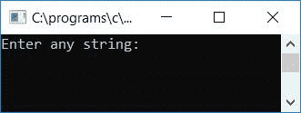
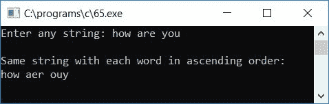

# c 程序排序每个词从给定的字符串在升序排列

> 原文：<https://codescracker.com/c/program/c-program-sort-each-word-ascending.htm>

在本文中，我们将学习如何从任何给定的[字符串](/c/c-strings.htm)(由用户在 运行时)中按升序排序或排列每个单词。

在这个程序中，每个单词都是按字符排序的，例如，如果用户给定的字符串是**这是 codescracker** 。这里 我们总共有三个单词(**这个**、**是**和 **codescracker** )出现在字符串中。因此在对每个 字排序后，字符串将变成 **hist is acccdeekorrs** 。如您所见，这三个单词都是按照升序 排序或排列的。

```
#include<stdio.h>
#include<conio.h>
int main()
{
    char str[100], chTemp;
    int i, j, len;
    printf("Enter any string: ");
    gets(str);
    len = strlen(str);
    for(i=0; i<len; i++)
    {
        for(j=0; j<(len-1); j++)
        {
            if(str[j]>=65 && str[j]<=90)
            {
                if(str[j+1]>=65 && str[j+1]<=90)
                {
                    if(str[j]>str[j+1])
                    {
                        chTemp = str[j];
                        str[j] = str[j+1];
                        str[j+1] = chTemp;
                    }
                }
            }
            if(str[j]>=97 && str[j]<=122)
            {
                if(str[j+1]>=97 && str[j+1]<=122)
                {
                    if(str[j]>str[j+1])
                    {
                        chTemp = str[j];
                        str[j] = str[j+1];
                        str[j+1] = chTemp;
                    }
                }
            }
        }
    }
    printf("\nSame string with each word in ascending order:\n%s", str);
    getch();
    return 0;
}
```

该程序是在 **Code::Blocks** IDE 下编写的，因此在成功构建和运行之后，下面是运行示例:



提供任意字符串，说 **how are you** 并按回车键查看相同的字符串，其中每个单词按 升序排序，如下面给出的示例运行的第二个快照所示:



以下是上述程序中使用的一些主要步骤:

*   使用 **gets()** [函数](/c/c-functions.htm)接收任意字符串
*   现在使用 **string.h** 库的 **strlen()** 函数找到给定字符串的长度
*   在任何一个[变量](/c/c-variables.htm)中存储给定字符串的长度，比如说 **len**
*   为循环创建一个[,从 0 开始，比字符串长度小 1，比较它的每个字符](/c/c-for-loop.htm)
*   在 **for** 循环中，创建另一个 **for** 循环来运行或重复比较字符串的每个字符
*   在循环的第二个**中，确认两个字符是否都是字母，只有当前一个 字符大于下一个字符时，才进行比较和反转**
*   假设如果用户提供字符串，比如说 **codescracker** ，那么 **c** 首先与 **o** 进行比较，因为 已经被安排好了，然后再将 **o** 与字符串的下一个字符 **d** 进行比较
*   现在我们必须应用反向操作将 **d** 放在 **o** 之前(因为 o 大于 d)并继续检查下一个字符的 ，即带有 **e** 的 **o** 等等
*   这样，字符串中的所有字符都被排序
*   这里，我们使用了两个**来代替**循环，从头到尾进行了两次 的比较和反转(如果前一个字符大于下一个字符)
*   最后，在输出屏幕上打印字符串的值，这将是相同的字符串，但按升序排列

[C 在线测试](/exam/showtest.php?subid=2)

* * *

* * *