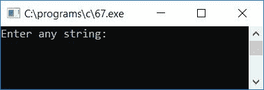
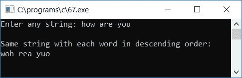

# C 程序：从给定的字符串中按降序排列每个单词

> 原文：<https://codescracker.com/c/program/c-program-sort-each-word-descending.htm>

在本文中，我们将学习如何从任何给定的[字符串](/c/c-strings.htm)(由用户在 运行时)中按降序排列每个单词。

在这个程序中，每个单词都是按字符排序的，例如，如果用户给定的字符串是**这是 codescracker** 。这里 我们总共有三个单词(**这个**、**是**和 **codescracker** )出现在字符串中。因此，在对每个 字排序后，字符串将变成**tsih si srrokeedcca**。

这样，下面的程序将以降序(按字母顺序)对给定字符串中的每个单词进行排序。

```
#include<stdio.h>
#include<conio.h>
int main()
{
    char str[100], chTemp;
    int i, j, len;
    printf("Enter any string: ");
    gets(str);
    len = strlen(str);
    for(i=0; i<len; i++)
    {
        for(j=0; j<(len-1); j++)
        {
            if(str[j]>=65 && str[j]<=90)
            {
                if(str[j+1]>=65 && str[j+1]<=90)
                {
                    if(str[j]<str[j+1])
                    {
                        chTemp = str[j];
                        str[j] = str[j+1];
                        str[j+1] = chTemp;
                    }
                }
            }
            if(str[j]>=97 && str[j]<=122)
            {
                if(str[j+1]>=97 && str[j+1]<=122)
                {
                    if(str[j]<str[j+1])
                    {
                        chTemp = str[j];
                        str[j] = str[j+1];
                        str[j+1] = chTemp;
                    }
                }
            }
        }
    }
    printf("\nSame string with each word in descending order:\n%s", str);
    getch();
    return 0;
}
```

该程序是在 **Code::Blocks** IDE 下编写的，因此在成功构建和运行之后，下面是它的运行示例:



现在输入任意字符串，说**你好吗**并按回车键查看相同的字符串，其中每个单词按降序排列:



以下是上述程序中使用的一些主要步骤:

*   使用 **gets()** [函数](/c/c-functions.htm)接收任意字符串
*   现在使用 **string.h** 库的 **strlen()** 函数找到给定字符串的长度
*   在任何一个[变量](/c/c-variables.htm)中存储给定字符串的长度，比如说 **len**
*   为循环创建一个[,从 0 开始，比字符串长度小 1，比较它的每个字符](/c/c-for-loop.htm)
*   在 **for** 循环中，创建另一个 **for** 循环来运行或重复比较字符串的每个字符
*   在循环的第二个**中，确认两个字符是否都是字母，只有当 第一个字符小于第二个字符或者第二个字符小于第三个字符时，才进行比较和反转，依此类推。**
*   假设如果用户提供字符串，比如说 **codescracker** ，那么首先将 **c** 与 **o** 进行比较，因为 c 小于 p，因此执行反向操作，在第一次 检查和反向之后，现在字符串将变成 **ocdescracker** ，现在再次将第二个字符，即 **c** 与第三个字符 **d** 进行比较， 这里 **c**再次小于 **d** ，然后再次执行相反的操作，d 转到 c 的位置，c 转到 d 的位置， 然后字符串将变成 **odcescracker** 等等
*   这样，字符串中的所有字符都按降序排序
*   这里，我们用两个**来代替**循环，从头到尾做了两次 的比较和反转(如果前一个字符小于下一个字符)
*   最后，在输出屏幕上打印字符串的值，这将是相同的字符串，但按降序排列

[C 在线测试](/exam/showtest.php?subid=2)

* * *

* * *