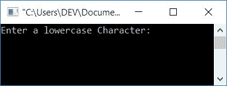
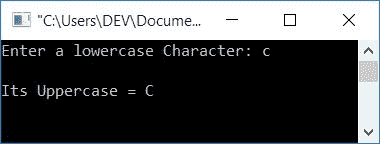
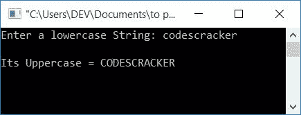

# C 程序：将小写转换成大写

> 原文：<https://codescracker.com/c/program/c-program-convert-lowercase-into-uppercase.htm>

在本文中，您将学习并获得将任何字符或字符串从小写转换为大写的代码。以下是您将了解的项目列表:

*   将小写字符转换为大写字符
*   将小写字符串转换为大写
*   使用库函数将小写字符串转换为大写

但是在进入这些程序之前，让我们先了解一下小写和大写的字符或字符串。

### 小写字符

用小写字母书写的字符称为小写字符。比如 **c**

### 小写字符串

如果字符串中的每个字符都用小写字母书写，则称为小写字符串。例如， **codescracker**

### 大写字符

用大写字母书写的字符被称为大写字符。比如 **C**

### 大写字符串

如果字符串中的每一个字符都用大写字母书写，则称为大写字符串。例如， **CODESCRACKER**

### 所有字母的 ASCII 值

**A-Z** (大写字母)的 ASCII 值为 **65-90** 。也就是说，ASCII 值为

*   a 是 65
*   b 是 66
*   c 是 67
*   等等

而 **a-z** (小写字母)的 ASCII 值为 **97-122** 。也就是说，ASCII 值为

*   a 是 97
*   b 是 98
*   c 是 99
*   等等

### 小写到大写的公式

你可以看到上面给出的小写和大写字母的 ASCII 值。小写字母 say**A**T6 的 ASCII 值比大写字母 say **A** 的 ASCII 值大 **32** 。因此，要将小写转换为大写，请使用以下公式

```
upperChar = lowerChar-32
```

其中 **lowerChar** 是用户输入的字符(小写)。例如，如果 lowerChar 持有 **a** ，那么通过应用上面的公式

```
upperChar = lowerChar-32
=a-32
=97-32
=65
```

而 65 是 **A** 的 ASCII 值。因此，给定的小写字符 **a** 被转换成大写字符 A。应用字符串的转换，然后使用上面的公式转换每个字符。现在让我们继续下面给出的程序:

## C 语言中小写到大写的字符

让我们首先创建一个将小写字符转换成大写字符的程序。所以问题是，**用 C 写一个程序， 要求用户输入一个字符(小写)并将其转换成大写。**这个问题的答案如下:

```
#include<stdio.h>
#include<conio.h>
int main()
{
    char lowerChar, upperChar;
    int ascii;
    printf("Enter a lowercase Character: ");
    scanf("%c", &lowerChar);
    ascii = lowerChar;
    upperChar = ascii-32;
    printf("\nIts Uppercase = %c", upperChar);
    getch();
    return 0;
}
```

这个程序是在 **Code::Blocks** IDE 下构建和运行的。以下是运行示例:



现在提供任意字符(小写)作为输入，比如说 **c** 并按下 **ENTER** 键来查看下面的输出:



## C #中小写字符串到大写的转换

问题是，**用 C 写一个程序，把任何给定的字符串从小写转换成大写。**这个问题的答案如下:

```
#include<stdio.h>
#include<conio.h>
int main()
{
    char lowerString[50]="", upperString[50]="";
    int i=0;
    printf("Enter a lowercase String: ");
    gets(lowerString);
    while(lowerString[i]!='\0')
    {
        upperString[i] = lowerString[i]-32;
        i++;
    }
    printf("\nIts Uppercase = %s", upperString);
    getch();
    return 0;
}
```

下面给出的快照显示了该程序的运行示例:



从上面的程序中可以看出，在 **while** 循环中，每个字符都被转换成大写的等价值。转换后，只需打印出**上串**的值作为输出。就是这样。要了解更多关于 **while** 循环的 ，请参考 C 教程中的 [`while`循环。](/c/c-while-loop.htm)

## 使用库函数将 C 语言中的小写字符串转换为大写字符串

这是本文的最后一个程序。这个程序使用标准库函数 **strupr()** ，该函数将 字符串作为参数，并将参数中给出的字符串返回为大写形式。让我们来看看这个程序:

```
#include<stdio.h>
#include<conio.h>
#include<string.h>
int main()
{
    char str[100];
    printf("Enter lowercase String: ");
    gets(str);
    printf("\nIts Uppercase = %s", strupr(str));
    getch();
    return 0;
}
```

这个程序产生的输出与前一个程序相同。

#### 其他语言的相同程序

*   [C++ 小写到大写](/cpp/program/cpp-program-convert-lowercase-into-uppercase.htm)
*   [Java 小写转大写](/java/program/java-program-convert-lowercase-to-uppercase.htm)
*   [Python 小写到大写](/python/program/python-program-convert-lowercase-to-uppercase.htm)

[C 在线测试](/exam/showtest.php?subid=2)

* * *

* * *