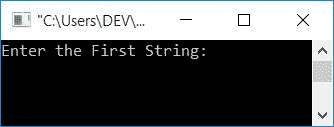
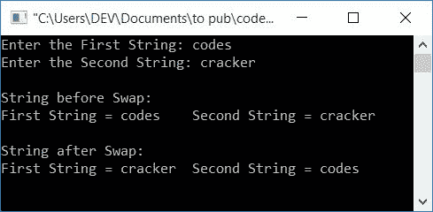

# C 程序：交换两个字符串

> 原文：<https://codescracker.com/c/program/c-program-swap-two-strings.htm>

在本文中，您将学习并获得使用以下方法在 C 编程中交换两个给定字符串的代码:

*   使用功能
*   不使用库函数

让我们首先创建一个使用库函数的程序。随后，你会得到一个没有任何库函数的程序来交换两个字符串。

## 使用 C 中的函数交换两个字符串

这个程序使用了一个[函数](/c/c-functions.htm) **strcpy()** 。该函数带两个参数 的*char*T6】type。第二个参数的值被复制到第一个参数中。 举例来说，如果有两个 *char* type [变量](/c/c-variables.htm)比如说 *num1* 和 T14】num 2。让我们假设， *num2* 将其值保存为 *codescracker* 。然后是下面的声明:

```
strcpy(num1, num2);
```

将 *num2* 的值复制到 *num1* 中。现在这两个变量，持有相同的值，那就是 *codescracker* 。函数 **strcpy()** 在 **string.h** 头文件中定义。现在让我们继续这个项目:

```
#include<stdio.h>
#include<conio.h>
#include<string.h>
int main()
{
    char str1[50], str2[50], temp[50];
    printf("Enter the First String: ");
    gets(str1);
    printf("Enter the Second String: ");
    gets(str2);
    printf("\nString before Swap:\n");
    printf("First String = %s\tSecond String = %s", str1, str2);
    strcpy(temp, str1);
    strcpy(str1, str2);
    strcpy(str2, temp);
    printf("\n\nString after Swap:\n");
    printf("First String = %s\tSecond String = %s", str1, str2);
    getch();
    return 0;
}
```

这个程序是在 *Code::Blocks* IDE 下构建和运行的。下面是它的运行示例:



现在输入第一个字符串 say **codes** ，然后输入第二个字符串 say **cracker** 来执行给定两个字符串的交换 操作，如以下输出所示:



从上面的程序可以看出，交换这两个字符串的主要代码是:

```
strcpy(temp, str1);
strcpy(str1, str2);
strcpy(str2, temp);
```

如果用户输入**代码**和**破解**作为第一个和第二个字符串的值。即**str 1 =代码**和**str 2 =破解者**。

然后在执行第一条语句后，即`strcpy(temp, str1);`
*str 1*的值被复制到 *temp* 。因此，现在 **temp=codes** 。

在执行第二条语句后，即`strcpy(str1, str2);`
， *str2* 的值被复制到 *str1* 。因此，现在 **str1=cracker**

最后在执行第三条语句后，即`strcpy(str2, temp);`
*temp*的值被复制到 *str2* 。因此，现在**str 2 =代码**

正如你所看到的，在执行了上面给出的三个语句之后， **str1** 保存了 **str2** 之前拥有的值，反之亦然。

## 在不使用库函数的情况下交换两个字符串

这个程序交换两个给定的字符串，而不使用任何类型的库函数。

```
#include<stdio.h>
#include<conio.h>
int main()
{
    char str1[50], str2[50], temp[50];
    int i=0;
    printf("Enter the First String: ");
    gets(str1);
    printf("Enter the Second String: ");
    gets(str2);
    printf("\nString before Swap:\n");
    printf("First String = %s\tSecond String = %s", str1, str2);
    while(str1[i]!='\0')
    {
        temp[i] = str1[i];
        i++;
    }
    temp[i] = '\0';
    i=0;
    while(str2[i]!='\0')
    {
        str1[i] = str2[i];
        i++;
    }
    str1[i] = '\0';
    i=0;
    while(temp[i]!='\0')
    {
        str2[i] = temp[i];
        i++;
    }
    str2[i] = '\0';
    printf("\n\nString after Swap:\n");
    printf("First String = %s\tSecond String = %s", str1, str2);
    getch();
    return 0;
}
```

它将产生与前一个程序相同的输出。在这个程序中，我们首先以逐个字符的方式将第一个字符串中的所有字符复制到一个变量中，比如说 *temp* 。然后将第二串 say *str2* 中的所有字符复制到第一串 say *str1* 中。最后将 *temp* 的所有字符复制到第二个字符串 say *str2* 。

**注意**——永远不要忘记初始化一个<u>空终止字符</u> (\0)作为所有 变量的最后一个字符，如 *str1* 、 *str2* 和 *temp* 。

例如，如果用户将**代码**和**破解**作为两个字符串输入。然后**代码**被初始化为 **num1** 变量:

*   S7-1200 可编程控制器
*   S7-1200 可编程控制器
*   S7-1200 可编程控制器
*   S7-1200 可编程控制器
*   num1[4] = s

二线也是如此。现在使用下面的代码块:

```
while(str1[i]!='\0')
{
    temp[i] = str1[i];
    i++;
}
```

由于 **i** 的初始值为 0，因此 *num1* 变量 的全部 5 个字符被逐一初始化为 *temp* 变量，其方式为:

*   **temp[i] = str1[i]** 或 **temp[0] = str1[0]** 或 **temp[0] = c**
*   **temp[i] = str1[i]** 或 **temp[1] = str1[1]** 或 **temp[1] = o**
*   **temp[i] = str1[i]** 或 **temp[2] = str1[2]** 或 **temp[2] = d**
*   类似地**温度[3] = e** 和**温度[4] = s**
*   然后 **temp[5] = \0**

现在**温度=代码**。再次将 **i** 的值初始化为 0，并对下一个进行 do。通过这种方式，可以执行两个字符串的交换。

#### 其他语言的相同程序

*   [C++交换两个字符串](/cpp/program/cpp-program-swap-two-strings.htm)
*   [Java 交换两个字符串](/java/program/java-program-swap-two-strings.htm)
*   [Python 交换两个字符串](/python/program/python-program-swap-two-strings.htm)

[C 在线测试](/exam/showtest.php?subid=2)

* * *

* * *