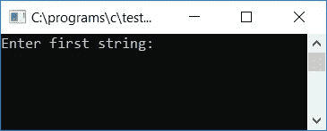
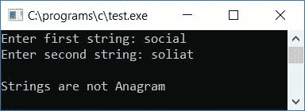
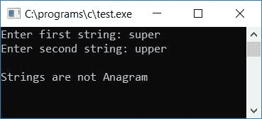
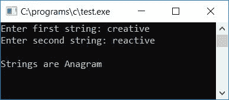

# C 程序检查字符串是否是变位词

> 原文：<https://codescracker.com/c/program/c-anagram-program.htm>

在本教程中，我们将学习如何用 C 语言创建一个程序来检查任何给定的两个字符串是否是变位词。

## C 语言中检查字谜与否。

在 C 编程中，要检查任何给定的两个字符串(用户在运行时给出的)是否是变位词，您必须要求用户输入这两个字符串来检查并找出这两个字符串是否都是变位词，如下面给出的程序所示。

当且仅当两个字符串包含相同数量的字符时，它们才是彼此的变位词；字符的顺序并不重要。也就是说，如果两个字符串是彼此的变位，那么一个字符串可以重新排列以形成另一个字符串。例如:

*   abc 和 cba 是变位词。
*   创造性和反应性是字谜。
*   课程和来源是字谜。

“super”和“upper”这两个字符串不是字谜。两个字符串包含相同数量的字符，但不包含“upper”中“super”的每个字符(或“super”中的“upper”，也就是说，您不能重新排列字符串“super”来分别形成“upper”或“super”)。

### C 程序：检查字符串是否是字谜代码

让我们看一下程序，检查给定的两个字符串在 C 中是否是变位词，下面是 C 变位词程序源代码:

```
#include<stdio.h>
#include<conio.h>
#include<string.h>
int main()
{
    char str1[20], str2[20];
    int len, len1, len2, i, j, found=0, not_found=0;
    printf("Enter first string: ");
    gets(str1);
    printf("Enter second string: ");
    gets(str2);
    len1 = strlen(str1);
    len2 = strlen(str2);
    if(len1 == len2)
    {
        len = len1;
        for(i=0; i<len; i++)
        {
            found = 0;
            for(j=0; j<len; j++)
            {
                if(str1[i] == str2[j])
                {
                    found = 1;
                    break;
                }
            }
            if(found == 0)
            {
                not_found = 1;
                break;
            }
        }
        if(not_found == 1)
            printf("\nStrings are not Anagram");
        else
            printf("\nStrings are Anagram");
    }
    else
        printf("\nBoth string must contain same number of character to be an Anagram Strings");
    getch();
    return 0;
}
```

由于上述程序是在 Code::Blocks IDE 中编写的，因此，在成功构建和运行之后，您将获得以下输出:以下是示例运行的初始快照:



现在提供任意两个字符串，比如 social 和 soliat，作为输入，并按 ENTER 键查看输出，如下面给出的示例运行的第二个快照所示:



让我们采取另一个样本运行，并检查另外两个字符串，说超级和上层。以下是示例运行的最终快照:



正如您在上面的输出中看到的，其中两个字符串表示 super 和 upper，提供第一个字符串“super”有一个额外的 s 和一个缺少的 p。第二个字符串 upper 有一个额外的 p 作为字符，并且缺少一个字符 s。所以我们不能把 super 重新排列形成 upper(或者 upper 形成 super)。

让我们使用下面的示例运行来检查另外两个字符串，比如 creative 和 reactive。以下是示例运行的最终快照:



以下是上述程序中使用的一些主要步骤:

*   接收任意两个字符串作为输入。
*   使用 strlen()函数计算两个字符串的长度。
*   然后将第一个字符串的长度初始化为任意变量，比如 len1，将第二个字符串的长度初始化为任意变量，比如 len2。
*   现在检查两个字符串的长度是否相等。
*   如果两个字符串不具有相同的字符数，则打印任何消息，就像两个字符串必须包含相同的字符数才能成为变位字符串一样。
*   如果两个字符串包含相同数量的字符，则按照下面给出的步骤检查第一个字符串中的每个字符是否都出现在第二个字符串中。
*   创建一个从 0 到小于字符串长度 1 的 for 循环(可以是第一个或第二个，因为我们已经检查并发现两个字符串包含相同数量的字符)。
*   在 for 循环中，将任何变量初始化为 0，比如 found，如果在第二个字符串中找到了第一个字符串中的一个字符，这个变量的值就增加 1。
*   创建另一个 for 循环，也是从 0 到比字符串长度小 1 的循环。
*   这里，我们创建了两个 for 循环，将第一个字符串中的每个字符与第二个字符串中的每个字符进行比较。
*   在比较时，如果第一个字符串中的字符与第二个字符串中的字符匹配，则将找到的变量初始化为 1，并使用 break 关键字跳出内部 for 循环。
*   运行内部 for 循环后，检查 found 是否保持其初始值 0。
*   如果它成立，则在第二个字符串中找不到第一个字符串的当前字符。因此，我们在内部 for 循环的每一次完整运行之后都进行了检查，以查看找到的值是否保持其原始值。如果它成立(即 0)，那么我们必须将 not_found 变量初始化为 1。并脱离外部 for 循环。如果第一个字符串中的任何字符在第二个字符串中找不到，这意味着不需要检查剩余的字符，因为如果第一个字符串中的任何字符与第二个字符串中的字符不匹配，则这些字符串不能是彼此的变位组合。
*   最后，我们检查了变量 say not_found 是否保持其初始值 0。
*   如果成立，那么两个字符串都是变位词。否则，两个字符串都不是变位词(以防它保存 1 的值)。

上述程序的简要描述是，首先我们必须检查两个字符串的长度；如果长度相等，则继续进行；否则，打印不等长的消息。我们已经将第一个字符串的第一个字符与第二个字符串的所有字符逐一进行了比较，然后将第一个字符串的第二个字符与第二个字符串的所有字符逐一进行了比较，然后将第一个字符串的第三个字符与第二个字符串的所有字符逐一进行了比较，以此类推。

在比较时，如果第一个字符串中的任何字符与第二个字符串中的字符匹配，那么我们已经将 found 初始化为 1 并退出内部循环。如果没有为任何字符找到匹配，那么 1 将不会被初始化。因此 found 保持其先前或初始值，即 0。

并且在退出内部循环之后，在检查“if (found == 0)”时，它变为真，并且 1 将被初始化为变量 not_found，并且退出外部循环。现在，在退出外部循环后，我们必须检查 not_found 是否等于 1 或 0。如果 not_found 等于 1，那么两个字符串都不是变位词，如果 not_found 等于 0，那么两个字符串都是变位词。

#### 其他语言的相同程序

*   [C++ 是否检查字谜](/cpp/program/cpp-anagram-program.htm)
*   [Java 是否检查字谜](/java/program/java-program-check-anagram.htm)

[C 在线测试](/exam/showtest.php?subid=2)

* * *

* * *