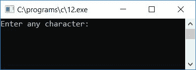

# C 程序：打印下一个连续字符和相邻字符

> 原文：<https://codescracker.com/c/program/c-program-print-successive-character.htm>

在本教程中，我们将学习如何用 C 语言创建一个程序来打印下一个连续字符和相邻字符。在这里，我们首先创建了一个程序，将要求用户输入任何字符，以找到并打印其下一个连续的字符。此外，我们已经创建了一个程序，将采取一个字符作为输入(从用户在运行时)，然后将打印其相邻的字符。

## 打印下一个连续字符

让我们首先创建一个程序，它将打印用户给定字符的下一个连续字符。假设用户已经输入了 **a** 作为字符输入，那么程序将打印**b**(**a**的下一个连续字符 )。或者如果用户将提供 **C** 作为字符输入，那么程序将打印 **D** 作为输出。

问题是，用 C 写一个程序，从用户那里接受一个字符，并以这两种方式处理它:

1.  如果字符是一个字母表，那么打印它的下一个连续字符。例如，如果用户输入 a，则打印 b，如果 x，则打印 y，如果 z，则打印 a。
2.  如果它不是一个字母表，那么打印字符本身作为输出

这个问题的答案如下:

```
#include<stdio.h>
#include<conio.h>
int main()
{
    char ch;
    printf("Enter any character: ");
    scanf("%c", &ch);
    printf("\n");
    if(ch>=65 && ch<90)
        printf("%c", ch+1);
    else if(ch>=97 && ch<122)
        printf("%c", ch+1);
    else if(ch==90)
        printf("%c", 65);
    else if(ch==122)
        printf("%c", 122);
    else
        printf("%c", ch);
    getch();
    return 0;
}
```

由于上面给出的程序是在 **Code::Blocks** IDE 下编写的，因此在成功构建和运行之后，下面是运行示例:



现在输入任意一个字符，比如说 **a** ，按`ENTER`键查看 跟在 **a** 后面的下一个字符。下面是示例运行的第二个快照:


让我们用另一个示例运行来检查同一个程序。这次输入为 **Z** 并按回车键:


下面是另一个示例运行，它检查如果用户提供任何不是字母字符的输入会发生什么:


#### 程序解释

*   接收任何字符作为输入
*   **A-Z** 的 ASCII 码为 **65-90** 。A 是 65，B 是 66，C 是 67，...，Z 为 90
*   而 **a-z** 的 ASCII 码是 **97-122** 。a 是 97 分，b 是 98 分，c 是 99 分，...，z 为 122
*   现在检查字符的 ASCII 码是否大于等于 65 且小于 90
*   如果是，则增加字符的值，并作为下一个连续字符打印出来
*   否则，检查字符的 ASCII 码**是否大于等于 97 且小于 122**
*   如果是，则再次递增并输出字符的值
*   这里我们已经排除了 Z(大写)和 Z(小写)的 ASCII 代码，因为如果用户输入 **z** ，那么我们必须打印 **a** 作为它的连续字符，如果用户输入 **Z** ，那么 我们必须打印 **Z** 作为它的连续字符，因此我们已经检查了使用 ASCII 代码并相应地打印值
*   最后，如果上述条件都不为真，则按原样打印字符。也就是说，如果给定的字符不在 **a-z** 和 **A-Z** 之下，就在输出屏幕上打印该字符

## 打印相邻字符

让我们创建另一个程序，它将在运行时打印用户任意给定字符的相邻字符。这里相邻的字符是两个字符，一个在给定字符之前，另一个在给定字符之后。例如，如果用户输入了 A，则打印其相邻字符 Z 和 b。或者，如果用户输入了 D，则打印 C 和 E

```
#include<stdio.h>
#include<conio.h>
int main()
{
    char ch;
    printf("Enter any character: ");
    scanf("%c", &ch);
    printf("\n");
    if(ch>65 && ch<90)
        printf("Adjacent characters = %c and %c", ch-1, ch+1);
    else if(ch>97 && ch<122)
        printf("Adjacent characters = %c and %c", ch-1, ch+1);
    else if(ch==90)
        printf("Adjacent characters = %c and %c", ch-1, 65);
    else if(ch==122)
        printf("Adjacent characters = %c and %c", ch-1, 97);
    else if(ch==65)
        printf("Adjacent characters = %c and %c", 90, ch+1);
    else if(ch==97)
        printf("Adjacent characters = %c and %c", 122, ch+1);
    else
        printf("%c", ch);
    getch();
    return 0;
}
```

以下是样本运行的最终快照:


上述程序中使用的概念与之前程序中使用的概念相似。除了我们必须打印前一个字符和下一个字符。因此，我们在不同的情况下对 A、A、Z 和 Z 使用 ASCII 码。

[C 在线测试](/exam/showtest.php?subid=2)

* * *

* * *