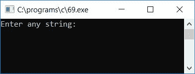
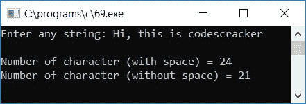

# C 程序：统计有空格和无空格字符

> 原文：<https://codescracker.com/c/program/c-program-count-characters-with-without-space.htm>

在本教程中，我们将学习如何计算和打印任何给定字符串(由用户在运行时提供)中的字符总数，包括空格和非空格。

让我们创建一个程序，它将计算并打印任何给定字符串中包含的字符总数，既有空格也有非空格。程序如下:

```
#include<stdio.h>
#include<conio.h>
int main()
{
    char str[100];
    int i, countWithSpace=0, countWithoutSpace=0;
    printf("Enter any string: ");
    gets(str);
    for(i=0; str[i]!='\0'; i++)
    {
        countWithSpace++;
    }
    for(i=0; i<countWithSpace; i++)
    {
        if(str[i]==32)
            countWithoutSpace++;
    }
    countWithoutSpace = countWithSpace-countWithoutSpace;
    printf("\nNumber of character (with space) = %d", countWithSpace);
    printf("\nNumber of character (without space) = %d", countWithoutSpace);
    getch();
    return 0;
}
```

由于程序是在 **Code::Blocks** IDE 下编写的，因此这里是成功构建和运行后的运行示例。这张 是第一张快照:



现在提供任意字符串，比如说 **Hi，这是 codescracker** 并按回车键查看给定字符串中包含和不包含 空格的字符总数，如第二个快照所示:



以下是上述程序中使用的一些主要步骤:

*   用 0 声明并初始化任意两个变量，比如说 **countWithSpace** 和**count with space**。第一个是指 带空格的字符串中出现的字符总数，第二个是指不带空格的字符串中出现的字符总数
*   接收**字符串**中的任意字符串
*   为从第一个字符到最后一个字符的循环创建一个
***   在循环内部，每次当程序流进入循环内部时，增加变量 say **countWithSpace***   当空终止字符(' \0 ')作为字符串中的一个字符出现时，字符串和程序流中没有任何内容会从第一个 **for** 循环中流出*   现在 **countWithSpace** 变量保存字符串长度的值*   为了计算没有空格的字符，我们必须检查字符串中有多少个空格*   然后减去带空格的字符总数( **countWithSpace** 保存字符总数的值)，即为不带空格的字符数*   因此，将其初始化为 **countWithoutSpace** 变量*   最后打印变量 say **countWithSpace** 和**count with space**的值**

 **[C 在线测试](/exam/showtest.php?subid=2)

* * *

* * ***