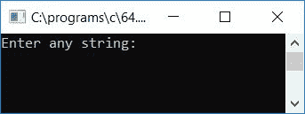
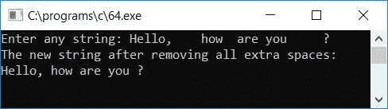

# c 程序删除给定字符串中所有多余的空格

> 原文：<https://codescracker.com/c/program/c-program-remove-extra-spaces.htm>

在本教程中，我们将学习如何从任何给定的字符串中移除所有多余的空格(由用户在运行时移除)。在这个程序中，如果用户提供的任何字符串在任何两个单词之间包含一个以上的空格，那么所有多余的空格将被删除，在任何两个单词之间，将只有一个空格。

问题是，*用 C 写一个程序，去掉给定字符串*中所有多余的空格。下面给出的程序是这个问题的答案:

```
#include<stdio.h>
#include<conio.h>
#include<string.h>
int main()
{
    char str[100], ch, count=0, len, i, j, temp;
    printf("Enter any string: ");
    gets(str);
    len = strlen(str);
    for(i=0; i<len; i++)
    {
        if(str[i]==32 && str[i+1]==32)
        {
            temp = i;
            for(j=i; j<(len-1); j++)
            {
                str[j] = str[j+1];
            }
            len--;
            str[len]='\0';
            i = 0;
        }
    }
    printf("The new string after removing all extra spaces:\n");
    puts(str);
    getch();
    return 0;
}
```

上面的程序是在 **Code::Blocks** IDE 下构建和运行的，因此这里是示例运行的第一个快照:



提供任何带有额外空格的字符串，并按 ENTER 键查看输出，如示例运行的第二个快照所示:



以下是上述程序中使用的一些主要步骤:

*   在任何字符串变量中使用 **gets()** 函数接收任何字符串，比如说 **str**
*   使用 **strlen()** 函数计算字符串的长度，并将其存储在任意变量中，比如 **len**
*   为循环创建一个**从 0 开始到比字符串长度小 1，因为索引是从 0 开始的**
*   在循环的**中，检查任意一个字符及其下一个字符是否等于 32。ASCII 码 32 指的是空间**
*   如果是，则删除下一个字符(空格)，方法是将每个下一个字符放置在前一个字符上
*   删除空格后，将字符串的长度减一，在字符串的最后，初始化一个空终止字符(' \0 ')，告诉编译器在该空终止字符之后，字符串中没有任何字符
*   用 0 初始化循环变量 **i** 并继续
*   删除所有空格后，将字符串的值打印为输出，这将是没有多余空格的相同字符串

[C 在线测试](/exam/showtest.php?subid=2)

* * *

* * *