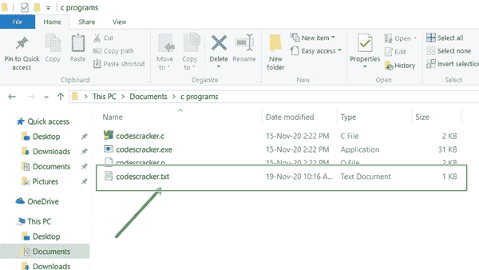
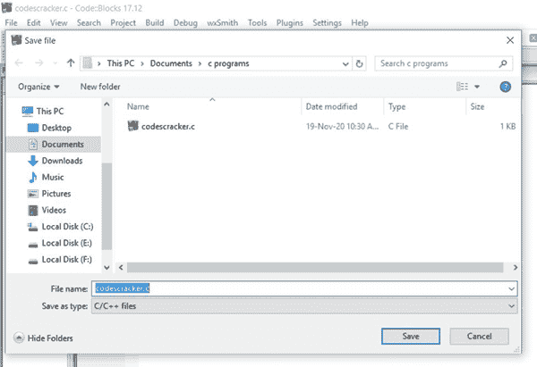
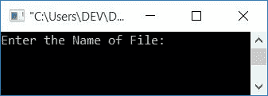
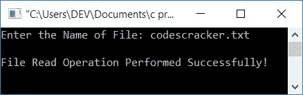

# C 程序：读取文件

> 原文：<https://codescracker.com/c/program/c-program-read-file.htm>

在本文中，您将学习并获得关于读取当前目录中的文件的代码。当前目录是指保存 C 源代码或程序的目录。

### 计划前要做的事情

在浏览程序之前，我们必须创建一个文件，比如说 **codescracker.txt** ，里面有一些内容 ，并将这个文件保存到当前目录。例如，放以下内容:

```
Hello C
This is a textual file
The name of this file is codescracker.txt
```

在 **codescracker.txt** 文件中。这个文件保存在我电脑 c 盘**下**文档** 目录的 **c 程序**文件夹下。以下是该文件夹的快照:**



如你所见，这个文件夹中有一个名为 *codescracker.txt* 的文件。让我们继续讨论使用 C 代码读取这个文件的程序 。

## 用 C 语言读取文件

问题是，*用 C 写一个程序读取一个文件*。这个问题的答案是:

```
#include<stdio.h>
#include<conio.h>
int main()
{
    char fname[20], str[500];
    FILE *fp;
    printf("Enter the Name of File: ");
    gets(fname);
    fp = fopen(fname, "r");
    if(fp==NULL)
        printf("Error Occurred while Opening the File!");
    else
    {
        fscanf(fp, "%[&Hat;\0]", str);
        printf("\nFile Read Operation Performed Successfully!");
    }
	fclose(fp);
    getch();
    return 0;
}
```

阅读后要显示文件内容，请参考[显示文件内容](/c/program/c-program-read-and-display-file.htm) 或学习完下面给出的所有内容后按照*下一个程序*。

这个程序是在 **Code::Blocks** IDE 下构建和运行的。如果你没有将你的源代码保存在 文件夹中，如本文前面所述，文件 *codescracker.txt* 就是在这个文件夹中创建的。然后你可以将这个文件移动到你保存源代码的目录下，或者将上面的程序保存在你创建了名为 *codescracker.txt* 的文件的目录下。

因此，因为我已经在*文档*目录的 *c 程序*文件夹中创建了这个文件。然后跟随 导航(将上述程序保存在创建文本文件的目录中):
**文件- >另存为..**
你会在*代码中看到以下窗口::块*:



写下源代码的名称，比如说 *codescracker.c* ，并将其保存在您创建文本文件的目录中。

下面是运行示例:



输入文件名，比如说 *codescracker.txt* ，按`ENTER`键可以看到如下输出:



上面给出的程序在运行时打开用户输入的文件。使用 **r** 文件打开模式以读取模式打开文件。函数 *fopen()* 用于打开任何文件。这需要两个论据。第一个 是文件名，第二个参数对应文件打开模式。如果文件 不存在或者打开文件时发生了奇怪的事情，则返回 *NULL* 。

**注-****%&帽子；\0]** 表示，读取文件内容，直到出现一个*空终止字符* (\0)。

**注-****str**的大小初始化为 500，假设文件不超过 500 个字符

#### 其他语言的相同程序

*   [C++读取文件](/cpp/program/cpp-program-read-file.htm)
*   [Java 读取文件](/java/program/java-program-read-file.htm)
*   [Python 读取文件](/python/program/python-program-read-file.htm)

[C 在线测试](/exam/showtest.php?subid=2)

* * *

* * *