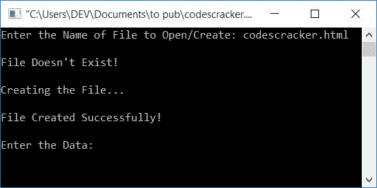

# C 程序：将数据写入文件

> 原文：<https://codescracker.com/c/program/c-program-write-file.htm>

在本文中，您将学习并获得将一些数据写入当前目录中的文件的代码。

[函数](/c/c-functions.htm) **fopen()** 用于打开[文件](/c/c-file-io.htm)。 它有两个参数，第一个是文件名，第二个是它的打开方式。要将一些数据 写入一个文件，我们必须使用 <u>w</u> 文件打开模式。举个例子，

```
fopen("codescracker.txt", "w");
```

在<u>写模式</u>下打开名为 **codescracker.txt** 的文件。

### 如果文件不存在怎么办？

使用 **w** 文件打开模式打开文件时，如果文件不存在，则会创建一个新文件。 因此，使用上面的语句，如果文件 **codescracker.txt** 在当前目录中不存在， 那么它被创建。当前目录是指保存 C 程序的目录或文件夹。 或保存*将数据写入文件*的程序的文件夹。

## 用 C 语言将数据写入文件

问题是，**用 C 写一个程序，要求用户输入文件名以打开文件，然后 再次要求输入数据以存储在文件**中。这个问题的答案是:

```
#include<stdio.h>
#include<conio.h>
#include<string.h>
int main()
{
    char data[200], fname[30];
    FILE *fp;
    printf("Enter a File Name to Open/Create: ");
    gets(fname);
    fp = fopen(fname, "w");
    if(fp==NULL)
        printf("Error Occurred while Opening/Creating the File!");
    else
    {
        printf("\nEnter the Data: ");
        gets(data);
        while(strlen(data)>0)
        {
            fputs(data, fp);
            fputs("\n", fp);
            gets(data);
        }
    }
    fclose(fp);
    getch();
    return 0;
}
```

这个程序是在 *Code::Blocks* IDE 下构建和运行的。下面是它的运行示例:


输入文件名，如 **codescracker.txt** 并按`ENTER`键。如果你输入的文件 比如说 **codescracker.txt** 在当前目录中不存在，那么它会在那里被创建。当前的 目录是指上面给出的你保存程序的目录。现在逐个输入一些数据 ，如果您想输入 3 行数据，则输入如下:

*   程序员你好，
*   你好吗？
*   这是 codescracker.txt 文件

每次输入新行或新句子时，按`ENTER`。如果你想停止向文件中写入数据，那么只需按下 键，而无需在它之前写入任何内容。下面是它的运行示例:


如你所见，我写了三行数据，因此在当前目录下创建了一个名为 **codescracker.txt** 的文件 ，该文件包含:


### 修改版本

这是上述程序的修改版本。这个程序一个接一个地打印信息，向用户保证，程序里面在进行什么。比如，如果用户输入一个不存在的文件，那么就会创建一个新文件。但是在创建文件之前，这个程序会打印一条消息，就像一个新文件正在创建一样...所有人都喜欢这些信息:

```
#include<stdio.h>
#include<conio.h>
#include<string.h>
int main()
{
    char data[200], fname[30];
    FILE *fp;
    printf("Enter the Name of File to Open/Create: ");
    gets(fname);
    fp = fopen(fname, "r");
    if(fp==NULL)
    {
        printf("\nFile Doesn't Exist!");
        printf("\n\nCreating the File...\n");
        fp = fopen(fname, "w");
        if(fp==NULL)
            printf("\nError occurred while creating the file..");
        else
            printf("\nFile Created Successfully!\n");
    }
    fclose(fp);
    fp = fopen(fname, "w");
    if(fp==NULL)
        printf("\nError occurred while opening the file..");
    else
    {
        printf("\nEnter the Data: ");
        gets(data);
        while(strlen(data)>0)
        {
            fputs(data, fp);
            fputs("\n", fp);
            gets(data);
        }
        printf("\nData is Written into the File Successfully!");
        printf("\nPress any Key to Exit...");
    }
    fclose(fp);
    getch();
    return 0;
}
```

让我们假设用户输入一个名为**codescracker.html**的文件，这个文件在当前的 目录中并不存在。现在，上面程序的示例运行如下。这是最初的输出:


现在输入文件名说**codescracker.html**并按`ENTER`键。因为这个文件 在当前文件夹中不可用，所以创建了一个新文件，下面是您将看到的示例输出:



现在输入以下数据，将其写入文件*codescracker.html*:

```
<h1>About Me</h1>
<p>Hello There.</p>
<p>This is an HTML Document.</p>
<p>The name of this file is <u>codescracker.html</u>.</p>
```

以上数据必须以先<u>进入第一行</u>的方式输入，即:

```
<h1>About Me</h1>
```

并按下`ENTER`键，再次<u>进入第二行</u>，即:

```
<p>Hello There.</p>
```

并再次按下`ENTER`键。以类似的方式，输入下面两行。以下是示例输出:


输入所有四行数据后，不输入任何内容，按`ENTER`键，停止将 数据写入文件。下面是输出，您将在完成后看到:


现在按任意键退出程序。下面是显示文件**codescracker.html**在当前文件夹中创建的快照:


因为，是带**的文件。html** 扩展名，那么如果你在像**谷歌 Chrome** 这样的网络浏览器中打开这个文件，它会显示:


要详细了解 [HTML](/html/index.htm) ,请跟随单独的教程。

#### 其他语言的相同程序

*   [C++ 将数据写入文件](/cpp/program/cpp-program-write-file.htm)
*   [Java 将数据写入文件](/java/program/java-program-write-to-file.htm)
*   [Python 将数据写入文件](/python/program/python-program-write-to-file.htm)

[C 在线测试](/exam/showtest.php?subid=2)

* * *

* * *