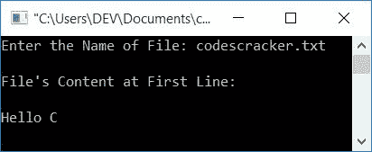

# C 程序：读取文件内容并显示它

> 原文：<https://codescracker.com/c/program/c-program-read-and-display-file.htm>

在本文中，您将学习并获得使用 C 程序读取文件并在输出中显示其内容的代码。该文件必须存在于当前目录中，即保存 C 程序的目录中。

### 计划前要做的事情

在执行下面给出的读取和显示文件的程序之前，必须创建一个文件。因此，如前一程序所述创建了一个文件[读取一个文件](/c/program/c-program-read-file.htm)， 名为 **codescracker.txt** ，内容如下:

```
Hello C
This is a textual file
The name of this file is codescracker.txt
```

该文件必须保存在您将要保存下面给出的程序的文件夹中。因为我要把程序保存在**文档**目录的 **c 程序**文件夹中。因此，这里也保存了文件 *codescracker.txt* (如前程序所述)。这是文件夹 *c 程序*的快照。参见 该文件夹中的文本文件:


## 在 C 中读取和显示文件内容

在 C 编程中，要读取和显示文件的内容，首先要使用 **fopen()** 函数打开该文件。这个[函数](/c/c-functions.htm)有两个参数，即

1.  文件名
2.  文件打开模式

在文件打开模式下，我们必须使用 **r** 来告诉编译器只以读取模式打开文件。现在 开始读取文件的内容，然后在输出上显示内容，如下面给出的程序所示:

下面的 C 程序要求用户输入要读取的文件名，并在屏幕上显示其内容:

```
#include<stdio.h>
#include<conio.h>
int main()
{
    char fname[20], str[500];
    FILE *fp;
    printf("Enter the Name of File: ");
    gets(fname);
    fp = fopen(fname, "r");
    if(fp==NULL)
        printf("Error Occurred while Opening the File!");
    else
    {
        fscanf(fp, "%[&Hat;\0]", str);
        printf("\nContent of File is:\n\n");
        printf("%s", str);
    }
	fclose(fp);
    getch();
    return 0;
}
```

这个程序是在 **Code::Blocks** IDE 下构建和运行的。下面是它的运行示例:


现在输入文件名，比如说 *codescracker.txt* ，按`ENTER`键，可以看到这个 文件的内容，如下图所示:


**注意** -如果你想把这个源代码保存在创建文本文件的文件夹中，那么 参考前面的程序。在那里，你会得到完整的细节

**注**——**%&帽子；\0]** ， **fscanf()** 函数的第二个参数表示读取文件 的内容，直到出现*空终止字符*为止。换句话说，读取文件的所有内容。

**注意**——操作完成后，不要忘记使用 **fclose()** 函数关闭文件指针。

### 仅显示第一行的内容

为了只显示用户在运行时输入的文件中第一行的内容，下面是这个程序:

```
#include<stdio.h>
#include<conio.h>
int main()
{
    char fname[20], str[200];
    FILE *fp;
    printf("Enter the Name of File: ");
    gets(fname);
    fp = fopen(fname, "r");
    if(fp==NULL)
        printf("Error Occurred while Opening the File!");
    else
    {
        fscanf(fp, "%[&Hat;\n]", str);
        printf("\nFile's Content at First Line:\n\n");
        printf("%s", str);
    }
    fclose(fp);
    getch();
    return 0;
}
```

以下是运行示例:



您可以将这个程序与本文的第一个程序进行比较。唯一的变化是在 **fscanf()** 函数的第二个参数中。也就是说，我们用 **\n** 代替 **\0** 来读取文件的内容，直到 出现一个*新行符*，代替*空终止符*。其余的事情都一样。

假定用户输入的文件的第一行 中出现的字符不超过 200 个字符，则**字符串**的大小减少并初始化为 200。

## 逐字符读取和打印文件内容

这个程序与本文的第一个程序做同样的工作。但是我们没有使用 *fscanf ()* 函数一次性读取全部内容，这里我们使用了 **fgetc()** 函数以逐字符的方式读取文件内容 。也就是说，读取第一个字符并打印它，然后读取第二个字符并打印它，以此类推。

```
#include<stdio.h>
#include<conio.h>
int main()
{
    char fname[20], ch;
    FILE *fp;
    printf("Enter the Name of File: ");
    gets(fname);
    fp = fopen(fname, "r");
    if(fp==NULL)
        printf("Error Occurred while Opening the File!");
    else
    {
        printf("\nFile's Content is:\n\n");
        ch = fgetc(fp);
        while(ch!=EOF)
        {
            printf("%c", ch);
            ch = fgetc(fp);
        }
    }
    fclose(fp);
    getch();
    return 0;
}
```

下面是它的运行示例:


**注意**-(文件结束)的**表示文件结束，即文件内没有任何字符。**

所以每次读取字符并在*ch*T2【变量中初始化后，得到 与的*比较。如果条件评估为假，则打印 *ch* 的值并读取下一个字符。再次 将其与*的*进行比较。继续文件内容的读取和打印操作，直到 *ch* 的值等于*的*值。*

#### 其他语言的相同程序

*   [C++读取&显示文件内容](/cpp/program/cpp-program-read-and-display-file.htm)
*   [Java 读取&显示文件内容](/java/program/java-program-read-and-display-file.htm)

[C 在线测试](/exam/showtest.php?subid=2)

* * *

* * *