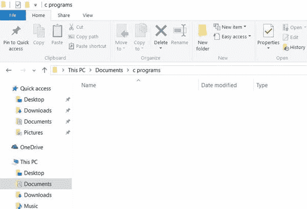
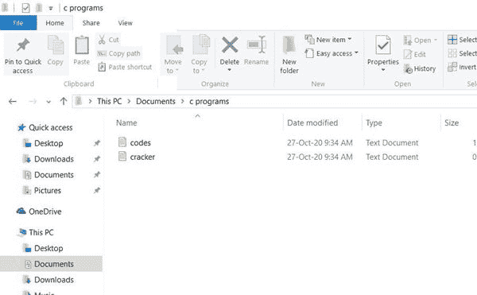
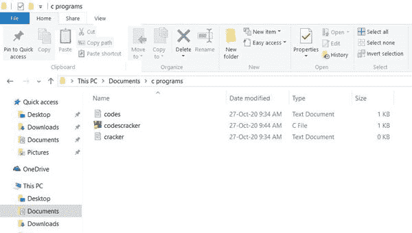
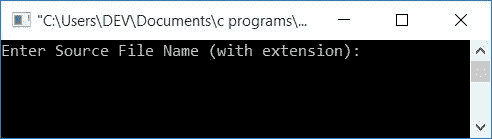
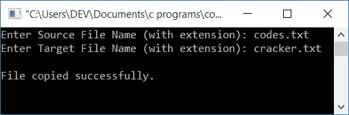
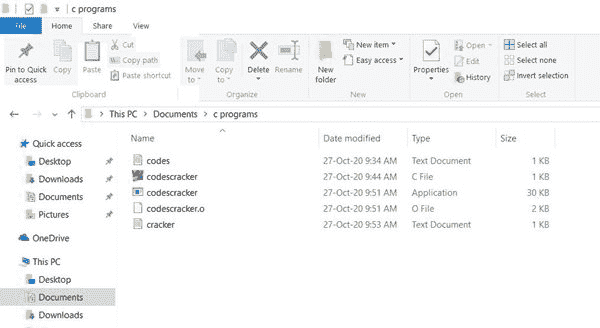

# 复制文件的 c 程序

> 原文：<https://codescracker.com/c/program/c-program-copy-file.htm>

在本文中，你将学习并获得用 C 语言将一个[文件](/operating-system/files.htm) 的内容复制到另一个文件的代码。但是在浏览下面给出的程序之前，让我们先了解一下在 c 中执行复制文件操作之前必须做的事情 。

### 计划前要做的事情

上节目之前，先做好以下几件事:

*   创建两个文件，即 **codes.txt** 和 **cracker.txt**
*   将这两个文件放在同一个[目录](/operating-system/directories.htm)下，你 将在那里保存源代码文件(复制 C 语言中的程序)

让我们假设，在这里我们已经创建了一个名为 **c 程序**的文件夹到我电脑的**文档** 文件夹的父目录。这是名为 **c 程序**的文件夹的快照



因为，这是新创建的文件夹。所以这个文件夹现在是空的。但是我打算把一些与拷贝文件程序有关的文件

现在是时候创建一个名为 **codes.txt** 的文件，内容如下。

```
this is codescracker.com
```

并创建名为 **cracker.txt** 的第二个没有任何内容的文件。将两个文件保存在与上面给出的快照中的 相同的文件夹中，即 **c 程序**文件夹。因此，该文件夹现在看起来像这样:



如果你打开这两个文件，那么你会看到第一个文件 **codes.txt** 中的一些内容，而第二个文件 **cracker.txt** 是空的。现在让我们转到将 **codes.txt** 文件的内容复制到 **cracker.txt** 文件的程序。

## 用 C 语言将一个文件复制到另一个文件的程序

在 C 编程中，要将一个文件的内容复制到另一个文件，必须首先打开两个文件，即源文件和目标文件。然后开始逐字符读取源文件的内容，并在每次读取字符时将源文件的内容放置或写入目标文件。

问题是，**用 C 写一个程序，把一个文件的内容复制到另一个文件**。这个问题的答案如下:

```
#include<stdio.h>
#include<conio.h>
int main()
{
    char ch, fileName1[20], fileName2[20];
    FILE *fs, *ft;
    printf("Enter Source File Name (with extension): ");
    gets(fileName1);
    fs = fopen(fileName1, "r");
    if(fs == NULL)
    {
        printf("\nError in Opening the file, %s", fileName1);
        getch();
        return 0;
    }
    printf("Enter Target File Name (with extension): ");
    gets(fileName2);
    ft = fopen(fileName2, "w");
    if(ft == NULL)
    {
        printf("\nError in Opening the file, %s", fileName2);
        getch();
        return 0;
    }
    ch = fgetc(fs);
    while(ch != EOF)
    {
        fputc(ch, ft);
        ch = fgetc(fs);
    }
    printf("\nFile copied successfully.");
    fclose(fs);
    fclose(ft);
    getch();
    return 0;
}
```

这个程序是在 **Code::Blocks** IDE 下构建和运行的。将上述程序的源代码保存在同一个 目录下，即名为 **c 程序**的文件夹内。要保存它， 使用**文件- >另存为...**内部导航**代码::块**。这里我们使用了**codescracker . c**T17】作为源代码文件的名称。将上述程序的源代码保存到**文档**中的文件夹 **c programs** 中后，该文件夹如下所示:



现在是时候构建并运行上面的程序了。以下是运行示例:



现在提供第一个文件的名称， **codes.txt** (本文前面创建的源文件，位于源代码所属的 文件夹中)。按下 **ENTER** 键，然后再次提供另一个文件的名称 ，比如 **cracker.txt** (目标文件，其中 **source.txt** 文件的内容将被复制)。 最后按**回车**键可以看到如下输出:



这是文件夹 **c 程序**的最终快照:



现在，如果您打开文件 **cracker.txt** (在本文前面创建时内容为空)，那么 您将看到 **codes.txt** 文件的内容被复制到其中。就是这样。要了解更多关于 C 语言中文件 的输入和输出操作，请参考 C 语言中的[文件输入/输出](/c/c-file-io.htm)教程。

#### 其他语言的相同程序

*   [C++复制文件](/cpp/program/cpp-program-copy-file.htm)
*   [Java 复制文件](/java/program/java-program-copy-file.htm)
*   [Python 复制文件](/python/program/python-program-copy-files.htm)

[C 在线测试](/exam/showtest.php?subid=2)

* * *

* * *