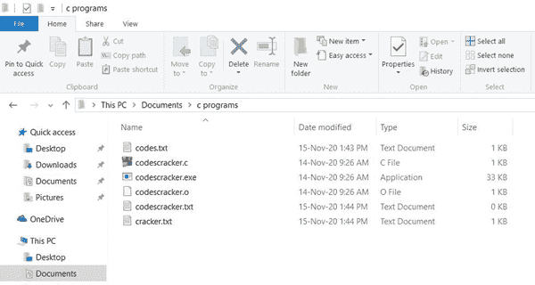
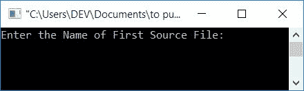
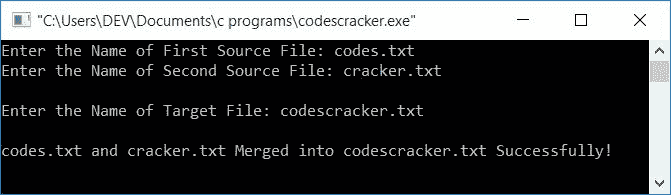

# 合并两个文件的 c 程序

> 原文：<https://codescracker.com/c/program/c-program-merge-two-files.htm>

在本文中，您将学习并获得关于合并两个文件的代码。合并两个文件意味着任何两个文件的内容(由用户在运行时输入)被合并到第三个文件中，第一个源文件的内容被复制到目标文件，然后第二个源文件的内容被附加到目标文件。

### 计划前要做的事情

在浏览程序之前，让我们首先创建三个文件(在当前目录中)，即:

*   **codes.txt** -作为第一个源文件
*   **cracker.txt** -作为第二个源文件
*   **codescracker.txt** -作为目标文件

所有上述文件必须保存在你正在保存(你以前的程序)或将要保存下面给出的程序的目录中。将以下内容放入 **codes.txt** 文件中:

```
I'm inside codes.txt file
```

然后把下面的内容，放在 **cracker.txt** 文件里面:

```
I'm inside cracker.txt file
```

第三个名为 **codescracker.txt** 的文件保持空白(没有任何内容)。因为下面给出的 程序将 **codes.txt** 和 **cracker.txt** 两个文件的内容合并到其中。 因为，我将我的源代码文件保存在一个名为 **c programs** 的文件夹中，该文件夹可从我电脑的 **C-Drive** 的父目录 **Documents** 中获得。这里是 **c 程序**文件夹的快照:



现在让我们继续下面给出的程序。

## 将两个文件的内容合并到第三个文件中

问题是，**用 C 写一个程序合并两个文件，写入一个新文件**。这个问题的答案是:

```
#include<stdio.h>
#include<conio.h>
int main()
{
    FILE *fsOne, *fsTwo, *fTarget;
    char fName1[20], fName2[20], fName3[30], ch;
    printf("Enter the Name of First Source File: ");
    gets(fName1);
    printf("Enter the Name of Second Source File: ");
    gets(fName2);
    printf("\nEnter the Name of Target File: ");
    gets(fName3);
    fsOne = fopen(fName1, "r");
    fsTwo = fopen(fName2, "r");
    if(fsOne==NULL || fsTwo==NULL)
    {
        printf("\nError Occurred while Opening the Source File!");
    }
    else
    {
        fTarget = fopen(fName3, "w");
        if(fTarget==NULL)
        {
            printf("\nError Occurred while Opening the Target File!");
        }
        else
        {
            ch = fgetc(fsOne);
            while(ch!=EOF)
            {
               fputc(ch, fTarget);
               ch = fgetc(fsOne);
            }
            ch = fgetc(fsTwo);
            while(ch!=EOF)
            {
                fputc(ch, fTarget);
                ch = fgetc(fsTwo);
            }
            printf("\n%s and %s Merged into %s Successfully!", fName1, fName2, fName3);
        }
    }
    fclose(fsOne);
    fclose(fsTwo);
    fclose(fTarget);
    getch();
    return 0;
}
```

这个程序是在 **Code::Blocks** IDE 下构建和运行的。以下是其示例运行的初始快照:



现在输入在本文前面 创建的两个源文件的名称，分别是 **codes.txt** 和 **cracker.txt** 。然后输入目标文件的名称 **codescracker.txt** 将两个文件的内容 复制到这个文件中。以下是运行示例:



如果你打开文件 **codescracker.txt** ，那么你会看到两个文件的内容都被复制 到其中。

两个源文件 *codes.txt* 和 *cracker.txt* 使用 **r** 文件 打开方式以读取方式打开。因为我们只需要读取这两个文件中的内容。

并且使用 **w** 文件打开模式以写模式打开目标文件 *codescracker.txt* 。因为我们 必须写一些东西(两个源文件的内容)进去。

### 如果文件不存在怎么办？

万一有文件不存在或者你没有权限访问[文件](/c/c-file-io.htm)， ，那么[函数](/c/c-functions.htm) **fopen()** 返回 *NULL* 。因此，在开始操作之前，我们已经检查了它是否返回 NULL。如果返回 NULL，则打印一条错误消息，否则继续合并操作。

使用 **fgetc()** 我们可以逐个使用文件[指针](/c/c-pointers.htm) **fsOne** 和 **fsTwo** 得到角色。 并使用 **fputc()** ，我们可以将字符放到文件 **fTarget** 中。因此，我们从两个文件中一个接一个地获取字符 并放入第三个文件。

如果所有内容都被读取，那么最后， **fgetc()** 函数将返回 **EOF** (文件结束)。所以 这里，我们也比较了 **ch** 的值是否等于*of*。如果不等于 EOF， 则继续输入字符，否则退出 [while 循环](/c/c-while-loop.htm)

**注意-** 执行完所有与文件相关的操作后，一定要使用 **fclose()** 函数关闭其指针。

#### 其他语言的相同程序

*   [C++合并两个文件](/cpp/program/cpp-program-merge-two-files.htm)
*   [Java 合并两个文件](/java/program/java-program-merge-two-files.htm)
*   [Python 合并两个文件](/python/program/python-program-merge-two-files.htm)

[C 在线测试](/exam/showtest.php?subid=2)

* * *

* * *