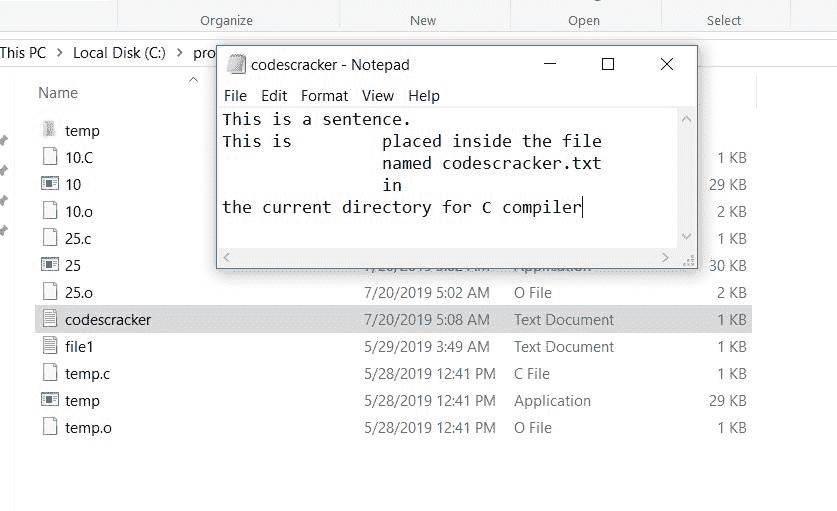
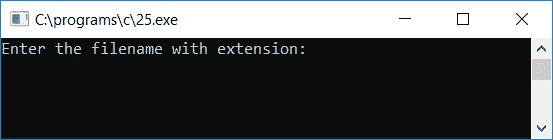
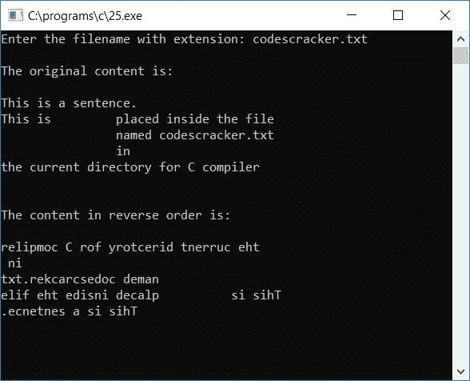
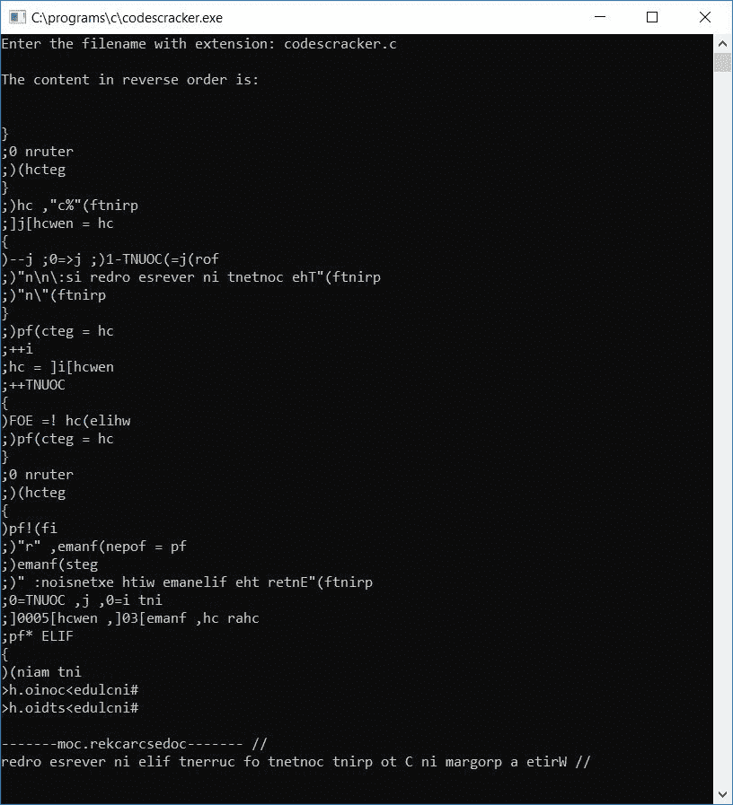

# C 程序：以逆序打印文件内容

> 原文：<https://codescracker.com/c/program/c-program-print-file-content-in-reverse-order.htm>

在本教程中，我们将学习如何用 C 语言创建一个程序，以逆序打印任何给定文件的内容(由用户在运行时打印)。

### 计划前要做的事情

在创建以逆序打印任何文件内容的程序之前。让我们首先创建一个包含一些内容的文件。例如，让我们在任何文本编辑器中编写以下内容，比如**记事本**:

```
This is a sentence.
This is		placed inside the file
		named codescracker.txt
		in 
the current directory for C compiler
```

将文件名为 **codescracker.txt** 的文件保存在当前目录下。下面是文件 及其内容的截图，以及创建和保存文件 **codescracker.txt** 的文件夹:



## 以相反的顺序打印文件内容

问题是，**用 C 写一个程序，以逆序显示一个文件的内容。文件名应该是在运行时**输入的 。这个问题的答案是:

```
#include<stdio.h>
#include<conio.h>
int main()
{
    FILE *fp;
    char ch, fname[30], newch[500];
    int i=0, j, COUNT=0;
    printf("Enter the filename with extension: ");
    gets(fname);
    fp = fopen(fname, "r");
    if(!fp)
    {
        printf("Error in opening the file...\nExiting...");
        getch();
        return 0;
    }
    printf("\nThe original content is:\n\n");
    ch = getc(fp);
    while(ch != EOF)
    {
        COUNT++;
        putchar(ch);
        newch[i] = ch;
        i++;
        ch = getc(fp);
    }
    printf("\n\n\n");
    printf("The content in reverse order is:\n\n");
    for(j=(COUNT-1); j>=0; j--)
    {
        ch = newch[j];
        printf("%c", ch);
    }
    printf("\n");
    getch();
    return 0;
}
```

上面的程序是在 **Code::Blocks** IDE 下编写的，因此在成功构建和运行之后，下面是运行示例:

这个程序将要求用户输入当前目录(上面的源代码保存的地方)中的任何文件名及其扩展名。因为我们已经创建了一个名为 **codescracker.txt** ， 的文件，并将它放在当前目录中。因此，我们可以对该文件进行操作，以了解上述程序输出是如何工作的:



现在输入之前创建的文件的名称，比如说 **codescracker.txt** ，然后按`ENTER` 键，首先以原始顺序查看内容，然后以相反顺序查看输出的相同内容，如下所示:



#### 程序解释

*   接收文件名及其扩展名
*   现在使用 **fopen()** [函数](/c/c-functions.htm) 打开[文件](/c/c-file-io.htm)并将其初始化为任意**文件** [指针](/c/c-pointers.htm) say **fp**
*   函数 **fopen()** 采用两个参数，第一个参数采用扩展名为\ 的文件名，第二个参数告诉文件将以何种模式打开
*   如果文件不存在或打开文件时出现任何错误，请打印错误消息并退出程序
*   否则，如果文件成功打开，则进行下一步操作文件，即以相反的顺序打印其内容
*   首先按原始顺序打印文件内容(按原样)
*   为此，使用 **fgetc()** 函数获取文件的第一个字符，并将第一个字符初始化为任意变量 ，比如说 **ch** 。这里函数 **fgetc()** 接受一个参数，这个参数将是文件指针 say **fp** 。这里的 **fp** 是用户在运行时输入文件名的 文件指针，比如 **codescracker.txt**
*   每当你调用 **fp** 时，名为 **codescracker.txt** 的文件的内容就会被指针调用
*   创建一个 [while 循环](/c/c-while-loop.htm)，该循环一直运行到到达**文件尾** (EOF)
*   也就是说，我们必须将 **while** 循环的条件语句应用为 **ch！= EOF** 。它表示，循环运行 直到 **ch** 的值等于 **EOF** 。e of 的值为 **-1**
*   EOF 表示文件中没有任何内容，或者文件中没有任何内容
*   在 **while** 循环中，我们有一个[变量](/c/c-variables.htm)比如说**计数**(在程序开始时用 0 初始化)来计算文件中出现的字符总数
*   使用 **putchar()** 函数将字符放在输出屏幕上。即 **putchar(ch)** 将 **ch** 的值放在 输出屏幕上
*   现在初始化一个数组中 **ch** 的值，比如说 **newch[]** 。这个数组的索引必须从 0 开始，因此 我们已经在程序开始时用 0 初始化了一个变量，比如说 **i** ，因此我们使用了**newch[I]= ch；** 语句第一次在**内而**循环第一次运行。也就是说，在循环的第一次运行时， **ch** 被初始化 **newch[0]**，在第二次运行时， **ch** 的新值被初始化为 **newch[1]** ，依此类推，因此，在初始化 **ch** 的值之后，我们让 递增 **i** 的值，以在下一次初始化 **ch** 的下一个值
*   永远不要忘记使用 **getc()** 函数获取下一个字符。因此，我们已经在循环的最后初始化了 **getc(fp)** 到 **ch**
*   这样，我们就按原来的顺序打印了文件的内容
*   现在创建另一个循环(这次用**代替**循环),以逆序打印文件内容
*   因为我们有一个名为 **newch[]** 的数组，它包含文件的所有字符(文件的字符，意味着文件的内容)。 我们有一个名为 **COUNT** 的变量，它保存文件内容的长度，或者给定文件中存在的字符总数
*   现在要以相反的顺序打印文件内容，只需为循环创建一个**，它从 **COUNT-1** 运行到 **0****
*   我们从数组的最后一个索引开始循环
*   也就是说，我们先打印最后一个字符，最后打印第一个字符，以逆序打印文件内容
*   例如，如果文件的内容是**这是 codescracker** ，那么这里列出了 **while**循环的分步演练。这里当程序流程进入循环时， **COUNT** 的值每次递增，每次打印 字符或 **ch** 的值，字符逐个初始化到名为 **newch[]** ， 的数组中，变量 **i** 的值每次递增，使用 **ch = getc(fp)扫描下一个字符；**语句 如下面给出的试运行列表所示。我们已经使用 **ch = getc(fp)扫描了文件内容的第一个字符；** 语句在进入 **while** 循环之前，因此 **t** 在第一次运行 **while** 循环之前被初始化为 **ch**
    *   在第一次运行 **while** 循环时:
        **COUNT**的值变为 1
        **t**打印在输出上
        **t**初始化为**newch【0】**
        **I**的值变为 1
        **h**初始化为 **ch**
    *   在第二次运行 **while** 循环时:
        计数**的值**变为 2
        **h**打印在输出上
        **h**初始化为**newch[1]** **I**的值变为 2
        **I**初始化为 **ch**
    *   在第三次运行 **while** 循环时:
        COUNT**的值**变为 3
        **I**打印在输出上
        **I**初始化为**newch【2】** **I**的值变为 3
        **s**初始化为 **ch**
    *   ..........
    *   在第二十次运行 **while** 循环时:
        计数**的值**变为 20
        **r**打印在输出端
        **r**初始化为**newch【19】** **I**的值变为 20
        EOF(-1)初始化为 **ch**
*   因此，要以逆序打印文件的内容，我们必须从最后一个索引开始打印数组的内容
*   即 **COUNT-1** 或 **20-1** 或 **19** 被初始化为 **j** (循环变量)，当 **19** 大于或等于 0 时 进入**进行**循环，并且 **newch[j]** 或 **newch[19]**或**r**并且打印出了 ch 的值****
*   这样，文件的所有内容都会以相反的顺序打印出来

## 逆序打印当前文件的内容

如果你想打印当前文件的内容(比如说 **codescracker.c** )，那么我们必须增加数组的大小，比如说 **newch[]** ，因为上面给出的代码 可能超过 500 个字符。因此，增加大小，使其为 5000 即**newch【5000】**。

**注意** -运行前不要忘记保存文件，输入当前文件名以逆序打印其内容。

让我为你创建一个程序来检查当前文件。这个程序将要求用户输入带有扩展名的文件名，并以相反的顺序打印文件。您可以输入任何带扩展名的文件名。但是这里我们将检查当前文件。

```
#include<stdio.h>
#include<conio.h>
int main()
{
    FILE *fp;
    char ch, fname[30], newch[5000];
    int i=0, j, COUNT=0;
    printf("Enter the filename with extension: ");
    gets(fname);
    fp = fopen(fname, "r");
    if(!fp)
    {
        getch();
        return 0;
    }
    ch = getc(fp);
    while(ch != EOF)
    {
        COUNT++;
        newch[i] = ch;
        i++;
        ch = getc(fp);
    }
    printf("\n");
    printf("The content in reverse order is:\n\n");
    for(j=(COUNT-1); j>=0; j--)
    {
        ch = newch[j];
        printf("%c", ch);
    }
    getch();
    return 0;
}
```

以下是示例运行的最终快照:



[C 在线测试](/exam/showtest.php?subid=2)

* * *

* * *