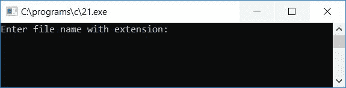
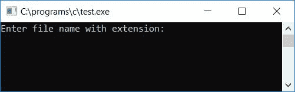

# C 程序：计算文件中字符，空格，制表符，换行符

> 原文：<https://codescracker.com/c/program/c-program-count-character-spaces-tabs-newline-in-file.htm>

在开始写一个 C 程序之前，计算当前目录下任何文件中的字符、空格、制表符和换行符的总数。这里的当前目录是指保存 C 程序文件的目录。

现在让我们创建一个名为 **codescracker.txt** 的文本文件，并编写下面一行:

```
hello	everyone
i am	a file
this is codescracker
there are total of 4 lines present here
```

现在把这个文件放在当前目录中。

这里是文件 **codescracker.txt** 的快照，所有上述文本都写在该文件中(共 4 行)。在这个 截图中，你也可以看到文件保存在当前目录下:


现在这里有一个程序，它计算前面创建的名为 **codescracker.txt** 的文件中的字符、空格、制表符和换行符。你也可以创建任何一个文件来计算这些东西。或者你也可以输入当前目录中已经存在的任何文件名 :

```
#include<stdio.h>
#include<conio.h>
int main()
{
   FILE *fp;
   char ch, fname[30];
   int noOfChar=0, noOfSpace=0, noOfTab=0, noOfNewline=0;
   printf("Enter file name with extension: ");
   gets(fname);
   fp = fopen(fname, "r");
   while(fp)
   {
      ch = fgetc(fp);
      if(ch==EOF)
         break;
      noOfChar++;
      if(ch==' ')
         noOfSpace++;
      if(ch=='\t')
         noOfTab++;
      if(ch=='\n')
         noOfNewline++;
   }
   fclose(fp);
   printf("\nNumber of characters = %d", noOfChar);
   printf("\nNumber of spaces = %d", noOfSpace);
   printf("\nNumber of tabs = %d", noOfTab);
   printf("\nNumber of newline = %d", noOfNewline);
   getch();
   return 0;
}
```

由于上面的程序是在 **Code::Blocks** IDE 下编写的，因此在成功构建并运行之后，下面是运行示例。 这是第一张截图:



现在输入在当前目录中创建的带有扩展名的文件的名称，并按回车键。如果您也将创建具有相同内容的相同文件，那么这里是示例运行的第二个屏幕截图，您也将在输出屏幕上看到:


如你所见，该程序显示了文件 **codescracker.txt** 中的字符、空格、制表符和换行符的总数。

您也可以键入编写当前程序的文件的名称。在我的例子中，程序的名字是 **21.c** ， 让我们键入 **21.c** ，看看会发生什么:


如你所见，该程序还打印出你编写并保存的程序中的字符、制表符、空格、换行符的总数。

**注意** -在输入您当前的程序名作为文件名之前，请确保您已经保存了您的程序。

以下是上述程序中使用的一些主要步骤:

1.  在运行时从用户处获取文件名作为输入。总是要求用户输入文件名及其扩展名，比如 **codescracker.txt** 。这里**。txt** 是文件的扩展名
2.  使用 fopen()函数打开文件，读取文件中内容
3.  创建一个 while 循环并运行这个循环，直到文件指针指向文件的末尾
4.  使用 fgetc()函数从文件中获取字符，并将其初始化为 ch 变量
5.  检查 ch 是否等于文件结尾，如果是，则中断循环，否则继续下一条语句
6.  首先增加负责字符计数的变量的值。因为文件中的一切都是字符
7.  然后检查字符变量是否等于空格，如果等于，则递增负责空格计数的变量的值
8.  以类似的方式，递增 tab 和换行符计数变量的值(如果找到的话)
9.  这样，您总共有四个变量，即 noOfChar、noOfSpace、noOfTab 和 noOfNewline
10.  所有这四个变量保存给定文件中存在的字符、空格、制表符和换行符的总数
11.  在跳出循环之后，不要忘记使用 fclose()函数关闭文件指针
12.  最后打印出所有四个变量的值

你也可以添加更多的代码行来计算额外的东西，如元音，数字等。让我们创建另一个程序，它带有一些额外的代码行及其示例运行。问题是，*用 C 写一个程序，计算用户在运行时*输入 的任何文件中的以下内容:

1.  字符总数
2.  空间总数
3.  选项卡总数
4.  换行符总数
5.  元音总数
6.  辅音总数
7.  数字总数

下面给出的程序是这个问题的答案:

```
#include<stdio.h>
#include<conio.h>
int main()
{
   FILE *fp;
   char ch, fname[30];
   int noOfChar=0, noOfSpace=0, noOfTab=0, noOfNewline=0;
   int noOfVowel=0, noOfConsonant=0, noOfNumber=0;
   printf("Enter file name with extension: ");
   gets(fname);
   fp = fopen(fname, "r");
   while(fp)
   {
      ch = fgetc(fp);
      if(ch==EOF)
         break;
      noOfChar++;
      if(ch>=65 && ch<=90)
      {
         noOfConsonant++;
         if(ch=='A' || ch=='E' || ch=='I' || ch=='O' || ch=='U')
            noOfVowel++;
      }
      if(ch>=97 && ch<=122)
      {
         noOfConsonant++;
         if(ch=='a' || ch=='e' || ch=='i' || ch=='o' || ch=='u')
            noOfVowel++;
      }
      if(ch>=48 && ch<=57)
         noOfNumber++;
      if(ch==' ')
         noOfSpace++;
      if(ch=='\t')
         noOfTab++;
      if(ch=='\n')
         noOfNewline++;
   }
   fclose(fp);
   printf("\nTotal Number of Characters = %d", noOfChar);
   printf("\nTotal Number of Spaces = %d", noOfSpace);
   printf("\nTotal Number of Tabs = %d", noOfTab);
   printf("\nTotal Number NewLines = %d", noOfNewline);
   printf("\nTotal Number Vowels = %d", noOfVowel);
   printf("\nTotal Number of Consonants = %d", noOfConsonant);
   printf("\nTotal Number of Numbers = %d", noOfNumber);
   getch();
   return 0;
}
```

在成功构建和运行之后，这里是上面程序的示例运行的第一个屏幕截图:



现在输入任意文件名。让我们输入当前文件名，在这里我们编写并保存了我们当前的程序，在这种情况下就是**test . c**T3 】,按`ENTER`键可以看到下面的输出:


[C 在线测试](/exam/showtest.php?subid=2)

* * *

* * *