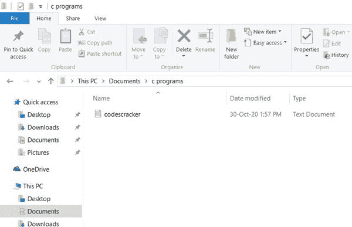
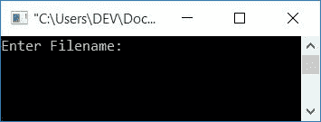
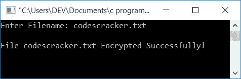
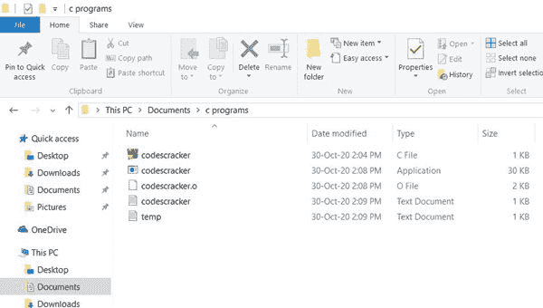
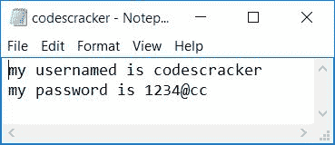
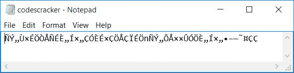
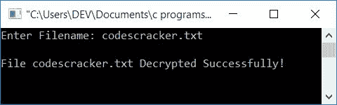

# C 程序：加密和解密文件

> 原文：<https://codescracker.com/c/program/c-program-encrypt-file.htm>

在本文中，您将学习并获得关于如何使用 C 语言加密或解密文件的代码。但是在讨论加密和解密的程序之前，让我们先了解一下当加密或解密一个文件时它实际上意味着什么。

### 加密或解密意味着什么？

数据加密是指将原始数据转换成任何人(公众)都无法阅读或理解的形式或代码。因为加密的数据只能被授权的人访问。这里的授权人是指知道其解密密钥(公式或密码)的人。解密密钥是一个密码或公式，用于将密文转换为明文或原始文本。

**注意** -加密的数据称为密文，而未加密的数据称为明文。

### 用 C 加密或解密文件

加密文件意味着，我们将把明文(文件的原始内容)转换成密文。以便我们存储在文件中的凭证信息被转换成密文。而解密文件意味着将我们的内容恢复到原始形式。

### 计划前要做的事情

在完成下面给出的程序之前，以下是必须要做的事情。因为，我们已经创建了一个程序来加密一个文件，然后创建了另一个程序来解密同一个文件。然后，我们必须在保存程序源代码的同一个目录下创建一个文件。

例如，创建一个名为**的 c 程序文件夹**到父[目录](/operating-system/directories.htm)名为 **的文档**。并创建一个名为 **codescracker.txt** 的[文件](/operating-system/files.htm)，内容如下:

```
my usernamed is codescracker
my password is 1234@cc
```

下面是**文档**的父目录中的 **c 程序**文件夹的快照:



从上面的快照可以清楚的看到，在 文件夹 **c 程序**中有一个名为 **codescracker.txt** 的文件。现在让我们继续使用下面给出的 C 程序来加密这个文件的内容。

## 用 C 语言加密文件的程序

在 C 编程中要加密一个文件，你必须打开这个文件并开始一个字符一个字符地读取它。在读取的时候，创建一些算法来加密文件的内容。并将内容逐个字符地放入临时文件中。最后，将临时文件的内容复制到原始文件，如下面给出的程序所示:

```
#include<stdio.h>
#include<conio.h>
int main()
{
    char fname[20], ch;
    FILE *fps, *fpt;
    printf("Enter Filename: ");
    gets(fname);
    fps = fopen(fname, "r");
    if(fps == NULL)
        return 0;
    fpt = fopen("temp.txt", "w");
    if(fpt == NULL)
        return 0;
    ch = fgetc(fps);
    while(ch != EOF)
    {
        ch = ch+100;
        fputc(ch, fpt);
        ch = fgetc(fps);
    }
    fclose(fps);
    fclose(fpt);
    fps = fopen(fname, "w");
    if(fps == NULL)
        return 0;
    fpt = fopen("temp.txt", "r");
    if(fpt == NULL)
        return 0;
    ch = fgetc(fpt);
    while(ch != EOF)
    {
        ch = fputc(ch, fps);
        ch = fgetc(fpt);
    }
    fclose(fps);
    fclose(fpt);
    printf("\nFile %s Encrypted Successfully!", fname);
    getch();
    return 0;
}
```

这个程序是在 **Code::Blocks** IDE 下编写的。在运行上面的程序之前，首先通过导航**文件- >另存为来保存它 ...**菜单(在代码::块中)。将文件保存到相同的目录中，如本文前面所做的那样，在该目录中保存了 文件 **codescracker.txt** ，即在 **c 程序**文件夹中。

现在，在保存上面的程序后，构建并运行它。因为，我们已经用 **w** 作为文件打开方式(对于 文件 **temp.txt** ，那是用来写的。如果文件不存在，则创建一个具有相同 名称的新文件，即 **temp.txt** (在这种情况下)。下面是上述程序的运行示例:



现在提供文件名为 **codescracker.txt** ，按`ENTER`键加密。这里是 同一个样本运行的第二个快照:



现在你的文件 **codescracker.txt** 被加密了。这里是文件夹 **c 程序**的快照。 你会看到一个新文件 **text.txt** 自动创建在同一个文件夹中:



加密前文件 **codescracker.txt** 的内容为:



而同一个文件， **codescracker.txt** 加密后的内容是:



### 在以前的程序中用于加密文件的算法

这是在上述程序中用来加密文件内容的简单加密密钥， **codescracker.txt** :

```
ch = ch+100;
```

意思是:

*   对于每个字符，我们增加了 100
*   加 100 意味着，如果文件 **codescracker.txt** 的第一个字符是 A .并且作为 A 的 ASCII 值是 **65** 。因此 加上 100 就变成了 165，所以一个 ASCII 值为 165 的字符作为它的第一个字符被放到 **temp.txt** 文件中
*   对 **codescracker.txt** 文件的第二个字符进行处理，应用算法后放入 **temp.txt** 文件
*   对所有角色继续这个过程
*   最后用 **temp.txt** 文件中的内容替换 **codescracker.txt** 文件中的内容。好了

上述程序中包含的其余内容都与文件处理有关，因此要详细了解文件处理，请参考[文件输入/输出](/c/c-file-io.htm)教程。

现在让我们来看一下用上述程序加密的文件的解密程序。

## 用 C 语言解密文件的程序

问题是，**用 C 写一个程序，解密用前面的程序**加密的文件。这个问题的答案如下:

```
#include<stdio.h>
#include<conio.h>
int main()
{
    char fname[20], ch;
    FILE *fps, *fpt;
    printf("Enter Filename: ");
    gets(fname);
    fps = fopen(fname, "w");
    if(fps == NULL)
        return 0;
    fpt = fopen("temp.txt", "r");
    if(fpt == NULL)
        return 0;
    ch = fgetc(fpt);
    while(ch != EOF)
    {
        ch = ch-100;
        fputc(ch, fps);
        ch = fgetc(fpt);
    }
    fclose(fps);
    fclose(fpt);
    printf("\nFile %s Decrypted Successfully!", fname);
    getch();
    return 0;
}
```

下面是上一个程序的运行示例(就在这句话的上面):



现在，如果您将看到文件 **codescracker.txt** ，那么它包含的原始内容是:

```
my usernamed is codescracker
my password is 1234@cc
```

也就是说，如果你将看到你的文件的内容，然后你会发现你的文件的内容将被解密，也就是说，你会得到你的原始内容。

**注意** -你可以使用许多算法和技术(用你自己的)来加密和解密你的文件内容。

#### 其他语言的相同程序

*   [C++加密和解密文件](/cpp/program/cpp-program-encrypt-file.htm)

[C 在线测试](/exam/showtest.php?subid=2)

* * *

* * *