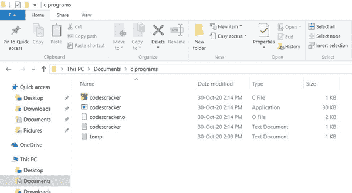
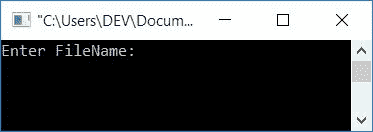
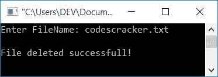
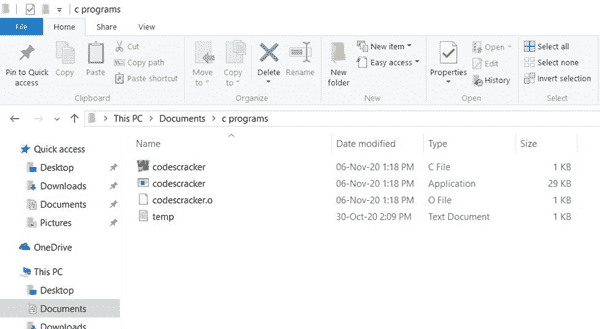

# C 程序：删除文件

> 原文：<https://codescracker.com/c/program/c-program-delete-file.htm>

在本教程中，您将学习并获得关于如何使用 C 程序从 当前目录中删除[文件](/c/c-file-io.htm)的代码。但是在完成这个程序之前，我们必须做几件事。

### 计划前要做的事情

在创建 C 程序之前删除一个文件。让我们首先在保存 C 源代码的目录中创建一个文件。因为我正在把我的源代码文件保存到我的计算机系统的 **文档**目录下的一个名为 **c 程序**的文件夹中。因此这里是文件夹的快照，包含一个名为 **codescracker.txt** 的 文件



您也可以在保存 C 程序的目录中创建一个文件。因为运行程序后，我们必须输入要删除的文件名。到时候我会输入这个文件的名字， **codescracker.txt** 。现在让我们继续这个项目。

## 从当前目录中删除文件

要删除一个文件，使用一个名为 **remove()** 的[函数](/c/c-functions.htm)，它将 string 作为参数。这里，字符串参数 是必须删除的文件的名称(带扩展名)。如果文件被删除，这个函数返回 **0** 。下面是 这个程序，用来删除当前目录中的任何文件:

```
#include<stdio.h>
#include<conio.h>
int main()
{
    int status;
    char fname[20];
    printf("Enter FileName: ");
    gets(fname);
    status = remove(fname);
    if(status==0)
        printf("\nFile deleted successful!");
    else
        printf("\nUnable to delete file!");
    getch();
    return 0;
}
```

这个程序是在 **Code::Blocks** IDE 下构建和运行的。下面是它的运行示例:



现在提供或输入文件名，如 **codescracker.txt** ，按`ENTER`键删除该文件。以下是运行示例:



现在，如果您想查看操作后的快照，这里是当前目录的快照(之前创建的 **c 程序**文件夹的快照):



#### 其他语言的相同程序

*   [C++删除文件](/cpp/program/cpp-program-delete-file.htm)
*   [Java 删除文件](/java/program/java-program-delete-file.htm)
*   [Python 删除文件](/python/program/python-program-delete-files.htm)

[C 在线测试](/exam/showtest.php?subid=2)

* * *

* * *