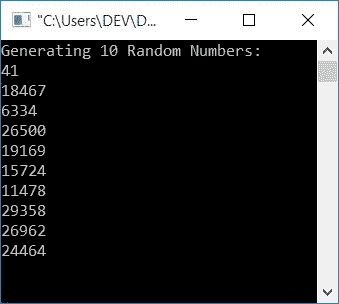
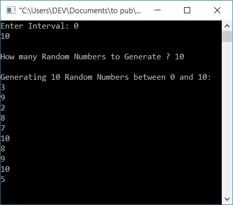
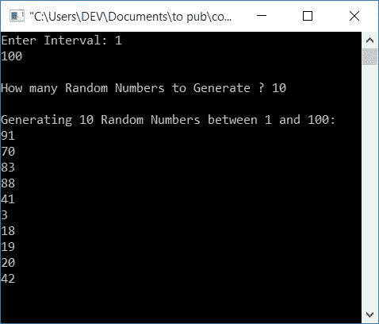

# C 程序：生成随机数

> 原文：<https://codescracker.com/c/program/c-program-generate-random-numbers.htm>

在本文中，您将学习并获得关于生成随机数的代码。第一个程序生成 10 个随机数。第二种在给定范围内产生有限数量的随机数。这里的限制和范围将由用户在运行时输入。

## 生成 10 个随机数

这个程序产生 10 个随机数。函数 **rand()** (来自 **stdlib.h** )用于生成随机数。

```
#include<stdio.h>
#include<conio.h>
#include<stdlib.h>
int main()
{
    int i, rnum;
    printf("Generating 10 Random Numbers:\n");
    for(i=0; i<10; i++)
    {
        rnum = rand();
        printf("%d\n", rnum);
    }
    getch();
    return 0;
}
```

这个程序是在 **Code::Blocks** IDE 下构建和运行的。下面是它的运行示例:



在上面的程序中，循环的[用于执行下面的代码块](/c/c-for-loop.htm)

```
rnum = rand();
printf("%d\n", rnum);
```

10 次。每次执行时，使用 **rand()** 生成一个随机数，并初始化为 **rnum** [变量](/c/c-variables.htm)。并且使用 **printf()** [函数](/c/c-functions.htm)，其值被打印在输出上。

## 生成一个范围内的随机数

这是另一个程序，与上面的相比，它有一个额外的特性。它包括一个功能，允许用户定义数量(多少随机数生成)和限制下，随机数必须生成。

```
#include<stdio.h>
#include<conio.h>
#include<stdlib.h>
#include<time.h>
int main()
{
    int i, rnum, amount, start, end;
    printf("Enter Interval: ");
    scanf("%d%d", &start, &end);
    printf("\nHow many Random Numbers to Generate ? ");
    scanf("%d", &amount);
    printf("\nGenerating %d Random Numbers between %d and %d:\n", amount, start, end);
    srand(time(0));
    for(i=0; i<amount; i++)
    {
        rnum = rand()%(end+1-start)+start;
        printf("%d\n", rnum);
    }
    getch();
    return 0;
}
```

下面给出的示例运行生成 10 个介于 0 和 10 之间的随机数。该值由用户在运行时输入。



如果函数 **srand()** 没有在上述程序中使用，那么在第二次样本运行时(具有相同的用户输入)， 所有 10 个随机数都是相同的。因此，要在每次样本运行时生成新的随机数，请使用 **srand()** 函数。

下面是另一个运行示例，它将生成 10 个介于 1 和 100 之间的随机数:



#### 其他语言的相同程序

*   [C++生成随机数](/cpp/program/cpp-program-generate-random-numbers.htm)
*   [Java 生成随机数](/java/program/java-program-generate-random-numbers.htm)
*   [Python 生成随机数](/python/program/python-program-generate-random-numbers.htm)

[C 在线测试](/exam/showtest.php?subid=2)

* * *

* * *