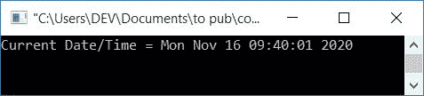
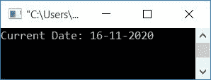
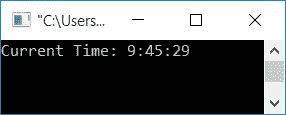
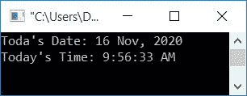

# C 程序：打印日期和时间

> 原文：<https://codescracker.com/c/program/c-program-print-date.htm>

在这篇文章中，您将学习并获得用以下方式打印日期和时间的代码:

*   用默认格式打印日期/时间
*   以 **DD-MM-YYYY** 格式打印日期
*   以**时:分:秒**格式打印时间
*   打印带有月份名称和 AM/PM 格式的日期/时间

## 打印日期和时间

让我们创建一个用默认格式打印当前日期和时间的程序。

```
#include<stdio.h>
#include<conio.h>
#include<time.h>
int main()
{
    time_t tm;
    time(&tm);
    printf("Current Date/Time = %s", ctime(&tm));
    getch();
    return 0;
}
```

这个程序是在 **Code::Blocks** IDE 下构建和运行的。下面是它的运行示例:



**time_t** 不是原始的[数据类型](/c/c-data-types.htm)，而是来自 C ISO 库的数据类型，用于存储系统的时间值。这个系统的时间值是从名为 **time()** 的标准库函数返回的。

[函数](/c/c-functions.htm) **ctime()** 根据 **tm** (参数)定时器返回一个代表本地 时间的[字符串](/c/c-strings.htm)。 **ctime()** 函数在 **time.h** 头文件中定义。

## 以日-月-年格式打印日期

现在让我们将当前日期格式化为 **DD-MM-YYYY** 格式，其中 *DD* 表示当天的日期(1-31)*MM*表示 月(1-12)*YYYY*表示年份。

```
#include<stdio.h>
#include<conio.h>
#include<time.h>
int main()
{
    time_t t;
    t = time(NULL);
    struct tm tm = *localtime(&t);
    printf("Current Date: %d-%d-%d", tm.tm_mday, tm.tm_mon+1, tm.tm_year+1900);
    getch();
    return 0;
}
```

下面是它的示例输出:



函数 **localtime()** 返回系统的本地时间。它在 **time.h** 头文件中定义。 它接受一个代表指向 **time_t** 对象的[指针](/c/c-pointers.htm)的参数。并且 返回一个指向 **struct tm** 对象的指针。现在使用[结构](/c/c-structures.htm)，对象 **tm** 可以分别访问数据成员 say **tm_mday** 、 **tm_mon** 和 **tm_year** 。打印它的 值作为输出，即日期、月份和年份。

**注意-***TM _ year*字段是相对于所有 POSIX 兼容平台上的 *1900* 的。因此我们 增加了 1900。如果没有添加 1900，那么它将打印 120 作为当前年份，而不是 2020，也就是说，从 1900 年到现在已经有 120 年了。

**注-***TM _ mon*从 1 开始显示，而不是从 0 开始。因为，如果 1 没有被加上 ，那么对于 1 月，它将显示 0 <sup>到</sup>月(开始或每年的第一个月)。

## 以 HH:MM:SS 格式打印时间

让我们创建与前一个程序相同的程序，对打印时间稍作修改，用 **HH:MM:SS** 格式 代替日期。这里 *HH* 代表小时， *MM* 代表分钟， **SS** 代表秒。

```
#include<stdio.h>
#include<conio.h>
#include<time.h>
int main()
{
    time_t t;
    t = time(NULL);
    struct tm tm;
	tm = *localtime(&t);
    printf("Current Time: %d:%d:%d", tm.tm_hour, tm.tm_min, tm.tm_sec);
    getch();
    return 0;
}
```

下面是它的示例输出:



## 打印带有月份名称的日期/时间& AM/PM

该程序使用[开关盒](/c/c-switch-statement.htm)匹配月份号并打印其名称。 例如，如果月份号是 1，则打印为 **Jan** ，如果是 2，则打印为 **Feb** 和 等等。对于时间，我们使用了 [if-else 语句](/c/c-if-statement.htm)来匹配当前 小时值是否大于 12。如果大于 12，则打印 PM，否则打印 AM。

```
#include<stdio.h>
#include<conio.h>
#include<time.h>
int main()
{
    time_t t;
    t = time(NULL);
    struct tm tm = *localtime(&t);
    int m;
    printf("Today's Date: %d ", tm.tm_mday);
    m = tm.tm_mon+1;
    switch(m)
    {
        case 1:
            printf("Jan, ");
            break;
        case 2:
            printf("Feb, ");
            break;
        case 3:
            printf("Mar, ");
            break;
        case 4:
            printf("Apr, ");
            break;
        case 5:
            printf("May, ");
            break;
        case 6:
            printf("June, ");
            break;
        case 7:
            printf("July, ");
            break;
        case 8:
            printf("Aug, ");
            break;
        case 9:
            printf("Sep, ");
            break;
        case 10:
            printf("Oct, ");
            break;
        case 11:
            printf("Nov, ");
            break;
        case 12:
            printf("Dec, ");
            break;
    }
    printf("%d", tm.tm_year+1900);
    printf("\nToday's Time: ");
    if(tm.tm_hour>=12)
    {
        if(tm.tm_hour==12)
            printf("12");
        else
            printf("%d", tm.tm_hour-12);
        printf(":%d:%d PM", tm.tm_min, tm.tm_sec);
    }
    else
        printf("%d:%d:%d AM", tm.tm_hour, tm.tm_min, tm.tm_sec);
    getch();
    return 0;
}
```

以下是上述程序产生的输出示例:



#### 其他语言的相同程序

*   [C++打印日期](/cpp/program/cpp-program-print-date.htm)
*   [Java 打印日期](/java/program/java-program-print-time-date.htm)
*   [Python 打印日期](/python/program/python-program-print-date-time.htm)

[C 在线测试](/exam/showtest.php?subid=2)

* * *

* * *