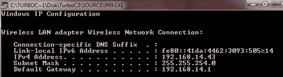
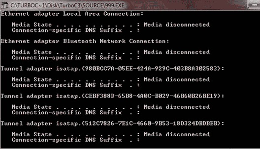
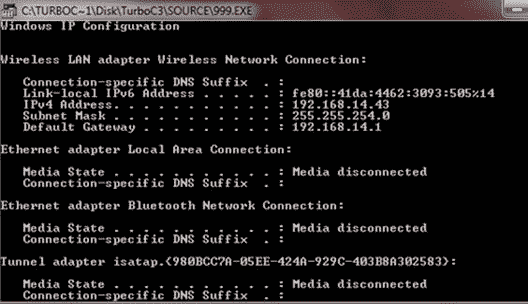
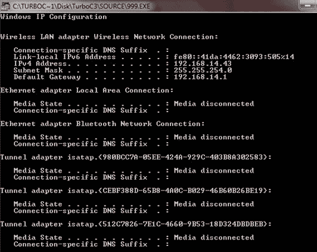

# C 程序：获取 IP 地址

> 原文：<https://codescracker.com/c/program/c-program-get-ip-address.htm>

## 获取 C 中的 IP 地址

要在 C 编程中查找或获取 IP 地址，使用 **system()** 函数，并在其中放置命令来查找或获取 IP 地址

## 获取 IP 地址的 c 编程代码

下面的 C 程序获取 IP 地址并显示在屏幕上:

```
#include<conio.h>
#include<stdlib.h>
void main()
{
   clrscr();
   system("C:\\Windows\\System32\\ipconfig");
   getch();
}
```

当编译并执行上述 c 程序时，它将产生以下结果:



您也可以从源文件夹而不是 BIN 文件夹中检查它(在源文件夹中，您可以找到您的程序名，单击它可以查看关于您的 ip 地址的输出，输出示例如下)。这是为“Turbo C”用户准备的。以上 C 编程示例输出(输出的下半部分):



以上 C 编程示例输出(输出的上半部分):



以上 C 编程示例输出(输出的完整部分):



### 其他编程语言中的相同程序

*   [C++ 获取 IP 地址](/cpp/program/cpp-program-get-ip-address.htm)
*   [Java 获取 IP 地址](/java/program/java-program-get-ip-address.htm)
*   [Python 获取 IP 地址](/python/program/python-program-get-ip-address.htm)

[C 在线测试](/exam/showtest.php?subid=2)

* * *

* * *