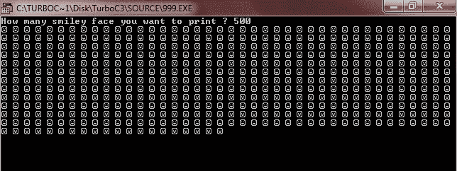

# 在屏幕上打印笑脸的 c 程序

> 原文：<https://codescracker.com/c/program/c-program-print-smiling-face-on-screen.htm>

用 C 编程在屏幕上打印笑脸，用笑脸的 ASCII 值，就是 1。

下面的 C 程序要求用户输入他/她想要在屏幕上打印的笑脸数量，以在屏幕上打印所需数量的笑脸:

```
#include<stdio.h>
#include<conio.h>
void main()
{
   clrscr();
   int sml=1, i, limit;
   printf("How many smiley face you want to print ? ");
   scanf("%d",&limit);
   for(i=0; i<limit; i++)
   {
      printf("%c ",sml);
   }
   getch();
}
```

当编译并执行上述 c 程序时，它将产生以下结果:



您也可以根据自己的需要格式化笑脸的输出屏幕

### 其他编程语言中的相同程序

您可能也喜欢用其他编程语言编写相同程序:

*   [C++打印笑脸](/cpp/program/cpp-program-print-smiling-face-on-screen.htm)

[C 在线测试](/exam/showtest.php?subid=2)

* * *

* * *