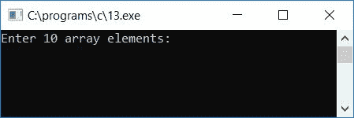
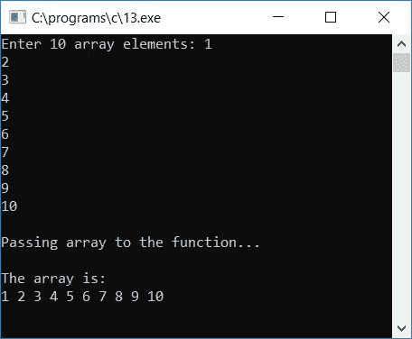
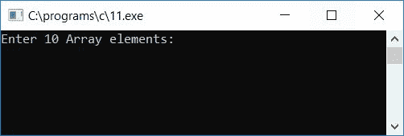
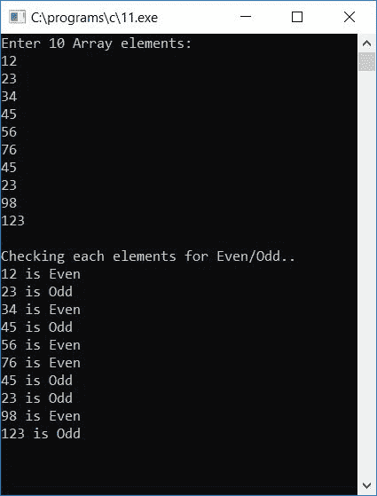
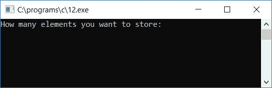
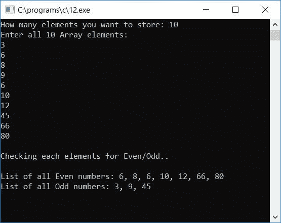

# 将数组传递给函数的 c 程序

> 原文：<https://codescracker.com/c/program/c-program-pass-array-to-function.htm>

在本教程中，我们将学习如何将单个数组元素或整个[数组](/c/c-arrays.htm)传递给 c 语言中的 [函数](/c/c-functions.htm)。首先，我们创建了一个将整个数组传递给函数的程序。然后创建了一个将单个数组元素传递给函数的 程序。

## 将整个数组传递给函数

让我们用下面给出的程序来学习如何将整个数组传递给 c 中的任何函数。你可以像在 main 函数中一样在函数中使用传递的数组

```
#include<stdio.h>
#include<conio.h>
void func(int arr[]);
int main()
{
    int arr[10], i;
    printf("Enter 10 array elements: ");
    for(i=0; i<10; i++)
        scanf("%d", &arr[i]);
    printf("\nPassing array to the function...\n");
    func(arr);
    getch();
    return 0;
}
void func(int arr[])
{
    int i;
    printf("\nThe array is:\n");
    for(i=0; i<10; i++)
        printf("%d ", arr[i]);
}
```

从上面的程序中可以看出，整个数组(数组中的所有内容)被传递到一个名为 **func()** 的函数中，并在该函数中执行操作。

上面的程序是在 **Code::Blocks** IDE 中编写的，因此在成功构建和运行之后，下面是示例输出:



现在提供任意 10 个数组元素(数字)然后按`ENTER`键。在这之后，你会得到一个 消息，说**将数组传递给函数...**然后将完整的数组传递给名为 **func()** 的函数。在该函数中，所有 10 个输入的数组元素都打印在输出屏幕上， 这里是示例运行的第二个屏幕截图:



#### 程序解释

*   接收任意 10 个数字作为 10 个数组元素，并在数组中逐个存储 say **arr[]**
*   也就是说，第一个数字存储在 **arr[0]** 中，第二个数字存储在 **arr[1]** ， 中，第三个数字存储在 **arr[2]** 中，....，第十个数字存储在 **arr[9]** 中
*   现在将数组传递给名为 **func** 的函数
*   要将数组传递给函数，只需写出数组的名称作为函数的参数，即 **func(arr)** ，这里 **func()** 是函数的名称， **arr** 是数组的名称
*   永远不要忘记在 **main()** 函数之前声明函数，或者在调用函数之前声明 **func()**
*   用**func(arr)；语句，数组 **arr** 被传递给程序 的函数定义部分**
*   在函数定义中，我们在输出屏幕上打印出了数组 **arr** 的所有 10 个元素

## 将单个数组元素传递给函数

现在让我们创建另一个程序，将单个数组元素逐个传递给一个函数。

```
#include<stdio.h>
#include<conio.h>
void check(int num);
int main()
{
    int arr[10], i;
    printf("Enter 10 Array elements:\n");
    for(i=0; i<10; i++)
        scanf("%d", &arr[i]);
    printf("\nChecking each elements for Even/Odd..\n");
    for(i=0; i<10; i++)
        check(arr[i]);
    getch();
    return 0;
}
void check(int num)
{
    if(num%2==0)
        printf("%d is Even\n", num);
    else
        printf("%d is Odd\n",num);
}
```

正如您在这里看到的，数组的所有 10 个元素都被传递给函数 **check()** ，该函数检查 元素是偶数还是奇数。下面是它的运行示例:



现在输入所有 10 个数字(数组元素)然后按`ENTER`。以下是示例输出:



#### 程序解释

*   接收任意 10 个数组元素
*   例如，假设用户提供了数组元素 1，2，3，..., 10
*   因此，第一个数字 **1** 存储在 **arr[0]** ，第二个数字 **2** 存储在 **arr[1]** ， 第三个数字 **3** 存储在 **arr[2]** ，...，并且第十个元素即 **10** 被存储在 **arr[9]**
*   现在我们已经打印了一条消息**检查每个元素的偶数/奇数**
*   在这个消息之后，我们为循环创建了一个**，它从 0 运行到 9，检查数组 中出现在索引号 0，1，2，...、和 9**
*   在循环的**第一次运行时， **check(arr[i])** 或 **check(arr[0])** 或 **check(1)** 传递给 函数 **check()** 。也就是说，数字 1(第一个数字或出现在第 0 个<sup>到第</sup>个数组索引处的数字)被传递给名为 **check()** 的函数**
*   在函数内部，我们使用了 **if-else** 语句来检查偶数/奇数
*   也就是说，如果 **num%2** ( **num** 变量保存本次为**1**) 或 **1%2** 的函数传递的数是否等于 0
*   如果是，则将数字打印为偶数，否则打印为奇数
*   打印偶数或奇数后，程序流程再次进入 **main()** 函数，而循环变量的**比如 **i** 递增并变为 1，当 1 大于 10 时，程序流程再次进入**循环的**循环**
*   再次调用函数**检查(arr[i])** 或**检查(arr[1])** 或**检查(2)** 。也就是说，数字 2 会将 传递给函数 **check**
*   在函数内部，2 被初始化为 **num** 变量，并检查 2 是否能被 2 整除，且不留下任何 余数
*   如果是，则将数字打印为偶数，否则打印为奇数
*   这样，进行类似的操作，直到循环的条件**评估为假，即直到 **i** (循环变量)的值 变为 10，并且条件 **i < 10** 或 **10 < 10** 评估为假，并且程序 流程退出循环**
*   因此，我们将所有给定的 10 个数组元素一个接一个地传递给函数，检查并打印为偶数或奇数

下面是上述程序的修改版本。允许用户在输入元素之前定义数组的大小:

```
#include<stdio.h>
#include<conio.h>
void checkEven(int e);
void checkOdd(int o);
static int n1=0, n2=0;
int main()
{
    int arr[100], i, size;
    printf("How many elements you want to store: ");
    scanf("%d", &size);
    printf("Enter all %d Array elements:\n", size);
    for(i=0; i<size; i++)
        scanf("%d", &arr[i]);
    printf("\nChecking each elements for Even/Odd..\n");
    printf("\nList of all Even numbers: ");
    for(i=0; i<size; i++)
        checkEven(arr[i]);
    printf("\nList of all Odd numbers: ");
    for(i=0; i<size; i++)
        checkOdd(arr[i]);
    getch();
    return 0;
}
void checkEven(int e)
{
    if(e%2==0)
    {
        if(n1==0)
            printf("%d", e);
        else
            printf(", %d", e);
        n1++;
    }
}
void checkOdd(int o)
{
    if(o%2 != 0)
    {
        if(n2==0)
            printf("%d", o);
        else
            printf(", %d", o);
        n2++;
    }
}
```

该程序设计为在运行时询问用户他/她想要存储多少个元素，比如说 **10** ，然后要求输入所有元素(比如说 10 个元素)。最后，程序会列出 所有的偶数和奇数。让我们通过下面给出的示例运行来看看它的输出:



现在输入 10 作为数组的大小，然后提供所有的 10 个元素，然后按`ENTER`查看所有的 偶数和奇数:



**注意**-**静态**类型的变量在整个程序中保持或记忆其先前的值。

[C 在线测试](/exam/showtest.php?subid=2)

* * *

* * *