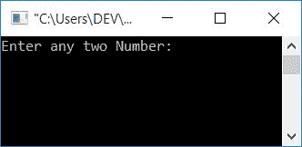
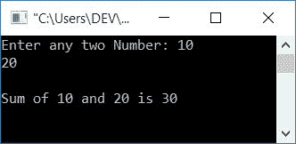
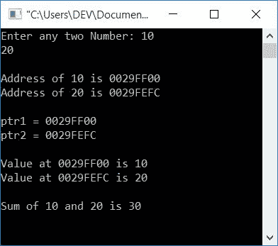

# 用指针将两个数相加的 c 程序

> 原文：<https://codescracker.com/c/program/c-program-add-two-numbers-using-pointers.htm>

在这篇文章中，你将学习并获得用 C 语言使用指针将两个数相加的代码。所以问题是，**用 C 写一个程序 ,把用户(在运行时)用指针**输入的任意两个数相加。

这里我们只讨论 C 语言中任意两个数相加时指针的简要说明，要详细了解指针，请参考 C 教程中的[指针。让我们先看看这个程序，然后再进一步解释。](/c/c-pointers.htm)

## C 语言中使用指针的加法

要在 C 编程中使用指针将两个数字相加，您必须要求用户输入任意两个数字，然后使用指针执行操作，如下面的程序所示:

```
#include<stdio.h>
#include<conio.h>
int main()
{
    int num1, num2, sum;
    int *ptr1, *ptr2;
    printf("Enter any two Number: ");
    scanf("%d%d", &num1, &num2);
    ptr1 = &num1;
    ptr2 = &num2;
    sum = *ptr1 + *ptr2;
    printf("\nSum of %d and %d is %d", *ptr1, *ptr2, sum);
    getch();
    return 0;
}
```

这个程序是在 **Code::Blocks** IDE 下编写的。以下是示例运行的初始快照:



现在提供任意两个数字作为输入，比如说 **10** 和 **20** ，并按下**回车键**来查看输出，如下图 所示:



在上面的程序中，有两个重要的操作符。 **&** (与号)和 ***** (星号)运算符。 **&** 称为操作符的**地址， ***** 称为地址**操作符的**值。**

#### 程序解释

*   声明三个[变量](/c/c-variables.htm)表示 **int** (整数)类型的 **num1、num2、**和 **sum**
*   这里前两个变量存储用户在运行时输入的两个数字
*   而第三个变量， **sum** 将用指针来存储给定的两个数的总和
*   声明两个变量表示 **ptr1** 和 **ptr2** 的 **int** 指针(整数指针)类型
*   要将任何变量声明为指针类型变量，只需将 ***** (星号)放在变量前面，不包括任何空格
*   在运行时扫描两个数。即要求用户输入任意两个数字，并将其保存在 **num1** 和 **num2** 变量中
*   使用**&** (**地址)[运算符](/c/c-operators.htm)初始化第一个变量 **num1** 到 **ptr1** 的地址。**
*   使用 **&** 【地址】 运算符初始化第二个变量 **num2** 到 **ptr2** 的地址。
*   使用 ***** (地址值)运算符执行运算
    **值在** ptr1 + **值在** ptr2
    。由于 **ptr1** 和 **ptr2** 都保存了输入的两位数的地址。最后 将其初始化为变量 **sum** 保存用户给定的两个数的相加结果
*   打印**和**的值作为输出

这里，我们使用 ( &)运算符的**地址，将第一个数字的地址初始化为第一个指针，将第二个数字的地址初始化为第二个指针。然后，我们在地址** (*)操作符处使用**值将这两个数相加， 将其初始化为变量 **sum** 。最后打印出**和**的值作为加法结果。**

这是另一个程序，让你在仔细观察它的输出后，对指针有全面的了解。让我们来看看这个程序:

```
#include<stdio.h>
#include<conio.h>
int main()
{
    int num1, num2, sum;
    int *ptr1, *ptr2;
    printf("Enter any two Number: ");
    scanf("%d%d", &num1, &num2);
    printf("\nAddress of %d is %p", num1, &num1);
    printf("\nAddress of %d is %p", num2, &num2);
    ptr1 = &num1;
    ptr2 = &num2;
    printf("\n\nptr1 = %p", ptr1);
    printf("\nptr2 = %p", ptr2);
    printf("\n\nValue at %p is %d", ptr1, *ptr1);
    printf("\nValue at %p is %d", ptr2, *ptr2);
    sum = *ptr1 + *ptr2;
    printf("\n\nSum of %d and %d is %d", *ptr1, *ptr2, sum);
    getch();
    return 0;
}
```

上述程序的输出显示在下面给出的快照中:



格式说明符 **%p** 用于内存地址的标准符号。

#### 其他语言的相同程序

*   C++使用指针将两个数相加
*   [Java 使用指针](/java/program/java-program-add-two-numbers-using-pointers.htm)将两个数相加

[C 在线测试](/exam/showtest.php?subid=2)

* * *

* * *