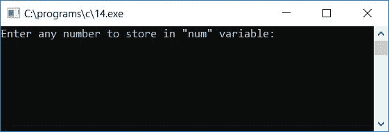
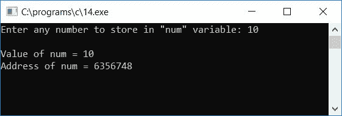
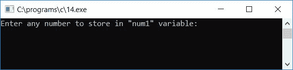
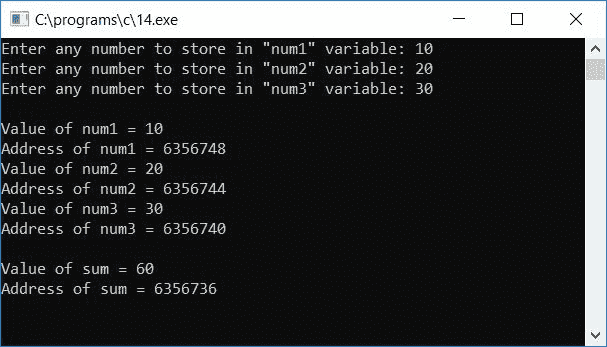
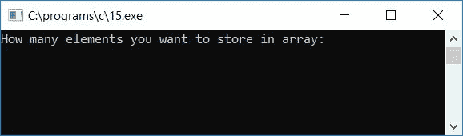
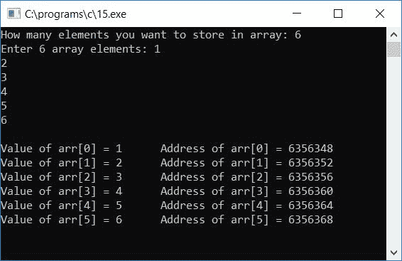
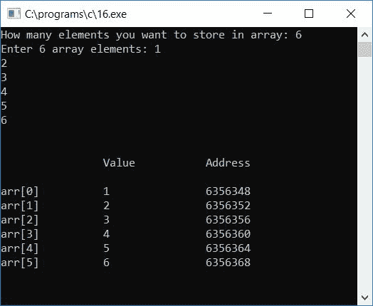
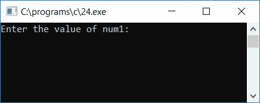
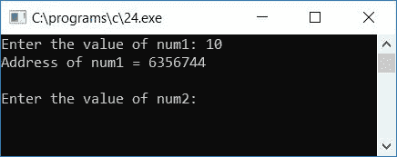
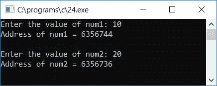

# 打印变量地址的 c 程序

> 原文：<https://codescracker.com/c/program/c-program-print-address-of-variable.htm>

在本教程中，我们将学习如何用 C 语言创建一个打印任何[变量](/c/c-variables.htm)的地址的程序。 最后我们还将学习使用[指针](/c/c-pointers.htm)在 C 中打印变量的地址。

```
#include<stdio.h>
#include<conio.h>
int main()
{
    int num;
    printf("Enter any number to store in \"num\" variable: ");
    scanf("%d", &num);
    printf("\nValue of num = %d", num);
    printf("\nAddress of num = %u", &num);
    getch();
    return 0;
}
```

由于程序是在 **Code::Blocks** IDE 下编写的，因此下面是成功构建和运行后的运行示例:



输入任意数字，如 **10** 并按`ENTER`键将其存储在变量 **num** 中。 您将看到 **num** 变量的值及其地址:



#### 程序解释

*   在变量中接收来自用户的任意数字，比如 **num**
*   在输出屏幕上打印出它的值
*   并打印变量地址 say **num**
*   我们必须使用格式说明符作为 **%u** ，并在 变量前添加**地址(& )** [运算符](/c/c-operators.htm)比如 **num** ，即**num**将给出 **num** 变量的地址

### 打印所有变量的地址

现在让我们修改上面的程序。这个程序总共使用了三个变量，比如说 **num1** 、 **num2** 和 **num3** ，还有一个额外的 变量，比如说 **sum** (存储给定三个数的求和结果)。看看变量的地址是如何一个一个变化的。

```
#include<stdio.h>
#include<conio.h>
int main()
{
    int num1, num2, num3, sum;
    printf("Enter any number to store in \"num1\" variable: ");
    scanf("%d", &num1);
    printf("Enter any number to store in \"num2\" variable: ");
    scanf("%d", &num2);
    printf("Enter any number to store in \"num3\" variable: ");
    scanf("%d", &num3);
    printf("\nValue of num1 = %d", num1);
    printf("\nAddress of num1 = %u", &num1);
    printf("\nValue of num2 = %d", num2);
    printf("\nAddress of num2 = %u", &num2);
    printf("\nValue of num3 = %d", num3);
    printf("\nAddress of num3 = %u", &num3);
    sum = num1+num2+num3;
    printf("\n\nValue of sum = %d", sum);
    printf("\nAddress of sum = %u", &sum);
    getch();
    return 0;
}
```

下面是它的运行示例:



现在输入任意三个数字分别存储在变量 **num1** 、 **num2** 和 **num3** 中。并按下`ENTER` 键，在输出截图上看到所有三个变量的值及其地址。我们创建了另一个名为 **sum** 的变量来存储所有三个变量的总和，然后在输出屏幕上打印出来作为它的值和地址:



### 打印数组中变量的值和地址

问题是，**用 C 写一个程序，打印一个数组**里面所有变量的值和地址。这个问题的答案是:

```
#include<stdio.h>
#include<conio.h>
int main()
{
    int arr[100], max, i;
    printf("How many elements you want to store in array: ");
    scanf("%d", &max);
    printf("Enter %d array elements: ", max);
    for(i=0; i<max; i++)
        scanf("%d", &arr[i]);
    printf("\n");
    for(i=0; i<max; i++)
    {
        printf("Value of arr[%d] = %d \t Address of arr[%d] = %u",i,arr[i],i,&arr[i]);
        printf("\n");
    }
    getch();
    return 0;
}
```

下面是上述程序的运行示例:



现在输入任意数字，比如说 **6** ，作为将要存储在数组 **arr[]** 中的元素总数。然后输入所有 6 个数组元素，并按`ENTER`键查看以下输出:



### 以表格形式打印值和地址

这是上述程序的修改版本。该程序以管状形式打印数据(值及其地址):

```
#include<stdio.h>
#include<conio.h>
int main()
{
    int arr[100], max, i;
    printf("How many elements you want to store in array: ");
    scanf("%d", &max);
    printf("Enter %d array elements: ", max);
    for(i=0; i<max; i++)
        scanf("%d", &arr[i]);
    printf("\n\n\t\tValue\t\tAddress\n\n");
    for(i=0; i<max; i++)
    {
        printf("arr[%d]\t\t%d\t\t%u",i,arr[i],&arr[i]);
        printf("\n");
    }
    getch();
    return 0;
}
```

下面是它的运行示例:



## 使用指针

现在让我们用 C 语言创建另一个程序，它使用指针打印任何变量的地址:

```
#include<stdio.h>
#include<conio.h>
int main()
{
    int num1, *ptr1, num2, *ptr2;
    printf("Enter the value of num1: ");
    scanf("%d", &num1);
    ptr1 = &num1;
    printf("Address of num1 = %u", &ptr1);
    ptr2 = &num2;
    printf("\n\nEnter the value of num2: ");
    scanf("%d", &num2);
    ptr2 = &num2;
    printf("Address of num2 = %u", &ptr2);
    getch();
    return 0;
}
```

这是示例运行的第一个快照:



为 **num1** 变量提供任意数字，按`ENTER`键查看该变量的地址，如下图所示:



现在再次为 **num2** 变量提供任意数字，并按`ENTER`键查看第二个变量的地址，如下所示:



#### 程序解释

*   声明任意两个整型指针变量
*   要将任何变量声明为指针变量，只需在变量前添加(*) 运算符的**值**
*   即 ***ptr1** 和 ***ptr2** 是指针类型的两个变量
*   去掉这两个变量前的 ***** 后，这两个变量都变成正常变量
*   现在接收一个数字作为输入，并将其存储在变量 **num1** 中
*   由于指针变量是用来指向变量的地址，因此要初始化任何变量的地址，只需用 **& num1** 将 **num1** 变量的地址初始化为指针
*   因此，语句**ptr 1 =&num 1；**声明， **num1** 变量的地址将 初始化为 **ptr1** 指针变量
*   现在要打印 **num1** 变量的值或地址，使用 **ptr1** 指针变量
*   使用 **& ptr1** 打印地址，使用 ***ptr1** 打印数值。这里 **&** 为 称为操作符的**地址， ***** 称为**操作符的**值**
*   永远不要忘记使用 **%u** 格式说明符来打印任何变量的地址

[C 在线测试](/exam/showtest.php?subid=2)

* * *

* * *