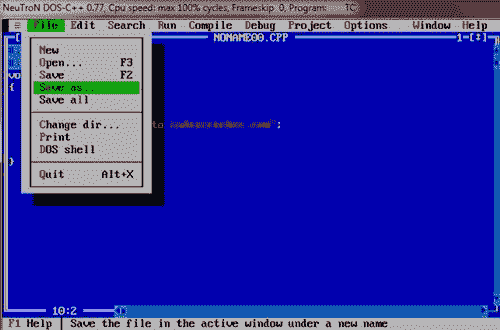

# C++ 环境设置

> 原文：<https://codescracker.com/cpp/cpp-executing-program.htm>

可以使用任何文本编辑器创建 C++ 程序。对于 C++ 的 UNIX 实现，vi 或 ed 文本编辑器可用于创建和编辑源代码。对于 C++ 的 DOS 实现，可以使用 edlin 或任何其他编辑器。一些系统如 Turbo C++ 和 Borland C++ 为开发程序提供了集成开发环境(ide)。这些 ide 在一个包中集成了打字、编辑、搜索、编译等功能。

C++ 程序文件应该有一个适当的文件扩展名，这取决于它被开发/编译成的 C++ 的实现。C++ 实现使用几个扩展，例如。c，。抄送，。cpp，。cxx 等。TurboC++ 和 Borland C++ 使用。C++ 程序的 cpp。Zortech C++ 使用扩展。cxx 和 UNIX 美国电话电报公司版本使用。c 和。抄送分机。

## 使用 Borland C++ 编译和执行 C++ 程序

为了用 Borland C++ 编写和编译程序，Borland C++ 软件必须在硬盘或软盘上可用。引导系统后，一旦屏幕上出现 dos 提示符，请执行以下步骤:

1.  将 Borland C++ 程序磁盘的工作副本放入软盘驱动器中(如果软盘上有 BC++)，或者转到 Borland C++ 子目录(如果硬盘上有 BC++)。
2.  在 dos 提示符下键入 BC，然后按 Enter 键。会带你到 BC++ 的 IDE(集成开发环境)。
    IDE 最上面一行显示其菜单，包含选项≡文件、编辑、搜索、运行、编译、调试、 项目、选项、窗口、帮助。通过按 Alt 键和 菜单选项的高亮字母，可以进入菜单上的每个选项。按 Alt+空格键可以使用系统菜单选项(≡)。具体可以参考 Borland C++ 的用户手册。
3.  然后，要编写一个程序，按 Alt+E 启动编辑器，然后逐行键入您的 C++ 程序
4.  要保存你的程序，然后，在键入程序后，按 Alt+F 激活文件菜单，按 S 保存程序文件，键入你想给你的程序文件的程序名。你不需要延期。cpp 自 Borland C++ 自动添加，然后按回车键，你的文件就保存了。
5.  要编译程序，请按 Alt+F9 组合键，或者也可以按 Alt+C，然后按 C 或 enter 键。
6.  要运行您的程序，请按 ctrl+F9 组合键或 Alt+R，然后按 R 或 enter 键。
    当你执行(运行)你的程序时，它等待用户输入(如果需要的话),并执行所有的指令。
7.  要查看程序输出，请按组合键 Alt+F5。任何按键或点击都会把你带回 Borland C++ IDE。

## 使用 TurboC++ 编译和执行 C++ 程序

现在让我们看看如何将 C++ 编程源代码保存在一个文件中，以及如何使用 TurboC++ 编译器编译和运行它。以下是简单的步骤:

1.  从[下载 TurboC++ 编译器(推荐)下载 TurboC++](http://liquidtelecom.dl.sourceforge.net/project/turbocforwindows-9/Turbo%20C%2B%2B%204.0%20Windows%207%20Windows%208%2064Bit%20Version.exe)
2.  在你的系统上安装它
3.  现在打开 TurboC++ 并在里面输入你的 C++ 程序。
4.  输入完整的 C++ 程序后，按 Alt+F 键并转到保存按钮，输入程序名，然后按。cpp 分机，然后按回车键。现在你的程序将被保存在 C 驱动器的 TurboC++ 的 BIN 目录下。
5.  现在要编译 C++ 程序，只需按 F9 键，如果出现错误，就查看代码进行更正并重新编译。
6.  如果没有错误出现，然后按 Ctrl+F9 键运行程序并观察结果。

### 编译器的角色

编译器工作的一部分是分析程序代码的“正确性”。如果程序的意思是正确的，那么编译器就不能发现错误(例如，如果使用了不同的语句等)。)，但编译器肯定能检测出程序形式的错误。一些常见的程序错误形式有:

1.  语法错误——当编程语言的规则被误用时，即当 C++ 的语法规则被误用时，就会出现语法错误。
2.  语义错误——当语句没有意义时，就会出现语义错误。语义指的是给出一个陈述的意义的一套规则。例如，语句。
3.  类型错误-C++ 中的数据有一个关联的数据类型。例如，值 7 是一个整数。“a”是一个字符常量，“hello”是一个字符串。如果一个函数被赋予了错误的数据类型，编译器就会发出类型错误的信号。
4.  运行时错误(执行错误)——运行时错误是在程序执行过程中发生的。这是由于一些非法操作的发生或程序执行所需的条件不存在。
5.  逻辑错误——逻辑错误是导致程序产生不正确或不希望的输出的错误。

## C++ 环境逐步设置- TurboC++

首先下载 TurboC++ 编译器(上面提供的链接)，然后将其安装在您的系统上，并打开 TurboC++ 编译器，下面是在您的系统上打开 TurboC++ 编译器后出现的窗口:


现在转到文件，点击新建(或简单地按 Alt+F，然后输入)。做完这些后，窗户就打开了。如果您发现系统上的窗口没有全屏显示，那么只需按 Alt+ENTER 键即可使窗口全屏显示。：


现在，要使蓝色占据全屏或在全屏模式下键入您的 C++ 程序，只需按 F5 功能键。下图显示了这一点:


现在在上图所示的窗口中键入这个 C++ 程序:

```
#include<iostream.h>
#include<conio.h>
void main()
{
   clrscr();

   cout<<"Welcome to codescracker.com";

   getch();
}
```

像这样键入上面的代码:


在编译任何 C++ 程序之前，首先保存类型化的 C++ 程序代码。要保存，只需点击文件，然后在另存为，并键入程序名称与。cpp 分机，然后像这样按回车键:



现在输入程序名。cpp 扩展，如下图所示:


在键入程序名并按 ENTER 键后，下图显示了下一个输出。请查看显示在中间窗口顶部的程序名称:


现在要编译你的 C++ 程序，只需按 F9 键，编译成功后，如下图所示:


按回车键或任意键。要运行 C++ 程序，只需按 Ctrl+F9。完成此操作后，程序将产生以下输出:


现在按任意键，返回代码窗口，开始用 C++ 编程。

### 更多示例

这里列出了更多的 C++ 程序，您可以在上面进行实验:

*   [打印 Hello World](/cpp/program/cpp-program-print-hello-world.htm)
*   [获取用户的输入](/cpp/program/cpp-program-receive-input.htm)
*   [交换两个数字](/cpp/program/cpp-program-swap-two-numbers.htm)
*   [查找 HCF LCM](/cpp/program/cpp-program-find-hcf-lcm.htm)
*   [打印斐波那契数列](/cpp/program/cpp-program-print-fabonacci-series.htm)
*   [生成阿姆斯特朗数字](/cpp/program/cpp-program-generate-armstrong-number.htm)
*   [查找 ncR nPr](/cpp/program/cpp-program-find-ncr-npr.htm)
*   [C++ 图案程序](/cpp/program/cpp-program-print-star-pyramid-patterns.htm)
*   [打印菱形图案](/cpp/program/cpp-program-print-diamond-pattern.htm)

[C++ 在线测试](/exam/showtest.php?subid=3)

* * *

* * *