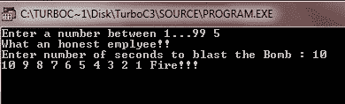
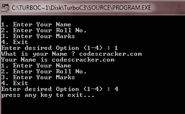

# C++ 关键字

> 原文：<https://codescracker.com/cpp/cpp-keywords.htm>

关键字是向语言编译器传达特殊含义的词。这些是用于特殊目的的保留字，不得用作正常的标识符名称。

## C++ 完整的关键字列表

下表列出了完整的 C++ 关键字:

| 关键词 | 较新的关键字 |
| 空对地导弹 | 继续 | 漂浮物 | 新的 | 签名 | 尝试 | 使用 |
| 汽车 | 系统默认值 | 为 | 操作员 | 尺寸 | typedef | 命名空间 |
| 破裂 | 删除 | 朋友 | 私人的 | 静电 | 联盟 | （同 balancing）平衡 |
| 情况 | 做 | 转到 | 保护 | 结构体 | 无符号的 | 静态 _ 转换 |
| 捕捉 | 两倍 | 如果 | 公众的 | 转换 | 虚拟的 | 常量 _cast |
| 茶 | 其他 | 在一条直线上的 | 注册 | 模板 | 空的 | 动态转换 |
| 班级 | 列举型别 | （同 Internationalorganizations）国际组织 | 返回 | 这 | 不稳定的 | 真实的 |
| 常数 | 走读生 | 长的 | 短的 | 扔 | 在…期间 | 错误的 |

注意:包含双下划线(_ _)的标识符是为 C++ 实现和标准库保留的，用户应该避免使用。

## C++ 关键字示例

以下示例显示了一些 C++ 关键字的用法:

```
/* C++ Keywords Example */

#include<iostream.h>
#include<conio.h>
#include<dos.h>

void main()
{
   clrscr();

   /* This program uses the following
      C++ keywords (most widely used) :
      for, if, else, int */

   int num, times, i;

   cout<<"Enter a number between 1...99 ";
   cin>>num;

   if(num>0 && num<100)
   {
      cout<<"What an honest employee!!";
   }
   else
   {
      cout<<"Bad employee!!";
   }

   cout<<"\nEnter number of seconds to blast the Bomb : ";
   cin>>times;

   for(i=times; i>0; i--)
   {
      cout<<i<<" ";
      sound(1000);
      delay(150);
      nosound();
   }

   cout<<"Fire!!!";

   getch();
}
```

当编译并执行上述 C++ 程序时，它将产生以下输出:



上面的程序只是展示 C++ 关键字(if，for，else，int)用法的例子，所以不要和声音动作混淆，这只是 C++ 图形的一部分。

注意-要使用 TurboC++ 编译器在您自己的计算机/笔记本电脑上执行声音操作，您必须进行以下更改:

*   转到你电脑的 c 盘
*   打开 TurboC++ 文件夹
*   现在打开磁盘>涡轮 3 > BGI
*   现在抄 EGAVGA。BGI 文件，并将该文件放在 BIN 目录中
*   现在，将上面的 C++ 程序代码复制到您的 TurboC++ 编译器中并运行
*   您将在炸弹爆炸部分听到来自上述 C++ 程序的声音。

让我们再看一个关于 C++ 关键字的例子，这个 C++ 程序使用了这些 C++ 关键字:char、do、while、switch、break 和 default

```
/* C++ Keywords Example2 */

/* This C++ program uses the
   following keywords :
   char, do, switch, while, break,
   default */

#include<iostream.h>
#include<conio.h>
#include<stdlib.h>

void main()
{
   clrscr();

   char choice, name[15], rollno, marks;

   do
   {
      cout<<"\n1\. Enter Your Name\n";
      cout<<"2\. Enter Your Roll No.\n";
      cout<<"3\. Enter Your Marks\n";
      cout<<"4\. Exit\n";
      cout<<"Enter desired Option (1-4) : ";
      cin>>choice;
      switch(choice)
      {
         case '1' : cout<<"What is your Name ? ";
            cin>>name;
            cout<<"Your Name is "<<name;
            break;
         case '2' : cout<<"What is Your Roll Number ? ";
            cin>>rollno;
            cout<<"Your roll number is "<<rollno;
            break;
         case '3' : cout<<"Enter Marks obtained in the examination : ";
            cin>>marks;
            cout<<"You got "<<marks;
            break;
         case '4' : cout<<"press any key to exit...";
            getch();
            exit(0);
         default : cout<<"You entered out of 1...4";
            break;
      }
   }while(choice != 4);

   getch();
}
```

当编译并执行上述 C++ 程序时，它将产生以下输出:



注意-如果你在理解上述程序的概念上有任何问题，那么就不要管它，更进一步，你将在后面单独的章节中学习所有的概念。

### 更多示例

这里列出了更多的 C++ 示例程序，你可以去看看:

*   [检查偶数或奇数](/cpp/program/cpp-program-check-even-odd.htm)
*   [检查是否灌注](/cpp/program/cpp-program-check-prime.htm)
*   [是否检查字母](/cpp/program/cpp-program-check-alphabet.htm)
*   [是否检查元音](/cpp/program/cpp-program-check-vowel.htm)
*   [是否勾选闰年](/cpp/program/cpp-program-check-leap-year.htm)
*   [制作计算器](/cpp/program/cpp-program-make-calculator.htm)

[C++ 在线测试](/exam/showtest.php?subid=3)

* * *

* * *