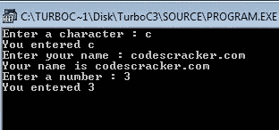

# C++ 标识符

> 原文：<https://codescracker.com/cpp/cpp-identifiers.htm>

标识符是程序的基本构件。标识符用作程序不同部分的通称，即变量、对象、类、函数、数组等。C++ 的标识符形成规则陈述如下:

标识符是任意长的字母和数字序列。第一个字符必须是字母；下划线(_)算作一个字母。大写和小写字母是不同的。所有角色都很重要。

C++ 是一种区分大小写的语言，因为它区别对待大写和小写字符。

## C++ 中的合法标识符

以下是 C++ 中的一些合法标识符:

```
Myfile   BAL3_23_76   Z23T02A9   MYFILE
_DGE   _HL3_SD   _CHK   FILE23
```

## 一些无效的标识符

以下是一些无效的标识符:

```
DATA-REC      contains special character - (other than A-Z, a-z, and _)
35CLTU        starting with a digit
continue      reserved keyword
My.file       contains special character
```

提示:您可以在变量名中使用下划线来分隔名称的各个部分，如 last_name、first_name、main_balance，或者您可以使用“大写形式”符号，如 lastName、firstName、mainBalance，即，将下一个单词的第一个字母大写。

## C++ 标识符示例

下面的 C++ 程序是一个 C++ 标识符的示例程序，它让您对 C++ 编程中标识符的使用有所了解:

```
/* C++ Identifiers Example */

#include<iostream.h>
#include<conio.h>

void main()
{
   clrscr();

   char ch;        // here ch is an identifier
   char Name[20];  // here Name is an identifier
   int num;        // here num is an identifier

   cout<<"Enter a character : ";
   cin>>ch;
   cout<<"You entered "<<ch;

   cout<<"\nEnter your name : ";
   cin>>Name;
   cout<<"Your name is "<<Name;

   cout<<"\nEnter a number : ";
   cin>>num;
   cout<<"You entered "<<num;

   getch();
}
```

当编译并执行上述 C++ 程序时，它将产生以下输出:



### 更多示例

这里列出了更多的 C++ 程序，你可以去看看更多的标识符:

*   [加两个数](/cpp/program/cpp-program-add-two-numbers.htm)
*   [检查偶数或奇数](/cpp/program/cpp-program-check-even-odd.htm)
*   [检查是否灌注](/cpp/program/cpp-program-check-prime.htm)
*   [检查阿姆斯特朗与否](/cpp/program/cpp-program-find-armstrong-number.htm)
*   [生成阿姆斯特朗数字](/cpp/program/cpp-program-generate-armstrong-number.htm)
*   [计算 nCr nPr](/cpp/program/cpp-program-find-ncr-npr.htm)

[C++ 在线测试](/exam/showtest.php?subid=3)

* * *

* * *