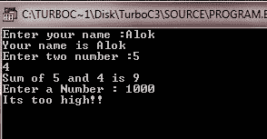

# C++ 标点符号

> 原文：<https://codescracker.com/cpp/cpp-punctuators.htm>

以下字符在 C++ 中用作标点符号(也称为分隔符):

```
[ ]   ( )   { }   ,   ;   :   *   ...   =   #
```

让我们逐一讨论以上所有分隔符:

*   括号[ ] -左括号和右括号表示单维和多维数组下标。
*   大括号{ } -左大括号和右大括号表示复合语句(包含多个可执行语句的代码块)的开始和结束。
*   括号()-左括号和右括号表示函数调用和函数参数。圆括号还将表达式分组并隔离条件表达式
*   逗号，-它在函数参数列表中用作分隔符。
*   星号* -它用于指针声明。星号是变量声明，表示创建了一个指向数据类型的指针。星号也用作指针运算符或乘法运算符。
*   分号；-它被用作语句结束符。每个可执行语句都以分号(；).
*   冒号:-表示带标签的语句。
*   等于符号= -它用于变量初始化，并作为表达式中的赋值运算符。
*   井号-井号(#)用于预处理程序指令，双井号(##)也用作运算符，在预处理程序扫描阶段执行标记替换和合并。
*   省略...-省略号(...)用于函数原型的形式参数列表中，以指示可变数量的参数(这意味着参数列表可以包含任意数量的参数和任意数据类型)。

## C++ 标点符号示例

以下是 C++ 标点符号的示例程序:

```
/* C++ Punctuators Example */

#include<iostream.h>
#include<conio.h>

int add(int, int);

void main()
{
   clrscr();

   char name[20];    // uses Brackets [] Punctuator
   int num;

   cout<<"Enter your name :";
   cin>>name;
   cout<<"Your name is "<<name<<"\n";

   int num1, num2, sum;

   cout<<"Enter two number :";
   cin>>num1>>num2;

   sum = add(num1, num2);    // uses Parentheses() Punctuator

   cout<<"Sum of "<<num1<<" and "<<num2<<" is "<<sum<<"\n";

   cout<<"Enter a Number : ";
   cin>>num;

   /* following uses Braces {} Punctuator */
   if(num>50)
   {
      if(num>500)
      {
         cout<<"Its too high!!";
      }
      else
      {
         cout<<"Its high!!";
      }
   }
   else
   {
      cout<<"Its too low";
   }

   getch();
}
int add(int a, int b)
{
   return a+b;
}
```

当编译并执行上述 C++ 程序时，它将产生以下输出:



### 更多示例

这里列出了更多的 C++ 程序，使用了一些 C++ 标点符号，你可以去看看:

*   [加两个数](/cpp/program/cpp-program-add-two-numbers.htm)
*   [交换两个数字](/cpp/program/cpp-program-swap-two-numbers.htm)
*   [找出两个数字中最大的一个](/cpp/program/cpp-program-find-greatest-of-two-numbers.htm)
*   [找出三个数字中最大的一个](/cpp/program/cpp-program-find-greatest-of-three-numbers.htm)
*   [求数字](/cpp/program/cpp-program-find-factorial.htm)的阶乘
*   [查找 HCF LCM](/cpp/program/cpp-program-find-hcf-lcm.htm)
*   [打印斐波那契数列](/cpp/program/cpp-program-print-fabonacci-series.htm)
*   [检查回文与否](/cpp/program/cpp-program-palindrome-number.htm)
*   [检查阿姆斯特朗与否](/cpp/program/cpp-program-find-armstrong-number.htm)
*   [生成阿姆斯特朗数字](/cpp/program/cpp-program-generate-armstrong-number.htm)
*   [计算 nCr nPr](/cpp/program/cpp-program-find-ncr-npr.htm)

[C++ 在线测试](/exam/showtest.php?subid=3)

* * *

* * *