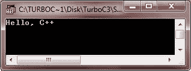
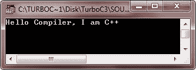
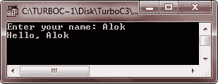
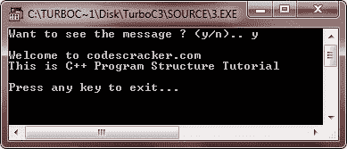
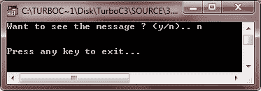

# C++程序结构

> 原文：<https://codescracker.com/cpp/cpp-program-structure.htm>

程序结构简单的 C++程序包含一个头文件，一个 main()函数，然后是程序代码。下面是一个简单 C++程序的程序结构:

```
header files
return_type main()
{
   program_code_statements;
}
```

下面是一个例子，展示了一个简单的 C++程序的程序结构:

```
/* C++ Program Structure - This is a multi-line comment */
#include<iostream.h>          // header file. This is a single-line comment
#include<conio.h>            // header file
void main()              // main function
{
   clrscr();       // to clear the screen
   cout<<"Hello, C++";      // prints Hello, C++
   getch();           // holds output screen until user press a key
}
```

### 解释的示例

在上面的程序中，第一行是多行注释。多行注释从/*开始，以*/结束。然后第二行和第三行，都是头文件，通过使用#include 包含在程序中。iostream.h 头文件负责 cout(标准输出)，conio.h 头文件负责 clrscr()(清除输出屏幕)和 getch()(保持输出屏幕，直到用户按下一个键)。现在第四行包含 main()函数。这里 void 表示程序不会返回任何值。最后，在{和}之间，存在 program_code_statements。其中，clrscr()函数清除输出屏幕，cout 用于在输出屏幕上发送字符串“Hello，C++”。换句话说，cout <



让我们再举一些例子来理解一些简单的 C++程序的结构:

```
// My first simple C++ program
/* C++ Program Structure - This program
 * prints Hello Compiler, I am C++ on
 * the output screen. */

#include<iostream.h>
#include<conio.h>
void main()
{
   clrscr();
   cout<<"Hello Compiler, I am C++";
   getch();
}
```

以下是上述 C++程序的示例输出:



这是另一种简单的 C++程序

```
/* C++ Program Structure - Example Program */

#include<iostream.h>
#include<conio.h>
void main()
{
   clrscr();
   char name[20];
   cout<<"Enter your name: ";
   cin>>name;
   cout<<"Hello, "<<name;
   getch();
}
```

下面是上述 C++程序的运行示例:



这是另一种使用函数的 C++程序。

```
/* C++ Program Structure - Example Program */

#include<iostream.h>
#include<conio.h>
void msg(void);
void main()
{
   clrscr();
   char ch;
   cout<<"Want to see the message ? (y/n).. ";
   cin>>ch;
   if(ch=='y' || ch=='Y')
   {
      msg();
   }
   cout<<"\n\nPress any key to exit...";
   getch();
}
void msg(void)
{
   cout<<"\nWelcome to codescracker.com";
   cout<<"\n";
   cout<<"This is C++ Program Structure Tutorial";
}
```

下面是这个 C++程序两个运行示例:




### 更多示例

这里列出了更多类型的 C++示例程序，您可以使用:

*   [加两个数](/cpp/program/cpp-program-add-two-numbers.htm)
*   [检查偶数或奇数](/cpp/program/cpp-program-check-even-odd.htm)
*   [打印斐波那契数列](/cpp/program/cpp-program-print-fabonacci-series.htm)
*   [检查回文与否](/cpp/program/cpp-program-palindrome-number.htm)
*   [检查阿姆斯特朗与否](/cpp/program/cpp-program-find-armstrong-number.htm)
*   [生成阿姆斯特朗数字](/cpp/program/cpp-program-generate-armstrong-number.htm)
*   [查找 ncR nPr](/cpp/program/cpp-program-find-ncr-npr.htm)
*   [花样程序](/cpp/program/cpp-program-print-star-pyramid-patterns.htm)

[C++在线测试](/exam/showtest.php?subid=3)

* * *

* * *