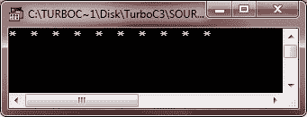

# C++ 基本语法

> 原文：<https://codescracker.com/cpp/cpp-basic-syntax.htm>

理解任何 C++ 程序的基本语法。让我们看看这个简单 C++ 程序的基本和一般形式。

```
/* Multi-line comments */

#include<header_file_name>;
return_type main()
{
   clrscr();
   program_code_statements;
   getch();
}
```

这是一个简单 C++ 程序的基本语法。在上面的代码片段中，函数 clrscr()用于清除输出屏幕。而[函数](/cpp/cpp-functions.htm) getch()保持输出屏幕，直到用户按键。

## C++ 中的分号

C++ 中的分号用于终止语句。下面是 C++ 中分号的一个例子:

```
int num;
int sum = 0;
fun(void);
```

## C++ 中的块

C++ 中的一个块，基本上是一组在左括号和右括号中逻辑连接的语句。这里有一个例子:

```
{
   cout << "Hello C++, I am Block";
   return 0;
}
```

## C++ 中的空白

空白可以是空格、换行符、制表符等。这里有一个例子。这里在 int 类型和变量 age 之间有一个空格:

```
int age;
```

现在让我们从简单到函数程序的几个例子程序来理解一个简单 C++ 程序的基本语法。这里我们提供了 7 种 C++ 程序，以便理解这些程序的基本语法。让我们从最简单的 C++ 程序开始，它将在输出屏幕上打印“Hello，World”。

```
/* C++ Basic Syntax */

#include<iostream.h>
#include<conio.h>
void main()
{
   clrscr();
   cout<<"Hello, World";
   getch();
}
```

下面是这个 C++ 程序的示例输出:


下面是另一种类型的 C++ 程序，使用 if 语句:

```
/* C++ Basic Syntax */

#include<iostream.h>
#include<conio.h>
void main()
{
   clrscr();
   char ch;
   cout<<"Press y to see greeting: ";
   cin>>ch;
   if(ch=='y' || ch=='Y')
   {
      cout<<"\nWelcome to codescracker.com";
   }
   getch();
}
```

下面是上述 C++ 程序的运行示例:


下面是另一种类型的 C++ 程序，使用了 [if-else 语句](/cpp/cpp-selection-statements.htm):

```
/* C++ Basic Syntax */

#include<iostream.h>
#include<conio.h>
void main()
{
   clrscr();
   char ch;
   cout<<"Press y to see greeting: ";
   cin>>ch;
   if(ch=='y' || ch=='Y')
   {
      cout<<"\nWelcome to codescracker.com";
   }
   else
   {
      cout<<"\nPress any key to exit..\n";
   }
   getch();
}
```

下面是上述 C++ 程序的两个运行示例:


让我们看看另一种类型的 C++ 程序，使用[进行循环](/cpp/cpp-iteration-statements.htm):

```
/* C++ Basic Syntax */

#include<iostream.h>
#include<conio.h>
void main()
{
   clrscr();
   int i;
   for(i=0; i<10; i++)
   {
      cout<<"*  ";
   }
   getch();
}
```

下面是这个 C++ 程序的示例输出:


这里是另一种类型的 C++ 程序，使用 [while 循环](/cpp/cpp-iteration-statements.htm)

```
/* C++ Basic Syntax */

#include<iostream.h>
#include<conio.h>
void main()
{
   clrscr();
   int i=0;
   while(i<10)
   {
      cout<<"*  ";
      i++;
   }
   getch();
}
```

下面是上述 C++ 程序的示例输出。这个输出与上面的输出相同。


下面是另一种类型的 C++ 程序，使用 [do-while 循环](/cpp/cpp-iteration-statements.htm):

```
/* C++ Basic Syntax */

#include<iostream.h>
#include<conio.h>
void main()
{
   clrscr();
   int i=0;
   do
   {
      cout<<"*  ";
      i++;
   }while(i<10);
   getch();
}
```

下面是上述 C++ 程序的输出示例。这个 C++ 程序也产生与上面两个 C++ 程序相同的输出。



让我们再看一个 C++ 程序，使用函数。

```
/* C++ Basic Syntax */

#include<iostream.h>
#include<conio.h>
void greet(void);
void main()
{
   clrscr();
   cout<<"Press any key for greeting..";
   getch();
   greet();
   getch();
}
void greet()
{
   cout<<"\n\nWelcome to codescracker.com";
}
```

下面是上述 C++ 程序的运行示例:


### 更多示例

这里列出了更多的 C++ 程序，你可以试试:

*   [加两个数](/cpp/program/cpp-program-add-two-numbers.htm)
*   [检查偶数或奇数](/cpp/program/cpp-program-check-even-odd.htm)
*   [检查是否灌注](/cpp/program/cpp-program-check-prime.htm)
*   [是否检查字母](/cpp/program/cpp-program-check-alphabet.htm)
*   [是否检查元音](/cpp/program/cpp-program-check-vowel.htm)
*   [是否勾选闰年](/cpp/program/cpp-program-check-leap-year.htm)
*   [打印斐波那契数列](/cpp/program/cpp-program-print-fabonacci-series.htm)
*   [检查回文与否](/cpp/program/cpp-program-palindrome-number.htm)
*   [检查阿姆斯特朗与否](/cpp/program/cpp-program-find-armstrong-number.htm)
*   [生成阿姆斯特朗数字](/cpp/program/cpp-program-generate-armstrong-number.htm)
*   [查找 ncR nPr](/cpp/program/cpp-program-find-ncr-npr.htm)

[C++ 在线测试](/exam/showtest.php?subid=3)

* * *

* * *