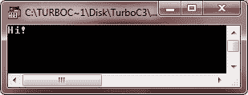
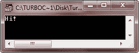
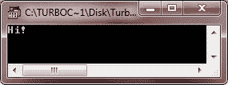

# C++注释

> 原文：<https://codescracker.com/cpp/cpp-comments.htm>

注释是编译器丢弃、忽略或干脆不执行的代码片段。注释的目的只是允许程序员插入一些注释或描述，以增强程序的可读性或可理解性。

在 C++程序中插入注释有以下两种方法:

*   单行注释
*   多行注释

## C++单行注释

以//开头的注释是单行注释。编译器会忽略同一行中//后面的所有内容。让我们举一个例子。

### C++单行注释示例

```
// C++ Comments - Single Line Comment

#include<iostream.h>
#include<conio.h>
void main()
{
   clrscr();   // to clear the screen
   cout<<"Hi!";   // prints Hi!
   getch();   // holds the output screen
}                       // until user press a key
```

下面是上述 C++程序的示例输出



## 多行注释

块注释，用/*标记注释的开始，用*/标记结束。这意味着，介于/*和*/之间的所有内容都被认为是注释，即使它分布在许多行中。我们举个例子。

### C++多行或块注释示例

```
/* C++ Comments - Multi Line Comment */

#include<iostream.h>
#include<conio.h>
void main()
{
   /* to clear the screen */
   clrscr();
   /* prints Hi! */
   cout<<"Hi!";
   getch();   /* holds the output screen
         * until user press a key */
}
```

这个 C++程序产生与上面相同的输出。



## C++注释示例

让我们看看另一个同时使用单行和多行或块注释的 C++程序。

```
/* C++ Comments - Multi Line Comment */

#include<iostream.h>
#include<conio.h>
void main()
{
   // to clear the screen (single-line comment)
   clrscr();
   // prints Hi! (single-line comment)
   cout<<"Hi!";
   getch();   /* holds the output screen
          * until user press a key
          * (multiline or block comment) */
}
```

这是这个 C++程序的示例输出，产生的输出与上面的 C++程序产生的输出相同。



在上面的 C++程序中，从//开始直到同一行的任何内容都被认为是单行注释。从/*开始并以*/结束的任何内容都被视为多行或块注释。

### 更多示例

这里列出了更多的 C++程序，你可以试试。这些是 C++中的数字转换程序:

*   [十进制到二进制的转换](/cpp/program/cpp-program-convert-decimal-to-binary.htm)
*   [十进制到八进制的转换](/cpp/program/cpp-program-convert-decimal-to-octal.htm)
*   [十进制到十六进制的转换](/cpp/program/cpp-program-convert-decimal-to-hexadecimal.htm)
*   [二进制到十进制的转换](/cpp/program/cpp-program-convert-binary-to-decimal.htm)
*   [二进制到八进制的转换](/cpp/program/cpp-program-convert-binary-to-octal.htm)
*   [十六进制到二进制的转换](/cpp/program/cpp-program-convert-hexadecimal-to-binary.htm)
*   [十六进制到八进制的转换](/cpp/program/cpp-program-convert-hexadecimal-to-octal.htm)

[C++在线测试](/exam/showtest.php?subid=3)

* * *

* * *