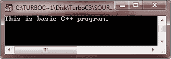

# C++基本程序

> 原文：<https://codescracker.com/cpp/cpp-first-program.htm>

下面列出一些基本的 C++程序，来理解 C++编程的基本概念。最后还列出了一些中级 C++程序。你可以把那些程序称为中级水平的基本 C++程序。让我们从基本的 C++程序开始。

## C++ Basic 程序 1 号

```
/* C++ Basic Programs */

#include<iostream.h>
#include<conio.h>
void main()
{
   clrscr();
   cout<<"This is basic C++ program.";
   getch();
}
```

以下是上述 C++程序的示例输出:



## C++ Basic 程序之二

这是 C++中另一种类型的基本程序

```
/* C++ Basic Programs */

#include<iostream.h>
#include<conio.h>
void main()
{
   clrscr();
   char ch;
   cout<<"Want to learn C++ ? (y/n).. ";
   cin>>ch;
   if(ch=='y' || ch=='Y')
   {
      cout<<"\nWelcome to codescracker.com";
      cout<<"\nYou can learn all about C++ here\n";
      cout<<"From very basic to an advance level\n";
   }

   getch();
}
```

下面是上述 C++程序的运行示例:


## C++ Basic 程序 No. 3

让我们以 C++中的另一种基本程序为例

```
/* C++ Basic Programs */

#include<iostream.h>
#include<conio.h>
void main()
{
   clrscr();
   int counter, i;
   int num;
   cout<<"Initializing counter...\n";
   cout<<"Enter a number: ";
   cin>>num;
   cout<<"\n";
   for(i=num; i>=0; i--)
   {
      cout<<i<<"  ";
   }
   cout<<"Fire...!!";

   getch();
}
```

下面是上述 C++程序的运行示例:


## C++ Basic 程序 4 号

下面是另一种类型的 C++ basic 程序。这个程序是上述 C++程序的改进版本。

```
/* C++ Basic Programs */

#include<iostream.h>
#include<conio.h>
#include<dos.h>
void main()
{
   clrscr();
   int counter, i;
   int num;
   cout<<"Initializing counter...\n";
   cout<<"Enter a number: ";
   cin>>num;
   cout<<"\n";
   for(i=num; i>=0; i--)
   {
      cout<<i<<"  ";
      delay(500);
   }
   cout<<"Fire...!!";

   getch();
}
```

下面是上述 C++程序的运行示例。：


## C++ Basic 程序 5 号

这是 C++中另一种类型的基本程序。

```
/* C++ Basic Programs */

#include<iostream.h>
#include<conio.h>
void main()
{
   clrscr();
   int check;
   cout<<"Enter 5: ";
   cin>>check;
   if(check==5)
   {
      cout<<"What an honest programmer, you are..!!";
   }
   else
   {
      cout<<"Sorry..!!..You entered wrong..!!";
   }
   getch();
}
```

下面是上述 C++程序的两个运行示例:


## C++ Basic 程序 6 号

让我们以 C++中的另一个基本程序为例

```
/* C++ Basic Programs */

#include<iostream.h>
#include<conio.h>
#include<stdlib.h>
void main()
{
   clrscr();
   char inf[20];
   char ans, ch;
   do
   {
      cout<<"Enter anything... ";
      cin.get(inf, 20);
      cin.get(ch);
      cout<<"\nYou entered "<<inf<<endl;
      cout<<"\nWant to enter more ? (y/n).. ";
      cin>>ans;
      cin.get(ch);
      cout<<"\n";
   }while(ans=='y' || ans=='Y');
   getch();
}
```

下面是这个 C++程序的运行示例


## C++ Basic 程序 No. 7

我们再来看另一种类型的 C++ basic 程序。

```
/* C++ Basic Programs */

#include<iostream.h>
#include<conio.h>
#include<stdlib.h>
void main()
{
   clrscr();
   int star, counter=0;
   int i, j;
   char check;
   cout<<"How many start you want to print ? ";
   cin>>star;
   counter=star;
   cout<<"\nWant to print in diagonal form ? (y/n).. ";
   cin>>check;
   if(check=='y' || check=='Y')
   {
      for(i=0; i<star; i++)
      {
         for(j=0; j<i; j++)
         {
            counter--;
            if(counter<0)
            {
               getch();
               exit(1);
            }
            else
            {
               cout<<"* ";
            }
         }
         cout<<"\n";
      }
   }
   else
   {
      cout<<"\n";
      for(i=0; i<star; i++)
      {
         cout<<"* ";
      }
   }
   getch();
}
```

下面是上述 C++程序的两个运行示例:


## C++ Basic 程序 No. 8

再举一个 C++ basic 程序的例子。

```
/* C++ Basic Programs */

#include<iostream.h>
#include<stdlib.h>
#include<conio.h>
void startup(void);
void add(int, int);
void subtract(int, int);
void multiply(int, int);
void divide(int, int);
void main()
{
   clrscr();
   startup();
   int num1, num2;
   char ch;
   do
   {
      cout<<"\n1\. Add";
      cout<<"\n2\. Subtract";
      cout<<"\n3\. Multiply";
      cout<<"\n4\. Divide";
      cout<<"\n5\. Exit\n";
      cout<<"\nWhat do you want ? ";
      cin>>ch;
      if(ch>='1' && ch<='4')
      {
         cout<<"\nEnter any two number: ";
         cin>>num1>>num2;
      }
      switch(ch)
      {
         case '1':
            add(num1, num2);
            break;
         case '2':
            subtract(num1, num2);
            break;
         case '3':
            multiply(num1, num2);
            break;
         case '4':
            divide(num1, num2);
            break;
         case '5':
            exit(1);
         default:
            cout<<"Wrong choice..!!..Press a key to exit..";
            getch();
            exit(2);
      }
      cout<<"\n";
   } while(ch>='1' && ch<='5');

   getch();
}

void startup(void)
{
   cout<<"Welcome to codescracker.com\n";
   cout<<"You are at C++ Basic Programs\n";
   cout<<"Press any key to start:\n";
   getch();
}

void add(int a, int b)
{
   cout<<"Result = "<<a+b;
}

void subtract(int a, int b)
{
   cout<<"Result = "<<a-b;
}

void multiply(int a, int b)
{
   cout<<"Result = "<<a*b;
}

void divide(int a, int b)
{
   if(b==0)
   {
      cout<<"Divide by zero error..!!";
      cout<<"\nPress any key to exti..\n";
      getch();
      exit(3);
   }
   cout<<"Result = "<<a/b;
}
```

以下是上述 C++程序的一些运行示例:


现在按任意键开始工作。按任意键后，下面是一些运行示例。


### 更多 C++基本程序

这里列出了更多的 C++ basic 程序，你可以去看看:

*   [加两个数](/cpp/program/cpp-program-add-two-numbers.htm)
*   [检查偶数或奇数](/cpp/program/cpp-program-check-even-odd.htm)
*   [检查是否灌注](/cpp/program/cpp-program-check-prime.htm)
*   [是否检查字母](/cpp/program/cpp-program-check-alphabet.htm)
*   [是否检查元音](/cpp/program/cpp-program-check-vowel.htm)
*   [是否勾选闰年](/cpp/program/cpp-program-check-leap-year.htm)
*   [制作计算器](/cpp/program/cpp-program-make-calculator.htm)

[C++在线测试](/exam/showtest.php?subid=3)

* * *

* * *