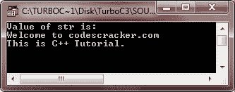
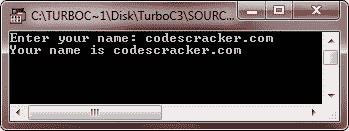
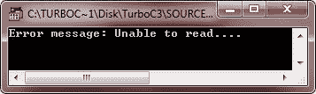
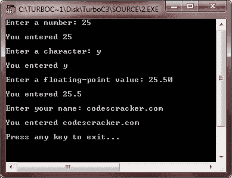
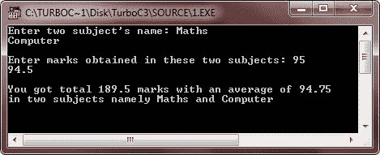

# C++ 输入输出流

> 原文：<https://codescracker.com/cpp/cpp-input-output.htm>

在 C++ 中，所有设备都被视为文件。因此，标准输入设备(键盘)、标准输出设备(屏幕或监视器)和标准错误设备(屏幕或监视器)(显示错误，如果有的话)都被视为文件。在最底层，文件被简单地解释为一个序列或字节流。在这一级，没有数据类型的概念，即数据被简单地视为字节序列，而不考虑其数据类型。然而，在用户级别，文件由一系列可能混合的数据类型组成——字符、算术值、类对象等。

## iostream.h 的功能

iostream.h 有以下不同级别的功能:

1.  在最低的实现级别，缺少数据类型的概念，文件被视为字节流，I/O 库管理这些字节的传输。
2.  在存在数据类型概念的用户级，I/O 库管理这两个级别之间的接口，即用户级和最低实现级之间的接口。
3.  I/O 库预定义了一组操作，用于处理内置数据类型的读写。

## I/O 库中预定义的流

如前所述，在最低层，文件被实现为字节流。流只是一个字节序列。istream(输入流)和 ostream(输出流)类支持输入和输出操作。

ostream 输出操作称为插入，由插入操作符"<> "执行。

### 预定义的流对象

输入、输出和错误的预定义流对象如下:

1.  cin(发音为“see-in”)，作为绑定到标准输入的 istream 类对象。cin 代表控制台输入。
2.  cout(读作“see-out”)，作为 ostream 类对象绑定到标准输出。cout 代表控制台输出。
3.  cerr(读作“see-err”)，作为 ostream 类对象与标准错误相关联。cerr 代表控制台错误。

让我们来讨论上面所有三个预定义的流对象的输入、输出和错误的例子:

## C++ 标准输出流

这是一个 C++ 标准输出流的例子

```
/* C++ Input and Output Stream */

#include<iostream.h>
#include<conio.h>

void main()
{
   clrscr();
   char str[] = "Welcome to codescracker.com\nThis is C++ Tutorial.";
   cout<<"Value of str is:\n";
   cout<<str;
   getch();
}
```

下面是这个 C++ 程序的示例输出:



## C++ 标准输入流

下面是一个在 C++ 中使用标准输入流的例子:

```
/* C++ Input and Output Stream */

#include<iostream.h>
#include<conio.h>
void main()
{
   clrscr();
   char name[20];
   cout<<"Enter your name: ";
   cin>>name;
   cout<<"Your name is "<<name;
   getch();
}
```

下面是上述 C++ 程序的运行示例:



## C++ 标准错误流

这里有一个例子可以帮助你理解 C++ 中的标准错误流:

```
/* C++ Input and Output Stream */

#include<iostream.h>
#include<conio.h>
void main()
{
   clrscr();
   char str[]="Unable to read....";
   cerr<<"Error message: "<<str;
   getch();
}
```

下面是这个 C++ 程序的运行示例:



现在，让我们讨论一下标准日志流，即 clog:

## C++ 标准日志流

下面是一个在 C++ 中使用标准日志流的例子:

```
/* C++ Input and Output Stream */

#include<iostream.h>
#include<conio.h>
void main()
{
   clrscr();
   char str[]="Unable to read...";
   clog<<"Error message: "<<str;
   getch();
}
```

## C++ 输入输出流示例

下面是一些 C++ 输入输出流示例程序，演示了 C++ 中输入和输出流的用法

```
/* C++ Input and Output Stream */

#include<iostream.h>
#include<conio.h>
void main()
{
   clrscr();

   int num;
   char ch;
   char str[80];
   float f;

   cout<<"Enter a number: ";
   cin>>num;
   cout<<"\nYou entered "<<num;
   cout<<"\n\nEnter a character: ";
   cin>>ch;
   cout<<"\nYou entered "<<ch;
   cout<<"\n\nEnter a floating-point value: ";
   cin>>f;
   cout<<"\nYou entered "<<f;
   cout<<"\n\nEnter your name: ";
   cin>>str;
   cout<<"\nYou entered "<<str;
   cout<<"\n\nPress any key to exit...\n";

   getch();
}
```

下面是上述 C++ 程序的运行示例:



让我们看另一个 C++ 程序:

```
/* C++ Input and Output Stream */

#include<iostream.h>
#include<conio.h>
void main()
{
   clrscr();

   char sub1[20], sub2[20];
   float mark1, mark2;
   float sum=0, avg=0;

   cout<<"Enter two subject's name: ";
   cin>>sub1>>sub2;
   cout<<"\nEnter marks obtained in these two subjects: ";
   cin>>mark1>>mark2;
   sum=mark1+mark2;
   avg=sum/2;
   cout<<"\nYou got total "<<sum<<" marks with an average of "<<avg;
   cout<<"\nin two subjects namely "<<sub1<<" and "<<sub2;

   getch();
}
```

下面是上述 C++ 程序的运行示例:



### 更多示例

这里列出了更多的 C++ 程序，你可以试试:

*   [加两个数](/cpp/program/cpp-program-add-two-numbers.htm)
*   [打印号码表](/cpp/program/cpp-program-print-table-of-number.htm)
*   [打印质数](/cpp/program/cpp-program-print-prime-numbers.htm)
*   [将 N 个数字相加](/cpp/program/cpp-program-add-n-numbers.htm)
*   [换乘号](/cpp/program/cpp-program-interchange-numbers.htm)
*   [反转数字](/cpp/program/cpp-program-reverse-numbers.htm)
*   [交换两个数字](/cpp/program/cpp-program-swap-two-numbers.htm)

[C++ 在线测试](/exam/showtest.php?subid=3)

* * *

* * *