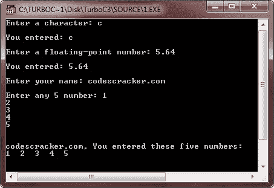
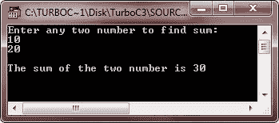
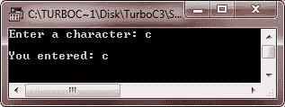
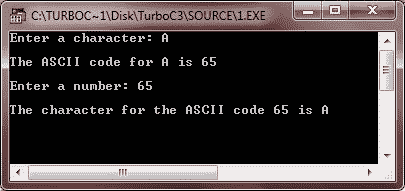
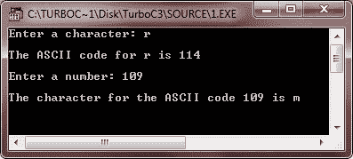
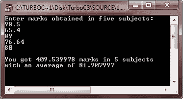
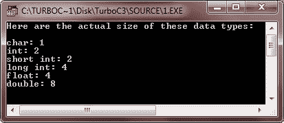

# C++ 数据类型

> 原文：<https://codescracker.com/cpp/cpp-data-types.htm>

数据可以是多种类型，例如，字符、整数、实数、字符串等。在 C++ 中，任何用单引号括起来的东西都代表字符数据。没有分数的数字表示整数数据。带分数的数字表示真实数据，任何用双引号括起来的数字都表示字符串。因此，C++ 像任何其他语言一样，通过提供数据类型来提供处理不同类型数据的方法和工具。

数据类型——数据类型是识别数据类型和处理数据的相关操作的手段。C++ 数据类型有以下两种类型:

1.  基本类型
2.  派生类型

C++ 中有五种基本的数据类型:char、int、float、double 和 void，分别表示字符、整数、浮点、双浮点和无值数据。

从基本类型构造的派生类型有:数组、函数、指针、引用、常量、类、结构、联合和枚举。让我们举一个例子程序，使用 C++ 中的基本类型和派生类型。

```
/* C++ Data Types */

#include<iostream.h>
#include<conio.h>
void main()
{
   clrscr();
   int i;
   char ch;
   char str[20];
   int arr[20];
   float fl;
   cout<<"Enter a character: ";
   cin>>ch;
   cout<<"\nYou entered: "<<ch;
   cout<<"\n\nEnter a floating-point number: ";
   cin>>fl;
   cout<<"\nYou entered: "<<fl;
   cout<<"\n\nEnter your name: ";
   cin>>str;
   cout<<"\nEnter any 5 number: ";
   for(i=0; i<5; i++)
   {
      cin>>arr[i];
   }
   cout<<"\n\n"<<str<<", You entered these five numbers:\n";
   for(i=0; i<5; i++)
   {
      cout<<arr[i]<<"  ";
   }
   getch();
}
```

下面是这个 C++ 程序的运行示例:



如前所述，C++ 中有以下五种基本数据类型:

1.  茶
2.  （同 Internationalorganizations）国际组织
3.  漂浮物
4.  两倍
5.  空的

C++ 中的所有其他数据类型都基于这些基本类型之一。这种数据类型称为派生数据类型。这些数据类型的大小和范围因处理器类型和 C++ 编译器的实现而异。一个字符通常是 1 个字节，一个整数通常是 2 个字节，但是如果你想让你的程序具有可移植性或者适应最广泛的计算机，你就不能做出这样的假设。让我们详细讨论每一种数据类型。

## C++ 基本数据类型

基本数据类型不是由其他数据类型组成的。有以下五种基本数据类型:

1.  int 数据类型(用于整数)
2.  char 数据类型(用于字符)
3.  浮点数据类型(用于浮点数)
4.  双精度数据类型(用于双精度浮点数)
5.  void 数据类型(用于空值集和不返回的函数)

## C++ 数据类型大小和范围

在讨论 C++ 的所有基本数据类型之前，让我们看看下表，了解 C++ 数据类型的大小和范围:

| 数据类型 | 存储大小(字节) | 范围 |
| 茶 | one | -127 到 127 |
| 无符号字符 | one | 0 到 255 |
| 有符号字符 | one | -127 到 127 |
| （同 Internationalorganizations）国际组织 | 2 或 4 | -32767 至 32767 |
| 无符号整数 | 2 或 4 | 0 到 65，535 |
| 有符号整数 | 2 或 4 | -32767 至 32767 |
| 短整型 | Two | -32767 至 32767 |
| 无符号短整型 | Two | 0 到 65，535 |
| 有符号短整型 | Two | -32767 至 32767 |
| 长整型 | four | -2147483647 至 2147483647 |
| 带符号长整型 | four | -2147483647 至 2147483647 |
| 无符号长整型 | four | 0 到 4，294，967，295 |
| 漂浮物 | four | 1E-37 至 1E+37(六位精度) |
| 两倍 | eight | 1E-37 至 1E+37(十位精度) |
| 长双份 | Ten | 1E-37 至 1E+37(十位精度) |

### C++ int 数据类型

整数是整数，如 4、56、-234、0 等。它们没有小数部分。整数在 C++ 中用 int 数据类型表示。声明为 int 的标识符不能有小数部分。整数可以是正数，也可以是负数，但是整数是否可以有负值，这取决于整数类型，这将在下一章给出的关于 [C++ 数据类型修饰符](/cpp/cpp-modifier-types.htm) 的单独章节中讨论。让我们举一个例子。

```
/* C++ Data Types */

#include<iostream.h>
#include<conio.h>
void main()
{
   clrscr();
   int num1, num2, sum=0;
   cout<<"Enter any two number to find sum:\n";
   cin>>num1>>num2;
   sum=num1+num2;
   cout<<"\nThe sum of the two number is "<<sum;
   getch();
}
```

下面是上述 C++ 程序的运行示例:



### C++ char 数据类型

字符可以存储 C++ 实现的基本字符集的任何成员。如果这个集合中的一个字符存储在一个字符变量中，它的值相当于该字符的整数代码。声明为 char 的标识符变成了字符变量。字符也可以是不同的类型，这将在下一章给出的关于 [C++ 数据类型修饰符](/cpp/cpp-modifier-types.htm)的单独章节中讨论。 让我们用一个示例程序来演示 C++ 中 char 类型的使用

```
/* C++ Data Types */

#include<iostream.h>
#include<conio.h>
void main()
{
   clrscr();
   char ch;
   cout<<"Enter a character: ";
   cin>>ch;
   cout<<"\nYou entered: "<<ch;
   getch();
}
```

下面是上述 C++ 程序的运行示例:



在 C++ 中，char 类型通常被称为整数类型。这样说是因为字母、符号等。在内存中由相关的数字代码表示。将数字编码成二进制非常容易。因此，甚至字母和符号也由它们相关联的数字代码(例如，ASCII 代码)来表示，因为这种字符数据类型被称为另一种整数类型。ASCII 码存储 256 个已知字符(字母、数字、符号、非图形字符等)的数字代码。).下面的 C++ 程序将 char 解释为 int 类型。这个 C++ 程序只显示字符的 ASCII 码，反之亦然:

```
/* C++ Data Types */

#include<iostream.h>
#include<conio.h>
void main()
{
   clrscr();
   char ch;
   int i;
   cout<<"Enter a character: ";
   cin>>ch;
   i = ch;
   cout<<"\nThe ASCII code for "<<ch<<" is "<<i<<"\n";
   cout<<"\nEnter a number: ";
   cin>>i;
   ch = i;
   cout<<"\nThe character for the ASCII code "<<i<<" is "<<ch;
   getch();
}
```

下面是上述 C++ 程序的两个运行示例:




A 的 ASCII 值是 65，Z 的值是 90。a 的 ASCII 值是 97，z 的 ASCII 值是 122。

### C++ 浮点数据类型

有小数部分的数是浮点数。例如，3.14159 是一个浮点数。小数点表示它是一个浮点数，而不是整数。数字 12 是一个整数，但 12.0 是一个浮点数。这个数字是正常的十进制记数法(分数形式)。浮点数也可以用指数符号表示。例如，147.9101 将被写成 1.479101E02。

声明为 float 的标识符成为浮点变量，可以保存浮点数。浮点变量代表实数，用于距离、面积、温度等可测量的量。并且通常具有小数部分。浮点变量也可以是不同的类型。关于细节，请遵循下一章给出的关于 C++ 数据类型修饰符的单独教程。 让我们用一个示例程序来演示 C++ 中浮点数据类型的使用

```
/* C++ Data Types */

#include<iostream.h>
#include<conio.h>
void main()
{
   clrscr();
   float marks[5];
   float sum=0, avg=0;
   cout<<"Enter marks obtained in five subjects:\n";
   for(int i=0; i<5; i++)
   {
      cin>>marks[i];
      sum=sum+marks[i];
   }
   avg=sum/5;
   cout<<"\nYou got "<<sum<<" marks in 5 subjects\n";
   cout<<"with an average of "<<avg;
   getch();
}
```

下面是上述 C++ 程序的运行示例:



与整数相比，浮点数有两个优点。首先，它们可以表示整数之间的值。其次，它们可以代表更大范围的值。但是浮点数也有一个缺点。浮点运算通常比整数运算慢。

### C++ 双精度数据类型

数据类型 double 也用于处理浮点数。但它被视为不同的数据类型，因为它(double 数据类型)占用的内存是 float 类型的两倍，并且存储范围和精度更大的浮点数(小数点后的有效数字)。它代表双精度浮点。当类型 float 太小或不够精确时使用它。

### C++ void 数据类型

void 类型指定一组空值。它用作不返回值的函数的返回类型。不能声明 void 类型的对象。从上面的 C++ 程序中可以看出，函数 main()的返回类型为 void。这告诉编译器 main()函数不会返回任何值。

### 分配数据类型的规则

分配数据类型有以下规则:

*   当你确定一个变量是一个整数，即没有小数点时，分配短整型、整型或长型数据类型。当要处理大整数(如电话号码)时，选择 long。
*   当需要分数(即带小数的数字)时，分配 float 或 double。数据类型 double 应该是首选的，因为使用它不会出现舍入误差(使用 floats 时经常出现)。
*   如果变量总是包含一个字符的数据，则赋值 char。这意味着只有一个字母(或字符)。

### 检查变量的实际大小

变量的大小可能会有所不同，这取决于您使用的计算机。下面是一个示例，它将在您的计算机上产生正确大小的各种数据类型。

```
/* C++ Data Types */

#include<iostream.h>
#include<conio.h>
void main()
{
   clrscr();

   cout<<"Here are the actual size of these data types:\n\n";
   cout<<"char: "<<sizeof(char)<<"\n";
   cout<<"int: "<<sizeof(int)<<"\n";
   cout<<"short int: "<<sizeof(short int)<<"\n";
   cout<<"long int: "<<sizeof(long int)<<"\n";
   cout<<"float: "<<sizeof(float)<<"\n";
   cout<<"double: "<<sizeof(double)<<"\n";

   getch();
}
```

使用 sizeof()函数/运算符，您可以获得各种平台上各种数据类型的实际大小。下面是上述 C++ 程序的输出示例。



## C++ 派生的数据类型

通过使用声明操作符，可以从基本数据类型派生出其他类型。下面是一些最重要的 C++ 派生数据类型。

*   [数组](/cpp/cpp-arrays.htm)
*   [功能](/cpp/cpp-functions.htm)
*   [指针](/cpp/cpp-pointers.htm)
*   [参考文献](/cpp/cpp-references.htm)
*   [类](/cpp/cpp-classes-objects.htm)
*   [结构](/cpp/cpp-data-structures.htm)

### 更多示例

这里列出了更多的例子，你可以去看看:

*   [加两个数](/cpp/program/cpp-program-add-two-numbers.htm)
*   [花样程序](/cpp/program/cpp-program-print-star-pyramid-patterns.htm)
*   [打印菱形图案](/cpp/program/cpp-program-print-diamond-pattern.htm)
*   [打印弗洛伊德三角形](/cpp/program/cpp-program-print-floyd-triangle.htm)
*   [打印帕斯卡三角形](/cpp/program/cpp-program-print-pascal-triangle.htm)
*   [检查回文与否](/cpp/program/cpp-program-palindrome-number.htm)
*   [检查阿姆斯特朗与否](/cpp/program/cpp-program-find-armstrong-number.htm)
*   [十六进制到十进制的转换](/cpp/program/cpp-program-convert-hexadecimal-to-decimal.htm)

[C++ 在线测试](/exam/showtest.php?subid=3)

* * *

* * *