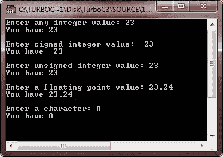

# C++ 变量类型

> 原文：<https://codescracker.com/cpp/cpp-variable-types.htm>

在 C++ 中，变量基本上是我们的程序可以操作的命名存储。C++ 中的每一个变量都有特定的类型，决定了变量的内存布局和大小，以及内存中可以存储的值的范围。

## C++ 变量类型示例

下面是一个例子，在 C++ 中使用了许多类型的变量:

```
/* C++ Variable Types */

#include<iostream.h>
#include<conio.h>
void main()
{
   clrscr();

   int i;
   float f;
   char c;
   double d;
   signed int si;
   unsigned int ui;

   cout<<"Enter any integer value: ";
   cin>>i;
   cout<<"You have "<<i;
   cout<<"\n\nEnter signed integer value: ";
   cin>>si;
   cout<<"You have "<<si;
   cout<<"\n\nEnter unsigned integer value: ";
   cin>>ui;
   cout<<"You have "<<ui;
   cout<<"\n\nEnter a floating-point value: ";
   cin>>f;
   cout<<"You have "<<f;
   cout<<"\n\nEnter a character: ";
   cin>>c;
   cout<<"You have "<<c;

   getch();
}
```

下面是这个 C++ 程序的运行示例:



C++ 还允许定义各种其他类型的变量，我们将在后续章节中介绍，如[指针](/cpp/cpp-pointers.htm)、[数组](/cpp/cpp-arrays.htm)、 、[引用](/cpp/cpp-references.htm)、[结构](/cpp/cpp-data-structures.htm)、 和[类](/cpp/cpp-classes-objects.htm)等。

### 更多示例

这里列出了更多的 C++ 程序，您可能会喜欢:

*   [加两个数](/cpp/program/cpp-program-add-two-numbers.htm)
*   [检查偶数或奇数](/cpp/program/cpp-program-check-even-odd.htm)
*   [检查是否灌注](/cpp/program/cpp-program-check-prime.htm)

[C++ 在线测试](/exam/showtest.php?subid=3)

* * *

* * *