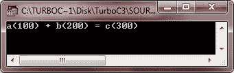
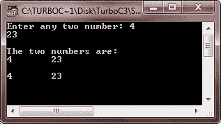
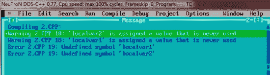
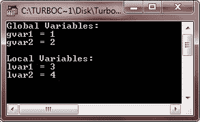
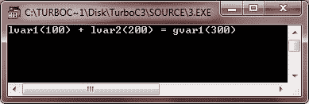

# C++变量范围

> 原文：<https://codescracker.com/cpp/cpp-variable-scope.htm>

变量作用域表示变量的作用域，也就是说，在 C++程序中可以使用它们的地方。基本上，在一个 C++程序中，一个变量可以有两个作用域。第一个是局部变量，第二个是全局变量。让我们来看看。

## C++局部变量

局部变量是那些在函数/块中声明的变量。下面是一个 C++中局部变量的例子，演示了 C++中的变量作用域:

```
/* C++ Variable Scope - Local Variable */

#include<iostream.h>
#include<conio.h>
void main()
{
   clrscr();
   int a = 100, b = 200, c;
   c = a + b;
   cout<<"a(100) + b(200) = c("<<c<<")";
   getch();
}
```

以下是上述 C++程序的示例输出:



让我们用另一个程序来演示 C++中的变量作用域:

```
/* C++ Variable Scope - Local Variable */

#include<iostream.h>
#include<conio.h>
void main()
{
   clrscr();
   int num1, num2;
   cout<<"Enter any two number: ";
   cin>>num1>>num2;
   cout<<"\nThe two numbers are:\n";
   cout<<num1<<"\t"<<num2;
   if(num1<100 || num2<100)
   {
      int localvar1, localvar2;   // local variables declared
      localvar1=num1;
      localvar2=num2;
      cout<<"\n\n"<<localvar1<<"\t"<<localvar2;
   }
   getch();
}
```

下面是这个 C++程序的运行示例:



如果您尝试在 If 块之外使用 localvar1 和 localvar2(它们是在本地声明的),如下所示:

```
/* C++ Variable Scope - Wrong use of Local Variables */

#include<iostream.h>
#include<conio.h>
void main()
{
   clrscr();
   int num1, num2;
   cout<<"Enter any two number: ";
   cin>>num1>>num2;
   cout<<"\nThe two numbers are:\n";
   cout<<num1<<"\t"<<num2;
   if(num1<100 || num2<100)
   {
      int localvar1, localvar2;   // local variables declared
      localvar1=num1;
      localvar2=num2;
   }
   cout<<"\n\n"<<localvar1<<"\t"<<localvar2;   // error occurred..!!
   getch();
}
```

然后，将显示四条错误消息，如下图所示:



从上面的 C++程序中可以看出，局部变量在退出声明它们的作用域时被销毁。所以他们在街区外变得不为人知。现在让我们讨论一下 C++中的全局变量

## 全局变量

全局变量是那些定义在所有函数/块之外的变量。下面是一个使用全局变量的例子，帮助你理解 C++中的变量作用域:

```
/* C++ Variable Scope - Global Variable */

#include<iostream.h>
#include<conio.h>

int gvar1, gvar2;

void main()
{
   clrscr();
   int lvar1, lvar2;

   gvar1 = 1;
   gvar2 = 2;
   lvar1 = 3;
   lvar2 = 4;

   cout<<"Global Variables:\n";
   cout<<"gvar1 = "<<gvar1<<"\n";
   cout<<"gvar2 = "<<gvar2<<"\n";
   cout<<"\nLocal Variables:\n";
   cout<<"lvar1 = "<<lvar1<<"\n";
   cout<<"lvar2 = "<<lvar2<<"\n";

   getch();
}
```

下面是这个 C++程序的示例输出:



下面是另一个 C++程序，也同时使用了局部和全局变量:

```
/* C++ Variable Scope - Global Variable */

#include<iostream.h>
#include<conio.h>

int gvar1;

void main()
{
   clrscr();
   int lvar1, lvar2;
   lvar1 = 100;
   lvar2 = 200;
   gvar1 = lvar1 + lvar2;
   cout<<"lvar1(100) + lvar2(200) = gvar1("<<gvar1<<")";
   getch();
}
```

下面是这个 C++程序的示例输出:



也可以用相同的名称声明局部和全局变量。但请记住，局部变量将采取更高的偏好。更多的局部变量，更多的偏好。这里有一个例子:

```
/* C++ Variable Scope - Global Variable */

#include<iostream.h>
#include<conio.h>

int var = 200;

void main()
{
   clrscr();

   /* local variable is going to declare
    * with same name as global variable
    * Local variables always having high
    * priority than global variables.
    * Therefore the value (100) initialized here
    * will be printed, not 200.
    */

    int var = 100;
    cout<<var;
    getch();
}
```

下面是上述 C++程序的示例输出:


[C++在线测试](/exam/showtest.php?subid=3)

* * *

* * *