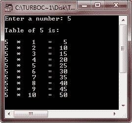
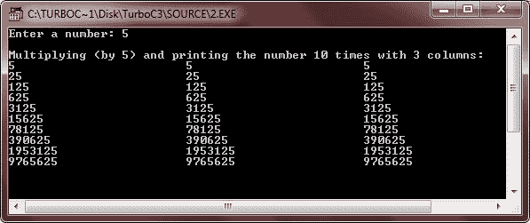

# C++ 格式化输出

> 原文：<https://codescracker.com/cpp/cpp-formatting-output.htm>

在 C++ 中格式化输出，在输出屏幕的开发中是很重要的，可以很容易地阅读和理解。C++ 为程序员提供了几个输入/输出操纵器。其中两种(广泛使用的)I/O 操纵器是:

*   setw()
*   设定精度()

为了使用这些操纵器，必须包含名为 iomanip.h 的头文件。下面是一个示例，显示如何在 C++ 程序中包含该头文件。

```
#include<iomanip.h>
```

## setw()操纵器

在 C++ 中，setw()操纵器设置为输出分配的字段宽度。它将字段的大小(以字符数表示)作为参数。下面是一个例子，这个代码片段:

```
cout<<setw(6)<<"R";
```

在屏幕上生成以下输出(每个下划线代表一个空格)。

```
_ _ _ _ _R
```

setw()操作符不会从一条 cout 语句粘着到下一条语句。例如，如果您想在一个 8 个空格的字段中右对齐三个数字，您需要对每个值重复 setw()，如下所示:

```
cout<<setw(8)<<22<<"\n";
cout<<setw(8)<<4444<<"\n";
cout<<setw(8)<<666666<<endl;
```

输出将是(每个下划线代表一个空格):

```
_ _ _ _ _ _ 2 2
_ _ _ _ 4 4 4 4
_ _ 6 6 6 6 6 6
```

## C++ 格式化输出示例

这里有一些示例程序演示，如何在 C++ 中格式化输出屏幕

```
/* C++ Formatting Output - The setw() Manipulator */

#include<iostream.h>
#include<iomanip.h>
#include<conio.h>
void main()
{
   clrscr();
   int i, num;
   cout<<"Enter a number: ";
   cin>>num;
   cout<<"\nTable of "<<num<<" is:\n\n";
   for(i=1; i<=10; i++)
   {
      cout<<num<<setw(3)<<"*"<<setw(4)<<i<<setw(4)<<"="<<setw(4)<<num*i<<"\n";
   }
   getch();
}
```

下面是上述 C++ 程序的运行示例:



这里是另一种类型的 C++ 程序，也是演示用 C++ 输出格式化

```
/* C++ Formatting Output - The setw() Manipulator */

#include<iostream.h>
#include<iomanip.h>
#include<conio.h>
void main()
{
   clrscr();
   int i;
   long int num;
   cout<<"Enter a number: ";
   cin>>num;
   cout<<"\nMultiplying (by 5) and printing the number 10 times with 3 columns:\n";
   for(i=0; i<10; i++)
   {
      cout<<num<<setw(25)<<num<<setw(25)<<num<<"\n";
      num = num * 5;
   }
   getch();
}
```

下面是这个 C++ 程序的运行示例:



### setprecision()操纵器

在 C++ 中，setprecision()操作符设置打印浮点数时显示的总位数。下面是一个例子，这个代码片段:

```
cout<<setprecision(5)<<123.456;
```

会将以下输出打印到屏幕上(注意舍入) :

```
123.46
```

setprecision()操纵器也可用于设置要显示的小数位数。为了让 setprecision()完成这个任务，您必须设置一个 ios 标志。该标志是用以下语句设置的:

```
cout.setf(ios::fixed);
```

一旦设置了标志，您传递给 setprecision()的数字就是您想要显示的小数位数。以下代码:

```
cout.setf(ios::fixed);
cout<<setprecision(5)<<12.345678;
```

在屏幕上生成以下输出(注意没有舍入):

```
12.34567
```

### 附加 IOS 标志

在声明中:

```
cout.setf(ios::fixed);
```

“固定”即 ios::fixed 被称为格式选项。其他可能的格式选项可以是下列选项之一:

| 格式值 | 意义 |
| 左边的 | 左对齐输出 |
| 正确 | 右对齐输出 |
| 展示点 | 显示所有浮点数的小数点和尾随零，即使不需要小数位 |
| 大写字母 | 将电子符号中的“E”显示为“E ”,而不是“E” |
| showpos | 在正值前显示前导加号 |
| 科学的 | 以科学(“E”)符号显示浮点数 |
| 固定的；不变的 | 以普通符号显示浮点数-没有尾随零，也没有科学符号 |

可以通过用 unsetf 替换 setf(与 cout 一起使用，recall cout.setf)来删除这些选项。例如，要将 5.8 显示为 5.80，需要以下代码行:

```
// display money
cout.setf(ios::fixed);
cout.setf(ios::showpoint);
cout<<setprecision(2);
cout<<5.8;
```

请注意，所有后续 couts 都保留上一次 setprecision()设置的精度。这意味着 setprecision()是“粘性的”。无论您设置什么样的精度，都将与 cout 设备保持一致，直到您在程序的后面使用额外的 setprecision()对其进行更改。

[C++ 在线测试](/exam/showtest.php?subid=3)

* * *

* * *