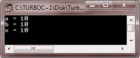

# C++赋值运算符和语句

> 原文：<https://codescracker.com/cpp/cpp-assignment-statements.htm>

## 赋值运算符

基本上，赋值运算符用于将一个[变量](/cpp/cpp-variables.htm)的值赋给另一个变量。或者给变量赋值。 这里是给变量赋值或给变量赋值的一般形式

```
a = b;
x = 10;
```

在上面的语句中，b 的值赋给 a，值 10 赋给 x。下面是一个例子

```
/* C++ Assignment Operator */

#include<iostream.h>
#include<conio.h>
void main()
{
   clrscr();

   int a, b=10, x;
   a = b;
   x = 10;

   cout<<"a = "<<a<<endl;
   cout<<"b = "<<b<<endl;
   cout<<"x = "<<x<<endl;

   getch();
}
```

以下是上述 C++程序的示例输出:



## 赋值语句

众所周知，一个表达式由一个或多个操作组成。表达式已终止；(分号)变成一个语句。C++程序中最小可执行单元的语句。语句以分号结束。

赋值语句给变量赋值。赋值可以是常量、变量或表达式。赋值语句的一般形式如下:

```
a = cve ;
```

其中 a 是被赋值的变量，cve 可以是常量、变量或表达式。以下是赋值语句的一些示例:

```
x = 16;
y = 3.6;
z = x + y;
z = z × x;
a = b + c - d;
```

符号“=”被称为赋值运算符。C++的一个常见特性是可以连续使用赋值操作符。

**提示** -赋值可以链接在一起。

赋值运算符=返回赋值的值，并实际将该值赋给左边的操作数。因此，作业可以被链接在一起。当将相同的值分配给多个项目时，这很有用。举个例子，

```
x = y = z = 13
```

此语句将值 13 赋给 x、y 和 z。此多重赋值语句中的所有变量必须在之前声明。这种说法是从右向左的。首先，将 13 赋给 z，然后将 z 的值(现在是 13)赋给 y，然后将 y 的值 13 赋给 x。

**注意**-turbo c++版本 3.0 允许链接最多 70 个赋值。所有参与多重赋值语句 的变量都必须预先声明。

### 更多示例

这里列出了一些 C++程序，您可能会喜欢:

*   [加两个数](/cpp/program/cpp-program-add-two-numbers.htm)
*   [检查偶数或奇数](/cpp/program/cpp-program-check-even-odd.htm)
*   [检查是否灌注](/cpp/program/cpp-program-check-prime.htm)
*   [是否检查字母](/cpp/program/cpp-program-check-alphabet.htm)
*   [是否检查元音](/cpp/program/cpp-program-check-vowel.htm)
*   [检查阿姆斯特朗与否](/cpp/program/cpp-program-find-armstrong-number.htm)
*   [生成阿姆斯特朗数字](/cpp/program/cpp-program-generate-armstrong-number.htm)
*   [查找 ncR nPr](/cpp/program/cpp-program-find-ncr-npr.htm)
*   [求数字](/cpp/program/cpp-program-find-factorial.htm)的阶乘
*   [查找 HCF LCM](/cpp/program/cpp-program-find-hcf-lcm.htm)

[C++在线测试](/exam/showtest.php?subid=3)

* * *

* * *