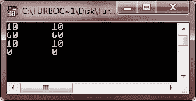

# C++ 速记

> 原文：<https://codescracker.com/cpp/cpp-shorthands.htm>

C++ 提供了特殊的简写方式，简化了某种类型赋值语句的编码。举个例子，

```
a = a + 10;
```

可以写成

```
a += 10;
```

运算符+=告诉编译器将 a+10 的值赋给 a。这种简写适用于 C++ 中的所有二元运算(需要两个操作数的运算)。C++ 简写的一般形式是:

```
var = var operator expression ;
```

与相同

```
var operator = expression ;
```

以下是一些 C++ 简写的例子:

```

x - = 10 ;      equivalent to      x = x - 10 ;
x ∗ = 3 ;      equivalent to      x = x ∗ 3 ;
x / = 2 ;      equivalent to      x = x/2 ;
x % = 2 ;      equivalent to      x = x % z ;
```

## C++ 速记示例

让我们举一个例子，演示 C++ 中的速记概念

```
/* C++ Shorthand */

#include<iostream.h>
#include<conio.h>
void main()
{
   clrscr();

   int x, res1, res2;

   x = 20;
   x = x - 10;
   res1 = x;
   x = 20;
   x -= 10;
   res2 = x;
   cout<<res1<<"\t"<<res2<<endl;

   x = 20;
   x = x * 3;
   res1 = x;
   x = 20;
   x *= 3;
   res2 = x;
   cout<<res1<<"\t"<<res2<<endl;

   x = 20;
   x = x/2;
   res1 = x;
   x = 20;
   x /= 2;
   res2 = x;
   cout<<res1<<"\t"<<res2<<endl;

   x = 20;
   x = x % 2;
   res1 = x;
   x = 20;
   x %= 2;
   res2 = x;
   cout<<res1<<"\t"<<res2<<endl;

   getch();
}
```

以下是上述 C++ 程序的示例输出:



[C++ 在线测试](/exam/showtest.php?subid=3)

* * *

* * *