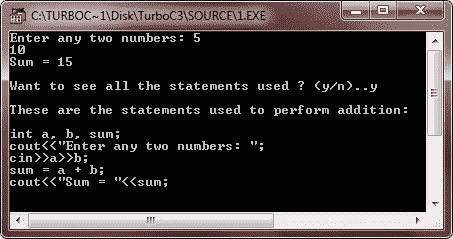

# C++语句

> 原文：<https://codescracker.com/cpp/cpp-statements.htm>

语句是计算机执行任何操作的指令，无论是数据移动、决策还是重复操作。C++程序中最小可执行单元的语句。

语句以分号(；).最简单的语句是空语句。它采取以下形式:

```
 ;       // it is a null statement (notice, it is just a semicolon)
```

在语言的语法要求存在语句但程序的逻辑不要求存在语句的情况下，空语句是有用的。

## 复合语句-块语句

C++中的复合语句是由一对大括号{}括起来的一系列语句。举个例子，

```
{
   statement1 ;
   statement2 ;
   :
   :
   :
   statementN ;
}
```

表示一个复合语句。复合语句等价地称为块。复合语句或块被视为一个单元，可以出现在程序中单个语句出现的任何地方。让我们举一个例子

```
/* C++ Statements */

#include<iostream.h>
#include<conio.h>
#include<stdlib.h>
void main()
{
   clrscr();
   int a, b, sum;
   cout<<"Enter any two numbers: ";
   cin>>a>>b;
   sum = a + b;
   cout<<"Sum = "<<sum;
   char ch;
   cout<<"\n\nWant to see all the statements used ? (y/n)..";
   cin>>ch;
   cout<<"\n";
   if(ch=='y' || ch=='Y')
   {
      cout<<"These are the statements used to perform addition:\n\n";
      cout<<"int a, b, sum;\n";
      cout<<"cout<<\"Enter any two numbers: \";\n";
      cout<<"cin>>a>>b;\n";
      cout<<"sum = a + b;\n";
      cout<<"cout<<\"Sum = \"<<sum;\n";
   }
   else
   {
      cout<<"Press any key to exit..\n";
      getch();
      exit(1);
   }
   getch();
}
```

下面是上述 C++程序的运行示例:



### 更多示例

下面列出了更多的 C++程序，您可能会喜欢:

*   [加两个数](/cpp/program/cpp-program-add-two-numbers.htm)
*   [华氏到摄氏的转换](/cpp/program/cpp-program-convert-fahrenheit-to-centigrade.htm)
*   [摄氏到华氏的转换](/cpp/program/cpp-program-convert-centigrade-to-fahrenheit.htm)
*   [打印 ASCII 值](/cpp/program/cpp-program-print-ascii-values.htm)
*   [打印斐波那契数列](/cpp/program/cpp-program-print-fabonacci-series.htm)
*   [检查回文与否](/cpp/program/cpp-program-palindrome-number.htm)
*   [检查阿姆斯特朗与否](/cpp/program/cpp-program-find-armstrong-number.htm)
*   [生成阿姆斯特朗数字](/cpp/program/cpp-program-generate-armstrong-number.htm)
*   [查找 ncR nPr](/cpp/program/cpp-program-find-ncr-npr.htm)

[C++在线测试](/exam/showtest.php?subid=3)

* * *

* * *