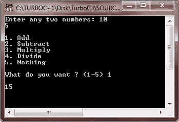
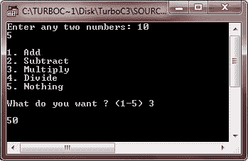
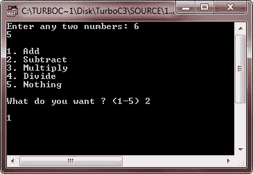
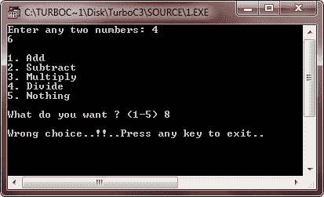

# C++决策

> 原文：<https://codescracker.com/cpp/cpp-decision-making.htm>

C++中的决策语句允许您指定一个或多个条件，由您的程序进行评估，以运行特定的语句。C++中有以下类型的决策语句。您将在[C++ if if-else if-else-if switch 语句](/cpp/cpp-selection-statements.htm)教程中详细了解这些 c++决策语句。

*   [if 语句](/cpp/cpp-selection-statements.htm)
*   [if-else 语句](/cpp/cpp-selection-statements.htm)
*   [嵌套 if 语句](/cpp/cpp-selection-statements.htm)
*   [开关语句](/cpp/cpp-selection-statements.htm)
*   [嵌套开关语句](/cpp/cpp-selection-statements.htm)

在下一个教程中，你将详细了解上述 C++决策语句。

## C++决策示例

让我们举一些例子，实际演示上面列出的 C++决策语句。如前所述，本章的解释和细节描述将在下一个教程中介绍。

```
/* C++ Decision Making */

#include<iostream.h>
#include<conio.h>
#include<stdlib.h>
void main()
{
   clrscr();
   int a, b;
   char choice;
   cout<<"Enter any two numbers: ";
   cin>>a>>b;
   cout<<"\n";
   cout<<"1\. Add\n";
   cout<<"2\. Subtract\n";
   cout<<"3\. Multiply\n";
   cout<<"4\. Divide\n";
   cout<<"5\. Nothing\n";
   cout<<"\nWhat do you want ? (1-5) ";
   cin>>choice;
   cout<<"\n";
   switch(choice)
   {
      case '1' :
         cout<<a+b;
         break;
      case '2' :
         cout<<a-b;
         break;
      case '3' :
         cout<<a*b;
         break;
      case '4' :
         cout<<a/b;
         break;
      case '5' :
         exit(1);
      default :
         cout<<"Wrong choice..!!..Press any key to exit..\n";
         getch();
         exit(2);
   }
   getch();
}
```

下面是上述 C++决策程序的运行示例:



这是 C++决策程序的另一个运行示例:



这是另一个 C++程序，也实际演示了 C++决策

```
/* C++ Decision Making */

#include<iostream.h>
#include<conio.h>
#include<stdlib.h>
void main()
{
   clrscr();
   int a, b;
   char choice;
   cout<<"Enter any two numbers: ";
   cin>>a>>b;
   cout<<"\n";
   cout<<"1\. Add\n";
   cout<<"2\. Subtract\n";
   cout<<"3\. Multiply\n";
   cout<<"4\. Divide\n";
   cout<<"5\. Nothing\n";
   cout<<"\nWhat do you want ? (1-5) ";
   cin>>choice;
   cout<<"\n";
   if(choice == '1')
   {
      cout<<a+b;
   }
   else if(choice == '2')
   {
      cout<<a-b;
   }
   else if(choice=='3')
   {
      cout<<a*b;
   }
   else if(choice=='4')
   {
      cout<<a/b;
   }
   else if(choice=='5')
   {
      exit(1);
   }
   else
   {
      cout<<"Wrong choice..!!..Press any key to exit..\n";
      getch();
      exit(2);
   }
   getch();
}
```

下面是上述 C++决策程序的两个运行示例:




### 更多示例

这里有更多的 C++决策程序，你可能会喜欢:

*   [检查偶数或奇数](/cpp/program/cpp-program-check-even-odd.htm)
*   [检查是否灌注](/cpp/program/cpp-program-check-prime.htm)
*   [是否检查字母](/cpp/program/cpp-program-check-alphabet.htm)
*   [是否检查元音](/cpp/program/cpp-program-check-vowel.htm)
*   [是否勾选闰年](/cpp/program/cpp-program-check-leap-year.htm)
*   [检查反转是否等于原稿](/cpp/program/cpp-program-check-reverse-equal-original.htm)
*   [加减乘除](/cpp/program/addition-subtraction-multiplication-division.htm)
*   [制作计算器](/cpp/program/cpp-program-make-calculator.htm)
*   [检查回文与否](/cpp/program/cpp-program-palindrome-number.htm)
*   [检查阿姆斯特朗与否](/cpp/program/cpp-program-find-armstrong-number.htm)

[C++在线测试](/exam/showtest.php?subid=3)

* * *

* * *