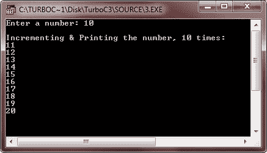

# C++ 循环

> 原文：<https://codescracker.com/cpp/cpp-loop-types.htm>

循环允许我们多次执行一段代码或语句。C++ 提供了以下类型的循环来处理程序中的循环需求。这些循环的详细描述在 [C++ for while do-while 循环](/cpp/cpp-iteration-statements.htm)教程中提供。

*   [为循环](/cpp/cpp-iteration-statements.htm)
*   [while 循环](/cpp/cpp-iteration-statements.htm)
*   [do-while 循环](/cpp/cpp-iteration-statements.htm)
*   [嵌套循环](/cpp/cpp-iteration-statements.htm)

上表中提供的所有循环的详细描述将在下一个教程中讨论。现在，让我们举一些关于循环的例子。先说 for 循环程序。

```
/* C++ Loops Example */

#include<iostream.h>
#include<conio.h>
void main()
{
   clrscr();
   int num, l;
   cout<<"Enter a number: ";
   cin>>num;
   cout<<"\nIncrementing & Printing the number, 10 times:\n";
   for(l=0; l<10; l++)
   {
      num++;
      cout<<num<<"\n";
   }
   getch();
}
```

下面是上述 C++ 程序的运行示例


下面是一个用 C++ 演示 while 循环的示例程序

```
/* C++ Loops Program */

#include<iostream.h>
#include<conio.h>
void main()
{
   clrscr();
   int num, l=0;
   cout<<"Enter a number: ";
   cin>>num;
   cout<<"\nIncrementing & Printing the number, 10 times:\n";
   while(l<10)
   {
      num++;
      cout<<num<<"\n";
      l++;
   }
   getch();
}
```

下面是这个 C++ 程序的运行示例，产生了与上面相同的结果


这是一个示例程序，演示了 C++ 中的 do-while 循环

```
/* C++ Loops Example */

#include<iostream.h>
#include<conio.h>
void main()
{
   clrscr();
   int num, l=0;
   cout<<"Enter a number: ";
   cin>>num;
   cout<<"\nIncrementing & Printing the number, 10 times:\n";
   do
   {
      num++;
      cout<<num<<"\n";
      l++;
   }while(l<10);
   getch();
}
```

下面是上面的 C++ 程序的运行示例，也产生了与上面两个程序相同的输出



你将在下一章详细地了解所有关于循环的内容。

### 更多示例

这里列出了更多示例，您可能会喜欢:

*   [十进制到二进制的转换](/cpp/program/cpp-program-convert-decimal-to-binary.htm)
*   [十进制到八进制的转换](/cpp/program/cpp-program-convert-decimal-to-octal.htm)
*   [十进制到十六进制的转换](/cpp/program/cpp-program-convert-decimal-to-hexadecimal.htm)
*   [二进制到十进制的转换](/cpp/program/cpp-program-convert-binary-to-decimal.htm)
*   [二进制到八进制的转换](/cpp/program/cpp-program-convert-binary-to-octal.htm)
*   [二进制到十六进制的转换](/cpp/program/cpp-program-convert-binary-to-hexadecimal.htm)
*   [八进制到十进制的转换](/cpp/program/cpp-program-convert-octal-to-decimal.htm)
*   [八进制到二进制的转换](/cpp/program/cpp-program-convert-octal-to-binary.htm)
*   [八进制到十六进制的转换](/cpp/program/cpp-program-convert-octal-to-hexadecimal.htm)
*   [十六进制到十进制的转换](/cpp/program/cpp-program-convert-hexadecimal-to-decimal.htm)
*   [十六进制到二进制的转换](/cpp/program/cpp-program-convert-hexadecimal-to-binary.htm)
*   [十六进制到八进制的转换](/cpp/program/cpp-program-convert-hexadecimal-to-octal.htm)
*   [花样程序](/cpp/program/cpp-program-print-star-pyramid-patterns.htm)

[C++ 在线测试](/exam/showtest.php?subid=3)

* * *

* * *