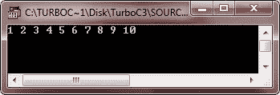

# C++ for while do-`while`循环

> 原文：<https://codescracker.com/cpp/cpp-iteration-statements.htm>

迭代(for、while 和 do-`while`循环)语句允许重复执行一组指令，直到满足某个条件。迭代语句也称为循环或循环语句。C++ 提供了三种循环:

*`for`循环
*`while`循环
*   do-`while`循环

只要指定的条件保持为真，C++ 的所有三个循环结构都会重复一组语句。这种特定条件通常被称为循环控制。对于所有三个循环语句，真条件是任何非零值。零值表示错误条件。

### 循环部件

每个循环都有控制和管理其执行的元素。通常，一个循环有四个不同用途的元素。这些要素是:

*   初始化表达式
*   测试表达式
*   更新表达式
*   卢普体

让我们逐一讨论循环的这些部分。

### 初始化表达式

进入循环之前，必须对其控制变量进行初始化。控制变量的初始化在初始化表达式下进行。初始化表达式为循环变量提供第一个值。初始化表达式仅在循环开始时执行一次。

### 测试表达式

测试表达式的真值决定了循环体是否会被执行。如果测试表达式的值为真，即 1，则执行循环体，否则循环终止。

在入口控制的循环中，测试表达式在退出循环之前被求值。在 C++ 中，`for`循环和`while`循环是入口控制循环，do-`while`循环是出口控制循环。

### 更新表达式

更新表达式改变循环变量的值。执行更新表达式；在执行完循环体后的循环结束时。

### 卢普体

从循环体开始重复执行的语句(只要测试表达式非零)。在一个入口控制的循环中，第一个测试表达式被求值，如果非零，循环体被执行；如果测试表达式评估为零，则循环终止。在退出控制的循环中，首先执行循环体，然后计算测试表达式。如果其评估为零，则循环终止，否则重复。现在让我们讨论 C++ 循环:for、while 和 do-while。

## C++`for`循环`for`循环是 C++ 循环中最容易理解的。它的所有循环控制元素都聚集在一个地方(循环的顶部)，而在 C++ 的另一个循环结构中，它们(顶部控制元素)分散在程序中。

### C++`for`循环语法`for`循环语句的一般形式(语法)是:

```
for(initialization expression(s); test-expression; update expression(s))
{
   body-of-the-loop ;
}
```

### C++`for`循环示例

以下示例程序说明了 for 语句的用法:

```
/* C++ Iteration Statements - C++ for Loop */

#include<iostream.h>
#include<conio.h>
void main()
{
   clrscr();
   int i;
   for(i=1; i<=10; i++)
   {
      cout<<i<<" ";
   }
   getch();
}
```

当编译并执行上述程序时，它将产生以下输出:



下面几行解释了上面给出的`for`循环程序的工作原理:

*   首先，执行初始化表达式，即 i=1，它将第一个值 1 赋予变量 I。
*   然后，测试表达式被评估，即 i <= 10，其结果为真，即 1。
*   因为测试表达式为真，所以执行循环体，即 cout << i << " ";
    ，打印 I 的当前值，然后打印一个空格。
*   在执行循环体之后，执行更新表达式，即 i++，它增加 I 的值。(在第一次执行循环之后，I 的值在执行 i++之后变成 2，因为最初 I 是 1)。
*   执行更新表达式后，将再次计算测试表达式。如果为真，则从步骤 3 开始重复该序列，否则循环终止。

**注意**——当你必须重复一组语句特定的次数时，使用`for`循环。

## C++ 无限循环

虽然任何 loop 语句都可以用来创建一个无限循环(endless loop ),但 for 习惯上用于此目的。省略测试表达式可以创建一个无限`for`循环，如下所示:

```
for(i=25; ; i--)
{
   cout << "This loop runs forever..!!" ;
}
```

同样，下面的`for`循环也是一个无限循环:

```
for( ; ; )
{
   cout << "I will not stop..!!" ;
}
```

这是一个 C++ 中无限循环的例子

```
/* C++ Loops - C++ Infinite Loop */

#include<iostream.h>
#include<conio.h>
void main()
{
   clrscr();
   for( ; ; )
   {
      cout<<"This loop will run forever..!!";
   }
   getch();
}
```

当条件表达式不存在时，假设为真。您可能有一个初始化和增量表达式，但 C++ 程序员更常用 for(；；)构造来表示无限循环。如果你试着运行上面的 C++ 程序，那么输出窗口会像这样，连续打印


**注意** -你可以通过按`Ctrl+C`键终止无限循环。让我们用另一个程序，无限次打印星星

```
/* C++ Loops - C++ Infinite Loop */

#include<iostream.h>
#include<conio.h>
void main()
{
   clrscr();
   for(;;)
   {
      cout<<"*  ";
   }
   getch();
}
```

运行这个 C++ 程序后，输出窗口看起来像这样，打印星号无限次


### C++ 空循环

如果循环体中不包含任何语句，则称之为空循环。在这种情况下，C++ 循环包含一个空语句，即 null 语句。`for`循环后面是一个空循环:

```
for(i=20; (i); i--) ;
```

看，上面的`for`循环体只包含(一个空语句)。这是一个空循环。空`for`循环在指针操作中有其应用，在这种情况下，您需要增加或减少指针位置，而不需要做任何其他事情。

程序中经常使用延时循环。下面的代码演示如何使用 for 创建一个:

```
for(t = 0; t < 3000; t++) ;
```

这意味着如果你在 for 的括号后面加一个分号，它只会重复计算控制变量。而如果在这样的循环后放一个语句块，那么它就不是`for`循环的一部分。例如，考虑以下情况:

```
for(i=0; i<10; i++) ;
{
   cout << "i = " << i << endl;
}
````for`循环后的分号仅在此结束循环。然后，below 也就是说，不是`for`循环的主体。

## C++`while`循环

C++ 中第二个可用的循环是`while`循环。`while`循环是一个空控制的循环。

### C++`while`循环语法

以下是`while`循环的语法:

```
while(expression)
{
   loop-body ;
}
```

其中循环体可以包含单个语句、复合语句或空语句。当表达式计算结果为 true 时，循环迭代。当表达式变为 false 时，程序控制传递到循环体代码之后的行。

在`while`循环中，循环控制变量应该在循环开始前初始化，因为未初始化的变量可以用在表达式中。循环变量应该在主体中更新。

### C++`while`循环示例

以下示例程序说明了`while`循环的工作方式:

```
/* C++ Iteration Statements - C++ while Loop */

#include<iostream.h>
#include<conio.h>
void main()
{
   clrscr();
   unsigned long num, fact=1;
   cout<<"Enter a number: ";
   cin>>num;
   while(num)
   {
      fact = fact*num;
      num--;
   }
   cout<<"The factorial of the number is "<<fact;
   getch();
}
```

当上述程序编译并执行时，它会产生以下输出:


上面的程序输入一个整数 num。然后，只要 num 是非零的(根据 while (num))，循环体就迭代，即，fact 乘以 num，并且结果被存储回 fact，随后 num 递减。再次评估测试表达式(num ):如果为真，则循环重复，否则终止。

## C++ do-`while`循环

与 for 和`while`循环不同，do-while 是一个受退出控制的循环，也就是说，它在执行完循环体语句后，在循环的底部计算其测试表达式。这意味着 do-`while`循环总是至少执行一次。

在 for 和 while 的其他两个循环中，测试表达式在循环开始时计算，即在执行循环体之前。如果测试表达式本身第一次评估为 false，则永远不会执行循环。但是在某些情况下，无论测试表达式的初始状态是什么，都希望循环体至少执行一次。在这种情况下，do-`while`循环是显而易见的选择。

### C++ do-`while`循环语法

do-`while`循环的语法是:

```
do
{
   statement ;
}while(test-expression);
```

当循环体包含单个语句时，不需要大括号{ }。以下 do-`while`循环打印所有大写字母:

```
char ch = 'A' ;
do
{
   cout << "\n" << ch ;
   ch++;
}while(ch <= 'Z');
```

上面的代码从“A”开始打印字符，直到条件 ch < =“Z”变为假。

### C++ do-`while`循环示例

do-`while`循环最常见的用途是在菜单选择例程中，其中菜单至少闪烁一次。然后根据用户的反应，重复或终止。

下面的示例程序是一个菜单选择程序。以下程序显示关于矩形操作的菜单，并根据用户的响应执行:

```
/* C++ Iteration Statements - C++ do-while Loop */

#include<iostream.h>
#include<conio.h>
#include<math.h>
#include<process.h>
void main()
{
   clrscr();
   char ch, ch1;
   float l, b, peri, area, diag;
   cout<<"Rectangle Menu";
   cout<<"\n 1\. Area";
   cout<<"\n 2\. Perimeter";
   cout<<"\n 3\. Diagonal";
   cout<<"\n 4\. Exit\n";
   cout<<"\nEnter your choice: ";
   do
   {
      cin>>ch;
      if(ch == '1' || ch == '2' || ch == '3')
      {
         cout<<"Enter length & breadth: ";
         cin>>l>>b;
      }
      switch(ch)
      {
         case '1' : area = l * b ;
            cout<<"Area = "<<area;
            break ;
         case '2' : peri = 2 * (l + b);
            cout<<"Perimeter = "<<peri;
            break;
         case '3' : diag = sqrt((l * l) + (b * b));
            cout<<"Diagonal = "<<diag;
            break;
         case '4' : cout<<"Breaking..Press a key..";
            getch();
            exit(1);
         default : cout<<"Wrong choice !!!!";
            cout<<"\nEnter a valid one";
            break;
      }     //end of switch
      cout<<"\nWant to enter more (y/n) ? ";
      cin>>ch1;
      if(ch1 == 'y' || ch1 == 'Y')
      cout<<"Again enter choice (1-4): ";
   }while(ch1 == 'y' || ch1 == 'Y') ;      //end of DO-WHILE loop
   getch();
}
```

当编译并执行上述程序时，它将产生以下输出:


## C++ 嵌套循环

一个循环体中可以包含另一个循环。这种形式的循环称为嵌套循环。但是在嵌套循环中，内部循环必须在外部循环之前终止。下面是一个嵌套循环的示例。

```
/* C++ Iteration Statements - C++ Nested Loops */

#include<iostream.h>
#include<conio.h>
void main()
{
   clrscr();
   int i, j;
   for(i=0; i<15; i++)
   {
      for(j=0; j<=i; j++)
      {
         cout<<"* ";
      }
      cout<<"\n";
   }
   getch();
}
```

当编译并执行上述程序时，它将产生以下输出:


这是另一个程序，演示了 C++ 中的嵌套循环

```
/* C++ Loops Program */

#include<iostream.h>
#include<conio.h>
void main()
{
   clrscr();
   int num, temp, i, j;
   cout<<"Enter a number: ";
   cin>>num;
   for(i=0; i<10; i++)
   {
      num++;
      temp=num;
      for(j=0; j<=i; j++)
      {
         cout<<num<<" ";
         num++;
      }
      cout<<"\n";
      num=temp;
   }
   getch();
}
```

下面是上述 C++ 程序的运行示例:


### 更多示例

这里列出了更多示例，您可能会喜欢:

*   [十进制到二进制的转换](/cpp/program/cpp-program-convert-decimal-to-binary.htm)
*   [花样程序](/cpp/program/cpp-program-print-star-pyramid-patterns.htm)
*   [打印菱形图案](/cpp/program/cpp-program-print-diamond-pattern.htm)
*   [打印弗洛伊德三角形](/cpp/program/cpp-program-print-floyd-triangle.htm)
*   [打印帕斯卡三角形](/cpp/program/cpp-program-print-pascal-triangle.htm)
*   [打印笑脸](/cpp/program/cpp-program-print-smiling-face-on-screen.htm)

[C++ 在线测试](/exam/showtest.php?subid=3)

* * *

* * *