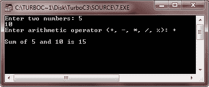

# C++ 函数

> 原文：<https://codescracker.com/cpp/cpp-functions.htm>

函数是作用于数据的子程序，通常返回一个值。大型程序通常会避免使用，因为很难管理单一的指令列表。因此，一个大的程序被分解成称为函数的更小的单元。函数是一组程序语句的命名单元。这个单元可以从程序的其他部分调用。

### 为什么要用函数？

使用函数的最重要的原因是使程序处理更容易，因为一次只处理程序的一小部分，从而避免歧义。使用函数的另一个原因是减少程序的大小。函数使程序对程序员来说更具可读性和可理解性，从而使程序管理更容易。

## C++ 函数类型

有两种类型的函数:库函数和用户自定义函数。库函数是具有特殊含义的预定义函数，而用户定义函数是由程序员/用户定义的函数。库函数也称为内置函数。你将在 [C++ 函数类型](/cpp/cpp-functions-types.htm)教程中详细了解函数类型。

## C++ 函数定义

在 C++ 中，函数必须在程序的任何地方使用之前定义。你会在 [C++ 函数原型&定义](/cpp/cpp-function-definition.htm)教程中了解到更多关于函数定义的知识。但是现在，让我们先了解一下。这里是在 C++ 中定义函数的一般形式

```
return_type function_name(comma_separated_parameter_list)
{
   function body
}
```

其中 return_type 是任何有效的 C++ 数据类型，指定函数的返回语句返回的值的类型。在这种情况下，如果没有指定类型，编译器会假设函数返回一个整数值。不返回任何值的函数被指定为 void 作为它们的 return_type。现在 function_name 是任意有效的 C++ 标识符，是函数的名字，然后 comma_separated_parameter_list 是用逗号分隔的函数的参数列表。这是一个 C++ 中函数定义的例子

```
int sum(int a, int b)
{
   int add;
   add = a+b;
   return add;
}
```

或者

```
int sum(int a, int b)
{
   return a+b;
}
```

如果函数不返回值，则将 return_type 指定为 void，如下例所示:

```
void greeting(void)
{
   cout<<"Hello C++";
}
```

## C++ 函数原型

函数原型是函数的声明，它告诉程序函数返回值的类型以及参数的数量和类型。你会在 [C++ 函数原型&定义](/cpp/cpp-function-definition.htm)教程中了解到更多关于函数原型的知识。但是现在，让我们对它有一些想法。 以下是一般形式:

```
return_type function_name(parameter_list);
```

注意这里的分号，正如你在上面的函数定义中看到的，没有分号。这可能成为 C++ 中区分函数定义和函数原型的一个原因。这是一个 C++ 的函数原型例子

```
int sum(int a, int b);
```

您也可以将上述声明为

```
int sum(int, int);
```

因为，函数 prototype 只告诉编译器，函数 sum 的返回类型为 int，并声明有两个整型参数。

## 在 C++ 中访问函数

通过提供函数名，后跟用括号括起来的参数，调用或执行函数。您将在 [C++ 函数调用](/cpp/cpp-function-calling.htm)教程中了解更多关于访问函数的信息。 但是现在，让我们先了解一下。调用一个函数，其中 prototype 看起来像上面给出的那样:

```
int sum(int, int);
```

那么函数调用语句可能如下所示:

```
sum(a, b);
```

其中，a 和 b 必须是整型变量。

## C++ 函数示例

下面是一些实际演示 C++ 中函数概念的示例程序。

```
/* C++ Functions - Example Program of C++ Functions */

#include<iostream.h>
#include<conio.h>
void greeting(void);
void main()
{
   clrscr();
   char ch;
   cout<<"Press y for greeting message: ";
   cin>>ch;
   if(ch=='y' || ch=='Y')
   {
      greeting();
   }
   cout<<"\n\nPress any key to exit..!!\n";
   getch();
}
void greeting(void)
{
   cout<<"\nHello, Programmer!";
   cout<<"\nWelcome to codescracker.com";
}
```

以下是上述 C++ 程序的示例输出:


这是另一种演示 C++ 函数的程序

```
/* C++ Functions - Example Program of C++ Functions */

#include<iostream.h>
#include<conio.h>
float cube(float);
void main()
{
   clrscr();
   float numpass, numget;
   cout<<"Enter a number to calculate its cube: \n";
   cin>>numpass;
   numget = cube(numpass);
   cout<<"\nThe cube of "<<numpass<<" is "<<numget;
   getch();
}
float cube(float x)
{
   float temp;
   temp = x*x*x;
   return temp;
}
```

下面是上述 C++ 程序的输出示例。这个程序要求用户输入一个数字，使用函数找到它的立方，然后在输出屏幕上显示该数字的立方，如下所示。


这是另一个 C++ 函数的示例程序

```
/* C++ Functions - Example Program of C++ Functions
 * This program demonstrates call by value method */

#include<iostream.h>
#include<conio.h>
void swap(int, int);
void main()
{
   clrscr();
   int num1, num2;
   cout<<"Enter any two number: ";
   cin>>num1>>num2;
   cout<<"\nBefore:\n\t";
   cout<<"num1 = "<<num1<<"\tnum2 = "<<num2<<"\n\n";
   swap(num1, num2);
   cout<<"After:\n\t";
   cout<<"num1 = "<<num1<<"\tnum2 = "<<num2<<"\n\n";
   getch();
}
void swap(int a, int b)
{
   int temp;
   temp = a;
   a = b;
   b = temp;
   cout<<"In:\n\t";
   cout<<"num1 = "<<a<<"\tnum2 = "<<b<<"\n\n";
}
```

上面的 C++ 程序演示了 C++ 中的按值调用方法。下面是上述 C++ 程序的运行示例。


现在这个程序演示了 C++ 中的引用调用方法

```
/* C++ Functions - Example Program of C++ Functions
 * This program demonstrates call by reference method */

#include<iostream.h>
#include<conio.h>
void swap(int &, int &);
void main()
{
   clrscr();
   int num1, num2;
   cout<<"Enter any two number: ";
   cin>>num1>>num2;
   cout<<"\nBefore:\n\t";
   cout<<"num1 = "<<num1<<"\tnum2 = "<<num2<<"\n\n";
   swap(num1, num2);
   cout<<"After:\n\t";
   cout<<"num1 = "<<num1<<"\tnum2 = "<<num2<<"\n\n";
   getch();
}
void swap(int &a, int &b)
{
   int temp;
   temp = a;
   a = b;
   b = temp;
   cout<<"In:\n\t";
   cout<<"num1 = "<<a<<"\tnum2 = "<<b<<"\n\n";
}
```

因为，通过引用方法调用，对变量的地址进行操作(传递的参数)。所以函数内部的值改变也会影响原始值。下面是上述 C++ 程序的运行示例。


你也可以用指针写上面的 C++ 程序，如这个程序所示。

```
/* C++ Functions - Example Program of C++ Functions
 * This program demonstrates call by reference method */

#include<iostream.h>
#include<conio.h>
void swap(int *, int *);
void main()
{
   clrscr();
   int num1, num2;
   cout<<"Enter any two number: ";
   cin>>num1>>num2;
   cout<<"\nBefore:\n\t";
   cout<<"num1 = "<<num1<<"\tnum2 = "<<num2<<"\n\n";
   swap(&num1, &num2);
   cout<<"After:\n\t";
   cout<<"num1 = "<<num1<<"\tnum2 = "<<num2<<"\n\n";
   getch();
}
void swap(int *a, int *b)
{
   int temp;
   temp = *a;
   *a = *b;
   *b = temp;
   cout<<"In:\n\t";
   cout<<"num1 = "<<*a<<"\tnum2 = "<<*b<<"\n\n";
}
```

因为，指针也是在内存地址上操作的，所以你可以把上面的程序说成是如上面第二个程序所示的引用调用程序。因此，这个 C++ 程序产生的输出与上面显示的引用调用程序中的输出相同。这是这个 C++ 程序产生的输出。


这是另一种类型的 C++ 程序，也演示了函数。

```
/* C++ Functions - Example Program of C++ Functions */

#include<iostream.h>
#include<conio.h>
#include<stdlib.h>
int find_pos(char str[], char ch);
void main()
{
   clrscr();
   char strng[80], chr;
   int y = 0;
   cout<<"Enter the main string: ";
   cin.getline(strng, 80);
   cout<<"Enter a character to be searched for: ";
   cin.get(chr);
   y = find_pos(strng, chr);
   if(y == -1)
   {
      cout<<"\nSorry..!!..character not found in the string..!!\n";
      cout<<"Press any key to exit..\n";
      getch();
      exit(1);
   }
   getch();
}
int find_pos(char str[], char ch)
{
   int flag = -1, i, count=0;
   for(i=0; str[i] != '\0'; i++)
   {
      if(str[i] == ch)
      {
         if(count>0)
         {
            cout<<", "<<i+1;
         }
         else
         {
            count++;
            cout<<"\nThe character is in the string at position\n"<<i+1;
         }
         flag = 0;
      }
   }
   return flag;
}
```

下面是上述 C++ 程序的两个运行示例:


再来一个 C++ 函数的程序。

```
/* C++ Functions - Example Program of C++ Functions */

#include<iostream.h>
#include<conio.h>
#include<stdlib.h>
void calculate(int, int, char);
void main()
{
   clrscr();
   int num1, num2;
   char ch;
   cout<<"Enter two numbers: ";
   cin>>num1>>num2;
   cout<<"Enter arithmetic operator (+, -, *, /, %): ";
   cin>>ch;
   calculate(num1, num2, ch);
   getch();
}
void calculate(int a, int b, char c)
{
   cout<<"\n";
   switch(c)
   {
      case '+':
         cout<<"Sum of "<<a<<" and "<<b<<" is "<<a+b;
         break;
      case '-':
         cout<<"Difference of "<<a<<" and "<<b<<" is "<<a-b;
         break;
      case '*':
         cout<<"Product of "<<a<<" and "<<b<<" is "<<a*b;
         break;
      case '/':
         if(a<b)
         {
            cout<<"First number should be greater than second";
            cout<<"\nPress any key to exit..\n";
            getch();
            exit(1);
         }
         cout<<"Quotient : "<<a<<" / "<<b<<" is "<<a/b;
         break;
      case '%':
         if(a<b)
         {
            cout<<"First number should be greater than second\n";
            cout<<"Press any key to exit...\n";
            getch();
            exit(2);
         }
         cout<<"Remainder : "<<a<<" % "<<b<<" is "<<a%b;
         break;
      default:
         cout<<"Sorry..!!..Wrong Operator..!!\n";
         cout<<"Press any key to exit..\n";
         getch();
         exit(3);
   }
}
```

下面是这个 C++ 程序的一些运行示例:




要在单独的章节中阅读更多关于 C++ 函数的内容，请阅读以下章节:

*   [C++ 函数](/cpp/cpp-functions.htm)
*   [C++ 函数类型](/cpp/cpp-functions-types.htm)
*   [C++ 函数定义](/cpp/cpp-function-definition.htm)
*   [C++ 调用函数](/cpp/cpp-function-calling.htm)
*   [C++ 从函数](/cpp/cpp-returning-from-function.htm)返回
*   [C++ 范围规则](/cpp/cpp-scope-rules.htm)
*   [C++ 库函数](/cpp/cpp-standard-library-functions.htm)
*   [C++ 头文件](/cpp/cpp-header-files.htm)
*   [C++ 字符串和字符函数](/cpp/cpp-string-character-functions.htm)
*   [C++ 数学函数](/cpp/cpp-mathematical-functions.htm)

[C++ 在线测试](/exam/showtest.php?subid=3)

* * *

* * *