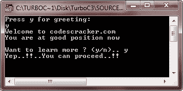

# C++ 函数类型

> 原文：<https://codescracker.com/cpp/cpp-functions-types.htm>

在 C++ 中，大致有两种类型的函数:

1.  内置(库)函数
2.  用户定义的函数

## C++ 内置函数

这些函数是编译器包的一部分。这些是编译器提供的标准库的一部分。比如 exit()、sqrt()、pow()、strlen()等。是库函数(内置函数)。内置函数已经在 [C++ 标准库函数](/cpp/cpp-standard-library-functions.htm)教程中讨论过了。

内置函数帮助你不用声明和定义就能使用函数。要在程序中使用内置函数，只需包含定义了所需函数的头文件。这里有一个例子。这个程序使用 string.h 头文件中名为 strlen()的内置函数来查找字符串的长度。

```
/* C++ Function Types - C++ Built-in Function */

#include<iostream.h>
#include<string.h>
#include<conio.h>
void main()
{
   clrscr();
   char str[80];
   cout<<"Enter any string (line):\n";
   cin.getline(str, 80);
   int len = strlen(str);
   cout<<"\nLength of the string is: "<<len;
   getch();
}
```

下面是上述 C++ 程序的运行示例，查找用户输入的字符串长度


## C++ 用户定义函数

用户定义的功能是由您(即程序员)创建的。这些函数是根据程序的要求创建的。下面是一个例子，演示了 C++ 中用户定义的函数

```
/* C++ Function Types - C++ User-defined Function */

#include<iostream.h>
#include<conio.h>
void start_msg(void);    // function declaration
void main()
{
   clrscr();
   start_msg();     // function calling
   int num;
   cout<<"Enter a number: ";
   cin>>num;
   cout<<"You entered: "<<num;
   getch();
}

void start_msg(void)   // function definition
{
   cout<<"Welcome to codescracker.com\n";
   cout<<"This is C++ Function Types Tutorial\n\n";
}
```

以下是上述 C++ 程序的示例输出:


这是另一个 C++ 程序，也展示了用户定义的函数

```
/* C++ Function Types - C++ User-defined Function */

#include<iostream.h>
#include<conio.h>
void greeting(void);
void main()
{
   clrscr();
   char ch;
   cout<<"Press y for greeting: \n";
   cin>>ch;
   if(ch=='y' || ch=='Y')
   {
      greeting();
   }
   cout<<"Want to learn more ? (y/n).. ";
   cin>>ch;
   if(ch=='y' || ch=='Y')
   {
      cout<<"Yep..!!..You can proceed..!!\n";
   }
   else
   {
      cout<<"Sure..!!..You can take rest..!!\n";
   }
   getch();
}

void greeting(void)
{
   cout<<"Welcome to codescracker.com";
   cout<<"\nYou are at good position now\n\n";
}
```

以下是上述 C++ 程序的一些运行示例:




让我们以另一个程序为例，全面理解 C++ 中的用户定义函数

```
/* C++ Function Types - C++ User-defined Function */

#include<iostream.h>
#include<conio.h>
void msg(void);
int add(int, int);
void main()
{
   clrscr();
   msg();
   int a, b;
   cout<<"Enter any two number: ";
   cin>>a>>b;
   cout<<"The sum of the two numbers is: "<<add(a, b);
   getch();
}

void msg(void)
{
   cout<<"Welcome to codescracker.com";
   cout<<"\nThis is addition program\n\n";
}

int add(int x, int y)
{
   return x+y;
}
```

下面是这个 C++ 程序的示例输出:


[C++ 在线测试](/exam/showtest.php?subid=3)

* * *

* * *