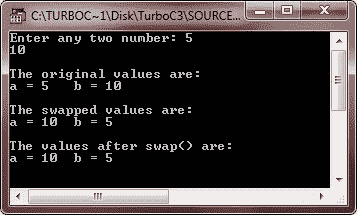

# C++ 函数调用

> 原文：<https://codescracker.com/cpp/cpp-function-calling.htm>

通过提供函数名来调用(或调用或执行)函数，后面是用括号括起来的参数。例如，调用一个函数，其原型看起来像:

```
float area(float, float);
```

函数调用语句可能如下所示:

```
area(x, y);
```

其中 x，y 必须是浮点变量。函数调用的语法与声明的语法非常相似，只是缺少类型说明符。每当遇到 call 语句时，控制(程序控制)被转移到函数，函数体中的语句被执行，然后控制返回到函数调用后的语句。以下程序使用函数原型、函数定义和函数调用:

## C++ 函数调用示例

下面的程序使用一个函数打印给定数目的立方体。这个程序演示了 C++ 中的函数调用:

```
/* C++ Function Calling or Calling a Function */

#include<iostream.h>
#include<conio.h>

float cube(float);

void main()
{
   clrscr();
   float x, y;
   cout<<"Enter number whose cube is to be calculated: \n";
   cin>>x;
   y = cube(x);   // function calling
   cout<<"\nThe cube of "<<x<<" is "<<y<<"\n";
   getch();
}

float cube(float a)
{
   float n;
   n = a * a * a;
   return n;
}
```

当编译并执行上述 C++ 程序时，它将产生以下输出:


上面的程序首先通过提供它的原型来声明一个函数立方体。然后，在接受该数字之后，它调用函数 cube，并将它的返回值赋给变量 y。一旦遇到函数调用语句，控制就被转移到函数体，并且执行它的所有语句。随着 return 语句的执行，控制返回到紧跟在函数调用语句之后的语句。

当调用需要一些参数的函数时，其 call 语句必须提供被发送的参数值，并且参数值的数量和类型必须与函数原型中定义的相同。参数值的顺序也必须与函数原型中定义的顺序相同。例如，如果函数 volume 需要两个值:第一个是 float 类型，第二个是 int 类型，那么它的 call 语句必须如下所示:

```
volume(a, b) ;
```

其中 a 必须是浮点值，b 必须是整数值。

通过指定空括号来调用不需要任何参数的函数。例如，如果函数消息不需要任何参数，它将被调用为:

```
message();
```

返回值的函数调用需要在 main()中有一个位置，以便返回值驻留、打印或操作。将函数想象成伸出手来将一个值传递回 main()。因此，main()必须伸出它的手(可能是一个变量位置)来驻留这个值。我们再举一个例子，演示 C++ 中的函数调用

```
/* C++ Function Calling or Calling a Function */

#include<iostream.h>
#include<conio.h>
#include<stdlib.h>

void msg1(void);
int fun1(int);
int fun2(int);
void msg2(void);

void main()
{
   clrscr();
   msg1();      // function calling
   char ch;
   cout<<"\nPress y to continue...";
   cin>>ch;
   if(ch=='y' || ch=='Y')
   {
      int num;
      cout<<"\nEnter a number: ";
      cin>>num;
      cout<<"\nSquare of the number is: "<<fun1(num);      // function calling
      cout<<"\nCube of the number is: "<<fun2(num);      // function calling
      msg2();         // function calling
   }
   else
   {
      cout<<"\nexiting...Press a key...";
      getch();
      exit(1);
   }
   getch();
}

void msg1(void)
{
   cout<<"Welcome to codescracker.com\n";
   cout<<"This is C++ Function Calling Tutorial\n";
}

int fun1(int x)
{
   int temp;
   temp = x*x;
   return temp;
}

int fun2(int x)
{
   int temp;
   temp = x*x*x;
   return temp;
}

void msg2(void)
{
   cout<<"\n\nThank You..!!\n";
}
```

下面是上述 C++ 程序的两个运行示例:


## C++ 中的函数调用方法

可以通过两种方式调用函数:

*   按值调用
*   引用调用

## C++ 按值调用

“按值调用”方法将实际参数的值复制到形参中，也就是说，函数创建自己的参数值副本，然后使用它们。

**提示** -在按值调用方法中，更改不会反映回原始值。

通过值调用方法的主要好处是，您不能改变用于调用函数的变量，因为函数内部发生的任何变化都是在参数值的函数副本上。参数值的原始副本保持不变。

### C++ 按值调用示例

下面的程序说明了函数调用的值调用方法。出现在函数调用语句中的参数是实际参数。出现在函数定义中的参数是形参。

```
/* C++ Function Calling - C++ Call by Value */

#include<iostream.h>
#include<conio.h>
int change(int);
void main()
{
   clrscr();
   int orig;
   cout<<"Enter a number: ";
   cin>>orig;
   cout<<"\nThe original value is: "<<orig<<"\n";
   cout<<"\nReturn value of function change() is: "<<change(orig)<<"\n";
   cout<<"\nThe value after function change() is over: "<<orig<<"\n";
   getch();
}
int change(int a)
{
   a = 20;         // the value of a is changed.
   return a;       // the changed value is returned.
}
```

当编译并执行上述 C++ 程序时，它将产生以下输出:


在上面的程序中，参数 change()的值，orig，即 5(这里是用户输入的)被复制到参数 a 上，这样 a 就得到值 5。当语句 a = 20 发生时，a 的值改变，但 orig 的值不变。orig 的值仍然是 5。

**注意**——在按值调用过程中，形参的任何变化都不会反映回实参。

**记住**传递给函数的是参数值的副本。函数内部发生的事情对函数调用中使用的变量 没有影响。

## C++ 引用调用

在按值调用方法中，被调用的函数创建一组新的变量，并将参数值复制到这些变量中。该函数不能访问原始变量(实际参数),只能处理它创建的值的副本。当原始值不被修改时，通过值传递参数是有用的。事实上，按值调用方法提供了函数不会损害原始值的保证。

引用调用方法使用不同的机制。不是将值传递给被调用的函数，而是传递对原始变量的引用。请记住，引用是预定义变量的别名(即不同的名称)。也就是说，两个名称中的任何一个都可以访问相同的变量值:原始变量名和引用名。

**提示** -在通过引用方法调用中，变化被反映回原始值。

引用调用方法在原始值的值将使用函数更改的情况下非常有用。

### C++ 引用调用示例

以下程序通过引用方法调用来交换两个值:

```
/* C++ Function Calling - C++ Call by Reference */

#include<iostream.h>
#include<conio.h>
void swap(int &, int &);
void main()
{
   clrscr();
   int a, b;
   cout<<"Enter any two number: ";
   cin>>a>>b;
   cout<<"\nThe original values are:\n";
   cout<<"a = "<<a<<"\tb = "<<b<<"\n";
   swap(a, b);
   cout<<"\nThe values after swap() are:\n";
   cout<<"a = "<<a<<"\tb = "<<b<<"\n";
   getch();
}
void swap(int &x, int &y)
{
   int temp;
   temp = x;
   x = y;
   y = temp;
   cout<<"\nThe swapped values are:\n";
   cout<<"a = "<<x<<"\tb = "<<y<<"\n";
}
```

当编译并执行上述 C++ 程序时，它将产生以下输出:



在上面的程序中，函数 swap()为第一个传入的整数创建引用 x，为第二个传入的整数创建引用 y。原始值将被处理，但是使用名称 x 和 y。

[C++ 在线测试](/exam/showtest.php?subid=3)

* * *

* * *