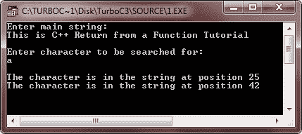

# C++从函数返回

> 原文：<https://codescracker.com/cpp/cpp-returning-from-function.htm>

由于调用函数很重要，从函数返回也同样重要，因为它不仅终止了函数的执行，还将控制权传递回调用函数。当遇到 return 语句或执行函数中的最后一条语句时，函数终止。通常，return 语句用于终止函数，不管它是否返回值。

## C++返回语句

return 语句在两个方面很有用。首先，一遇到 return 语句，就立即退出函数，控制权返回给 main 的调用方操作系统。return 语句的第二个用途是用于向调用代码返回值。

尽管函数中没有必要有 return 语句，但大多数函数依赖 return 语句来停止执行，要么是因为必须返回值，要么是为了使函数的代码更简单、更高效。

一个函数可能包含几个 return 语句。但是，只有其中一个得到执行，因为一旦遇到返回，函数的执行就会终止。以下程序使用了多个 return 语句。

## C++从函数返回示例

下面的程序检查一个给定的字符是否包含在一个字符串中，并找到它的位置:

```
/* C++ Return from a Function */

#include<iostream.h>
#include<conio.h>

int findpos(char str[], char ch);

void main()
{
   clrscr();
   char string[80], ch;
   int y = 0;
   cout<<"Enter main string:\n";
   cin.getline(string, 80);
   cout<<"\nEnter character to be searched for:\n";
   cin.get(ch);
   y = findpos(string, ch);
   if(y == -1)
   {
      cout<<"\nSorry! character is not in the string\n";
   }
   getch();
}
int findpos(char s[], char c)
{
   int flag = -1 ;
   for(int i = 0 ; s[i] != '\0' ; i++)
   {
      if(s[i] == c)
      {
         flag = 0;
         cout<<"\nThe character is in the string at position " << i+1 ;
      }
   }
   return(flag);
}
```

当编译并执行上述 C++程序时，它将产生以下输出:



在上面的程序中，函数 findpos 检查一个字符是否包含在一个字符串中。一旦在字符串中找到该字符，函数就终止并返回该字符的位置。否则，返回值-1，表示没有找到该字符。findpos 中有两个 return 语句，但是一次只能执行其中一个。

[C++在线测试](/exam/showtest.php?subid=3)

* * *

* * *