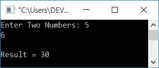

# C++ 友元函数

> 原文：<https://codescracker.com/cpp/cpp-friend-function.htm>

在本教程中，您将学习 C++ 中的友元函数及其示例程序和代码的逐步解释。

## 什么是好友功能？

友元函数是该类的一个函数，它与同一个类的成员函数具有相同的访问权限。但是朋友函数不是成员函数。如果一个关键字 **friend** 被放在任何一个在 类中声明的函数之前，那么这个函数就可以被称为 friend 函数。

## 声明友元函数的地方。

友元函数在声明同一个类的成员函数的类中声明。但是友元函数不是它是友元的类的成员函数(或者声明它的类)。

使用**友元**关键字声明一个[函数](/cpp/cpp-functions.htm)为友元函数。或者在 函数名前加上这个关键字。举个例子，

```
friend void myFun();
```

友元函数在类外定义(在类中声明)。定义好友功能时，**好友** 关键字不是必需的。只有在类内部声明函数时，才需要该关键字。

## 为什么使用朋友关键字？

它用来告诉编译器，它不是类的成员函数。相反，它是一个朋友功能。因为如果你去掉关键字 **friend** ，那么这个函数就会被编译器作为这个类的成员函数 来处理。

## 如何调用好友功能？

友元函数没有对象来调用它。或者友元函数没有任何调用者对象。因为它不是声明它的类的成员函数。为了定义它，lebel 在定义函数时没有附加任何成员。因此，要从 **main()** 函数中调用这个函数，只需像普通函数 调用一样调用它即可。

## 为什么要使用好友功能

在一个大项目中，有很多程序员为同一个项目工作。因此，使用友元函数，一个程序员可以访问另一个程序员定义的类的私有数据成员。

例如，让我们假设一个名为 **James** 的程序员想要访问由另一个名为 **Ricky** 的程序员定义的 类的私有数据成员。因此，**里奇**在他定义的 类中声明了一个朋友函数，并将这个函数的名字告诉了他的朋友**詹姆斯**，他的朋友为同一个项目工作。 现在 **James** 可以使用这个函数访问由 **Ricky** 定义的类的私有数据成员。

## 朋友功能的逐步解释

现在让我们举一个将用户输入的任意两个数相乘的例子。本程序中使用了**好友功能** 。让我们看一下程序，稍后我会一步一步地解释程序中的每一个和每一件事。

```
#include<iostream>
using namespace std;

class CodesCracker
{
    private:
        int m, n, res;
    public:
        void getData()
        {
            cout<<"Enter Two Numbers: ";
            cin>>m>>n;
        }
        void showResult()
        {
            cout<<"\nResult = "<<res;
        }
        friend void mulFun(CodesCracker &c);
};
int main()
{
    CodesCracker c;
    c.getData();
    mulFun(c);
    c.showResult();
    cout<<endl;
    return 0;
}
void mulFun(CodesCracker &c)
{
    c.res = (c.m) * (c.n);
}
```

这个程序是在 **Code::Blocks** IDE 下构建和运行的。下面给出的快照显示了上面的 程序的运行示例:


现在供应两个数字说 **5** 和 **6** 。按`ENTER`键查看输出，如下图 所示:



以下是对之前程序的逐步解释:

*   程序流程总是从 **main()** 函数开始
*   因此，在 **main()** 函数中，有一条语句
    **CodesCracker c；**

*   它告诉编译器，创建一个名为 **c** 的对象，该对象属于 **CodesCracker** 类
*   但是在创建对象之前，编译器会检查类 **CodesCracker** 。也就是说，它 是否被定义。
*   因为它被定义了，所以名为 **c** 的对象被创建
*   使用这个对象 **c** ，一个成员函数 **getData()** 被调用
*   因为 **c** 是为类 **CodesCracker** 声明的对象，所以这个类的函数 **getData()** 只被调用
*   该函数要求用户输入任意两个数字，并将其存储在 **m** 和 **n** 变量中
*   该变量被声明为同一类的私有数据成员
*   现在，一个友元函数 **mulFun()** 被调用，其参数为 **c**
*   这里 **c** 是类 **CodesCracker** 的对象
*   所以程序检查这个函数是否在那个对象的类中被声明
*   因为它是用关键字 **friend** 在同一个类中声明的
*   所以这个函数是那个类的朋友
*   同一个类的朋友意味着它可以访问那个类的私有数据
*   因为它已经在作为其参数传递的那个对象的同一个类中声明了
*   所以程序转到函数定义部分
*   在函数定义中，语句**c . RES =(c . m)*(c . n)；**定义了，对象 **c** 所声明的类的 **m** 和 **n** 变量的值相乘并存储在同一个类的变量 **res** 中
*   现在程序流程再次返回到 **main()** 函数
*   以及语句**c . show result()；**被执行，其中 **res** 变量的值被打印在 输出屏幕上。就是这样。

[C++ 在线测试](/exam/showtest.php?subid=3)

* * *

* * *