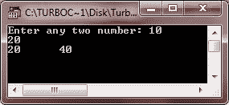
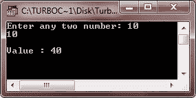

# C++范围规则

> 原文：<https://codescracker.com/cpp/cpp-scope-rules.htm>

可以访问特定代码段或数据值(例如变量)的程序部分被称为代码段或变量的范围。

语言的作用域规则是决定特定代码段或数据项在程序的哪个(哪些)部分是已知的并且可以在其中被访问的规则。

C++中有四种作用域:

*   局部范围
*   功能范围
*   文件范围
*   类别范围

## C++局部范围

在书中声明的名称(即{....})对于该块是本地的，并且只能在该块及其下包含的其他块中使用。形式参数的名称被视为是在该连接的最外层块中声明的。

## C++函数范围

在函数最外层块中声明的变量有函数作用域，也就是说，它们只能在声明它们的函数中被访问。(goto 的)标签也有函数作用域，即它们不能在函数之外使用。

## C++文件范围

在所有块和函数之外声明的名字具有文件作用域，也就是说，它可以在名字声明出现的文件内编写的所有块和函数中使用。

## C++类范围

一个类成员的名字有类作用域，并且对它的类是局部的。

### C++范围规则示例

让我们看看下面的例子:

```
#include<......>
int x, y;          // file scope (Global Variables)
void main()
{
   clrscr();
   int a, b;       // function scope for main()
   float amt;      // local variables of main()

   void check(int);
      :
   {
      char grade;    // block scope (local variable of block)
      :              // block 2
   }
}
void check(int i)      // function scope for check()
{
   long temp;         // local variables of check()
}
```

这是一个示例程序，演示了 C++中的作用域规则

```
/* C++ Scope Rules */

#include<iostream.h>
#include<conio.h>

int a, b;    // global variables
int fun(int);

void main()
{
   clrscr();
   int num1, num2;    // local variables of main()
   cout<<"Enter any two number: ";
   cin>>num1>>num2;
   if(num1==num2)
   {
      int temp;   // block scope (local variable of this if block)
      temp = num1 + num2;
      cout<<"\nValue : "<<fun(temp);
   }
   else
   {
      cout<<fun(num1)<<"\t"<<fun(num2);
   }
   getch();
}
int fun(int x)       // function scope for fun()
{
   int res;   // local variable of fun()
   res = x * 2;
   return res;
}
```

下面是上述 C++程序的两个运行示例:




[C++在线测试](/exam/showtest.php?subid=3)

* * *

* * *