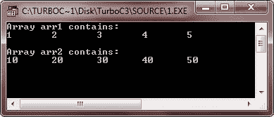
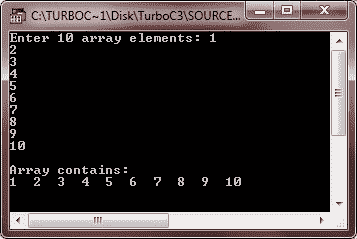
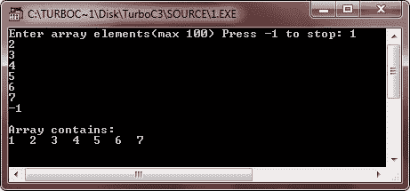
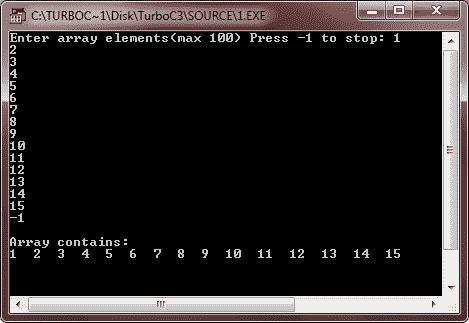

# C++ 数组

> 原文：<https://codescracker.com/cpp/cpp-arrays.htm>

一个数组只是由一个公共名称引用的相同[数据类型](/cpp/cpp-data-types.htm) 的[变量](/cpp/cpp-variables.htm)的集合。换句话说，当线性 结构的元素在内存中通过连续的内存位置表示时，这些线性结构被称为数组。

数组存储有限数量(n)的同类数据元素(即相同类型的数据元素)的列表。数字 n 称为数组的长度、大小或范围。

## 在 C++ 中计算数组大小

当一个数组的上界(UB)和下界(LB)给定时，那么它的大小可以计算如下:

```
Array_Size = UB - LB + 1
```

其中 UB 表示上限，LB 表示下限。例如，如果数组中的元素编号为:

```
-7, -6, -5, ....0, 1, 2, ....15
```

那么它 UB 是 15，LB 是-7，数组大小可以这样计算:

```
= 15 - (-7) + 1
= 15 + 7 + 1
= 23
```

**注**——在 C++ 中，下界总是 0，上界是 size-1。(size 指定数组中元素的数量)。

在 [C++](/cpp/index.htm) 中，所有数组都由连续的内存位置组成。最低地址对应于第一个元素，最高地址对应于最后一个 元素。数组是一种将多个项目组合成一个最大单元的方法。数组可以有简单类型的数据项，如 int 或 float， ，甚至可以有用户定义类型的数据项，如结构和对象。

## C++ 中的数组类型

数组基本上有两种类型:一维数组和多维数组。你可以把多维数组想成很多类型的数组比如二维数组，三维数组等等。你将在下面单独的章节中详细学习一维数组和二维数组。在二维数组一章中，你还会学到多维数组。

*   [C++ 一维数组](/cpp/cpp-one-dimensional-arrays.htm)
*   [C++ 二维数组](/cpp/cpp-two-dimensional-arrays.htm)

## 在 C++ 中声明数组

下面是在 C++ 中声明数组的一般形式:

```
type array_name[array_size];
```

以上是一维数组声明的一般形式。这里 type 是任何有效的 C++ 类型，array_name 是一个有效的标识符，它是程序员给定的数组名称，array_size 表示该数组可以容纳的元素数量。下面是一个声明名为 arr、类型为 int、大小为 20 的数组的示例:

```
int arr[20];
```

下面是用 C++ 声明二维数组的一般形式。

```
type array_name[array_size1][array_size2];
```

下面是在 C++ 中声明多维数组的一般形式

```
type array_name[array_size1][array_size2][array_size3]....[array_sizeN];
```

## 在 C++ 中初始化数组

下面是在 C++ 中初始化数组的一般形式:

```
type array_name[array_size] = {values_list};
```

下面是一个例子，在 C++ 中初始化数组 arr 的值:

```
int arr[5] = {97, 69, 18, 46, 83};
```

**注意** -大括号{ }之间的值的数量不能大于数组大小(此处为 5)或元素数量(此处为 5)。

如果忽略数组大小，那么数组会变得足够大，以容纳初始化的创建。因此，如果你写:

```
int arr[] = {97, 69, 18, 46, 83};
```

您将创建与上一个示例完全相同的数组。因此，您也可以像这样初始化多于或少于 5 个值:

```
int arr[] = {10, 12, 23};
```

或者

```
int arr[] = {12, 23, 34, 35, 45, 33, 10, 2, 54};
```

## 在 C++ 中为特定数组元素赋值

下面是为特定数组元素赋值的一般形式:

```
array_name[index_number] = value;
```

下面是一个示例，将值 20 赋给 arr 数组中的第 5 个元素:

```
arr[4] = 20;
```

**注意** -因为，索引总是从 0 开始，所以索引号 4 对应于数组中的第 5 个元素。

## 在 C++ 中访问数组元素

可以通过索引数组名称来访问元素。这是通过将元素的索引号放在数组名称后面的方括号中来实现的。下面是在 C++ 中访问数组元素的一般形式:

```
type variable_name = array_name[index_number];
```

下面是一个访问数组 arr 的索引号 4 处的值的示例:

```
int num = arr[4];
```

因此，如果 arr[4]处的值(数组 arr 中索引 4 处的值)是 20，那么 20 将初始化为变量 num。

## C++ 数组示例

下面是一些在 C++ 中实际演示数组概念的例子。

```
/* C++ Arrays - C++ Arrays Example Program */

#include<iostream.h>
#include<conio.h>
void main()
{
   clrscr();
   int arr1[5] = {1, 2, 3, 4, 5};
   int arr2[] = {10, 20, 30, 40, 50};
   int i;
   cout<<"Array arr1 contains:\n";
   for(i=0; i<5; i++)
   {
      cout<<arr1[i]<<"\t";
   }
   cout<<"\n\n";
   cout<<"Array arr2 contains:\n";
   for(i=0; i<5; i++)
   {
      cout<<arr2[i]<<"\t";
   }

   getch();
}
```

以下是上述 C++ 程序的示例输出:



这是另一个数组示例。

```
/* C++ Arrays - C++ Arrays Example Program */

#include<iostream.h>
#include<conio.h>
void main()
{
   clrscr();
   int arr[10];
   int i;
   cout<<"Enter 10 array elements: ";
   for(i=0; i<10; i++)
   {
      cin>>arr[i];
   }
   cout<<"\nArray contains:\n";
   for(i=0; i<10; i++)
   {
      cout<<arr[i]<<"  ";
   }
   getch();
}
```

下面是这个 C++ 程序的运行示例:



让我们把上面的 C++ 程序变得更加用户友好。

```
/* C++ Arrays - C++ Arrays Example Program */

#include<iostream.h>
#include<conio.h>
void main()
{
   clrscr();
   int arr[100];
   int i, count=0;
   cout<<"Enter array elements(max 100) Press -1 to stop: ";
   for(i=0; i<100; i++)
   {
      cin>>arr[i];
      if(arr[i] == -1)
      {
         getch();
         break;
      }
      count++;
   }
   cout<<"\nArray contains:\n";
   for(i=0; i<count; i++)
   {
      cout<<arr[i]<<"  ";
   }
   getch();
}
```

下面是上述 C++ 程序的两个运行示例:




### 更多示例

这里列出了更多的数组示例程序，您可以参考:

*   [一维数组程序](/cpp/program/cpp-program-one-dimensional-array.htm)
*   [线性搜索](/cpp/program/cpp-program-linear-search.htm)
*   [二分搜索](/cpp/program/cpp-program-binary-search.htm)
*   [找到数组中最大的元素](/cpp/program/cpp-program-find-largest-element-in-array.htm)
*   [找到数组中最小的元素](/cpp/program/cpp-program-find-smallest-element-in-array.htm)
*   [反向排列](/cpp/program/cpp-program-reverse-array.htm)
*   [在数组中插入元素](/cpp/program/cpp-program-insert-element-in-array.htm)
*   [从数组中删除元素](/cpp/program/cpp-program-delete-element-from-array.htm)
*   [合并两个数组](/cpp/program/cpp-program-merge-two-arrays.htm)
*   [冒泡排序](/cpp/program/cpp-program-bubble-sort.htm)
*   [选择排序](/cpp/program/cpp-program-selection-sort.htm)
*   [插入排序](/cpp/program/cpp-program-Insertion-sort.htm)
*   [二维数组程序](/cpp/program/cpp-program-two-dimensional-array.htm)
*   [相加两个矩阵](/cpp/program/cpp-program-add-two-matrices.htm)
*   [减去矩阵](/cpp/program/cpp-program-subtract-matrices.htm)
*   [转置矩阵](/cpp/program/cpp-program-transpose-matrix.htm)
*   [将两个矩阵相乘](/cpp/program/cpp-program-multiply-two-matrices.htm)
*   [三维阵列程序](/cpp/program/cpp-program-three-dimensional-array.htm)

[C++ 在线测试](/exam/showtest.php?subid=3)

* * *

* * *